# PRFactory

> AI-powered automation that transforms ideas into GitHub pull requests using AI agents via CLI adapters

**PRFactory transforms your team's development workflow** by combining the power of AI agents with human oversight at every critical decision point. Unlike fully autonomous AI coding tools, PRFactory puts your team in control—AI proposes, your team decides.

PRFactory streamlines the development workflow by:
- **Capturing** requirements directly in its Web UI or syncing from external systems (Jira, Azure DevOps, GitHub Issues)
- **Analyzing** requirements and your codebase
- **Clarifying** requirements through AI-generated questions
- **Planning** detailed implementations for developer review
- **Optionally implementing** code and creating pull requests (can be disabled per tenant)
- **Syncing** completed work back to external systems (Jira, Azure DevOps, etc.) for final storage

### What Makes PRFactory Different?

✅ **Team-Based Review** - Multi-reviewer approval workflows ensure no AI-generated code reaches production without proper oversight

✅ **Transparent Planning** - AI creates detailed implementation plans (committed to git) that your team reviews *before* any code is written

✅ **Multi-Platform Support** - Works with GitHub, Bitbucket, Azure DevOps (GitLab coming soon)

✅ **Enterprise-Ready** - Multi-tenant isolation, encrypted credentials, audit trails

✅ **Optional Implementation** - Use AI to plan only, or let it implement code under your team's review

### Perfect For:
- **Regulated Industries** requiring multiple sign-offs on code changes
- **Enterprise Teams** who need AI assistance without sacrificing control
- **.NET Ecosystems** (built natively on C# / .NET 10)
- **Organizations** transitioning from idea → implementation → pull request with confidence

**Key Principle:** *AI assists, humans decide.* Every step requires human approval—no automatic deployments, no surprises.

## Table of Contents

- [How It Works](#how-it-works)
- [Workflow Overview](#workflow-overview)
- [Quick Start](#quick-start)
- [Documentation Map](#documentation-map)
  - [Getting Started](#getting-started)
  - [Core Documentation](#core-documentation)
  - [Architecture Deep-Dives](#architecture-deep-dives)
  - [Planning and Design Documents](#planning-and-design-documents)
  - [For AI Agents](#for-ai-agents)
  - [Component Documentation](#component-documentation)
- [Architecture](#architecture)
- [Technology Stack](#technology-stack)
- [Contributing](#contributing)

## How It Works

PRFactory provides a Web UI for managing your development workflow with three phases:

### Phase 1: Requirements Clarification

When you create a ticket in PRFactory's Web UI (or sync from Jira/Azure DevOps):
1. The system clones your repository and analyzes the codebase
2. Claude AI generates clarifying questions based on context
3. Questions are displayed in the PRFactory UI for you to answer
4. You respond with answers directly in the UI
5. Optionally sync Q&A to external systems (Jira, Azure DevOps) for tracking

### Phase 2: Implementation Planning

After receiving your answers:
1. Claude generates a detailed implementation plan
2. The plan is committed to a feature branch as markdown files
3. The plan is displayed in the PRFactory UI for review
4. You review and approve the plan in the UI (or request changes)
5. Plan summary can be synced to external systems (Jira, Azure DevOps)

### Phase 3: Code Implementation (Optional)

Once the plan is approved:
1. Claude implements the code following the approved plan (or you can implement manually)
2. Changes are committed and pushed to the feature branch
3. A pull request is created and linked in the PRFactory UI
4. **Mandatory code review** by your team before merging
5. Completed work syncs to external systems (Jira, Azure DevOps) for final storage

## Workflow Overview

```mermaid
flowchart TB
    Start([Developer creates ticket<br/>in PRFactory UI]) --> OptionalSync{Sync from<br/>external system?}
    OptionalSync -- Yes --> SyncIn[Import from Jira/<br/>Azure DevOps/GitHub]
    OptionalSync -- No --> Direct[Direct creation<br/>in UI]
    SyncIn --> Queue[Ticket queued<br/>for processing]
    Direct --> Queue

    Queue --> Phase1[Phase 1: Analysis]
    Phase1 --> Clone[Clone repository]
    Clone --> Analyze[AI analyzes codebase<br/>and requirements]
    Analyze --> Questions[Display clarifying<br/>questions in UI]
    Questions --> Wait1{User responds<br/>in UI}

    Wait1 --> Phase2[Phase 2: Planning]
    Phase2 --> Plan[AI creates detailed<br/>implementation plan]
    Plan --> Branch[Create feature branch<br/>& commit plan files]
    Branch --> DisplayPlan[Display plan in UI<br/>for review]
    DisplayPlan --> Wait2{Developer<br/>approves plan?}
    Wait2 -- Needs changes --> Questions

    Wait2 -- Approved --> Phase3[Phase 3: Implementation]
    Phase3 --> Code[AI implements changes<br/>OR developer does manually]
    Code --> Test[Run tests]
    Test --> Commit[Commit and push]
    Commit --> PR[Create Pull Request]

    PR --> Review[Mandatory human<br/>code review]
    Review --> Approve{Approved?}
    Approve -- Changes needed --> Code
    Approve -- Approved --> Merge[Human merges PR]
    Merge --> SyncOut[Sync completed work<br/>to external systems]
    SyncOut --> Done([Complete])

    style Phase1 fill:#e1f5ff
    style Phase2 fill:#fff4e1
    style Phase3 fill:#e8f5e9
    style Review fill:#ffebee
    style Merge fill:#f3e5f5
```



### Human Control Points

| Phase | Human Control | Can AI Proceed Alone? |
|-------|--------------|----------------------|
| Ticket Creation | Create and describe requirements in PRFactory UI | No |
| Analysis | Answer clarifying questions in PRFactory UI | No |
| Planning | Review and approve implementation plan in PRFactory UI | No |
| Implementation | Review and merge PR in GitHub/GitLab/Azure DevOps | No |

## Quick Start

### Prerequisites

- [.NET 10 SDK](https://dotnet.microsoft.com/download/dotnet/10.0) or later
- [Docker](https://www.docker.com/get-started) (optional, for containerized deployment)
- GitHub/GitLab/Azure DevOps account with Personal Access Token
- AI CLI tool installed (e.g., Claude Code CLI, Codex CLI, or Gemini CLI)
- (Optional) Jira/Azure DevOps account for syncing completed work

### Installation

1. **Clone the repository**
   ```bash
   git clone <repository-url>
   cd PRFactory
   ```

2. **Configure the application**

   Create `appsettings.json` with minimal system-wide settings:
   ```json
   {
     "ConnectionStrings": {
       "DefaultConnection": "Data Source=prfactory.db"
     },
     "ClaudeCodeCli": {
       "ExecutablePath": "claude",
       "DefaultTimeoutSeconds": 120,
       "ProjectContextTimeoutSeconds": 300
     }
   }
   ```

   **Repository Configuration**: PRFactory supports multiple repositories across multiple platforms (GitHub, Bitbucket, Azure DevOps). Repositories, credentials, and platform-specific settings are configured through the **Web UI** after startup, not in appsettings.json.

   For each repository you can configure:
   - Git platform (GitHub, Bitbucket, Azure DevOps, GitLab)
   - Platform credentials (stored encrypted)
   - Branch naming conventions
   - Approval workflows
   - External system integrations (Jira, Azure DevOps Work Items)

   See [docs/SETUP.md](docs/SETUP.md) for detailed configuration instructions.

3. **Run locally** (single command)
   ```bash
   # Navigate to the project
   cd src/PRFactory.Web

   # Apply database migrations
   dotnet ef database update

   # Start the application (all-in-one: UI + API + Background Services)
   dotnet run
   ```

   The application will be available at:
   - Blazor UI: http://localhost:5003
   - API (Swagger): http://localhost:5000/swagger
   - Background services: Running within the same process

4. **Or run with Docker Compose** (recommended for production)
   ```bash
   docker-compose up --build
   ```

   The containerized application will be available at:
   - Blazor UI: http://localhost:5003
   - API: http://localhost:5003/api
   - All services run in a single container

For detailed setup instructions, see [docs/SETUP.md](docs/SETUP.md).

## Documentation Map

PRFactory has comprehensive documentation organized by purpose. Choose your path based on what you need:

### Getting Started

Start here if you're new to PRFactory:

- **[Setup Guide](docs/SETUP.md)** - Complete installation, configuration, and deployment guide
  - Prerequisites and requirements
  - Docker and local setup instructions
  - Configuration options (environment variables, user secrets, appsettings)
  - External service integrations (Jira, GitHub, Claude)
  - Troubleshooting common issues

### Core Documentation

Essential reading for understanding the system:

- **[Architecture Overview](docs/ARCHITECTURE.md)** - High-level system design and architectural patterns
  - Clean Architecture principles
  - Domain-Driven Design approach
  - Multi-tenancy architecture
  - State machine and workflow management
  - Technology stack details

- **[Workflow Details](docs/WORKFLOW.md)** - Complete workflow from ticket to PR
  - Phase 1: Requirements Clarification
  - Phase 2: Implementation Planning
  - Phase 3: Code Implementation
  - State transitions and error handling
  - Example walkthrough with timelines

- **[Database Schema](docs/database-schema.md)** - Database structure and entity relationships
  - Entity Relationship Diagrams
  - Table definitions and indexes
  - JSON field structures
  - Encrypted fields and security
  - Performance optimization tips

### Architecture Deep-Dives

Detailed technical documentation for specific components:

- **[Core Engine Architecture](docs/architecture/core-engine.md)** - Workflow orchestration and state management
  - State machine implementation
  - Domain model and entities
  - Application services and background jobs
  - Error handling and resilience patterns

- **[CLI Agent Integration](docs/architecture/cli-agent-integration.md)** - LLM-agnostic AI integration ✨ **NEW**
  - ICliAgent abstraction layer (LLM-agnostic)
  - ClaudeCodeCliAdapter (production implementation)
  - Agent prompt management and customization
  - Process execution with timeout and cancellation

- **[Jira Integration](docs/architecture/jira-integration.md)** - Bidirectional Jira communication
  - Webhook handling and validation
  - Comment parsing and @claude mentions
  - REST API client implementation
  - Security and rate limiting

- **[Git Platform Integration](docs/architecture/git-integration.md)** - Multi-platform git operations
  - LibGit2Sharp for local operations
  - Strategy pattern for platform providers
  - GitHub, Bitbucket, and Azure DevOps support
  - Workspace management and cleanup

### Planning and Design Documents

Historical context and future planning:

- **[Original Proposal](docs/archive/ORIGINAL_PROPOSAL.md)** - Initial project vision and requirements
  - Problem statement and solution
  - Proof of concept plan
  - Pricing models and benefits
  - Risk mitigation strategies

- **[Web UI Implementation Plan](docs/archive/IMPLEMENTATION_PLAN_WEB_UI.md)** - Planned UI enhancements
  - Web UI as primary interface
  - External system sync strategy
  - 10-phase implementation plan
  - Technology choices (Blazor vs React)

### For AI Agents

Working on the PRFactory codebase with AI assistance?

- **[CLAUDE.md](CLAUDE.md)** - Architecture guidance for AI agents
  - Core architectural principles to preserve
  - Multi-graph architecture explanation
  - Multi-platform strategy importance
  - What NOT to simplify vs what IS overengineered
  - Development guidelines for AI-assisted work
  - Quick reference for architectural decisions

This document helps AI agents understand which architectural decisions are intentional and should be preserved, and which areas can be simplified or improved.

### Component Documentation

Deep dive into specific codebase components:

- [Domain Layer](src/PRFactory.Domain/README.md) - Business entities, value objects, and domain logic
- [Infrastructure Layer](src/PRFactory.Infrastructure/README.md) - External integrations (Jira, Git, Claude, database)
- [API Layer](src/PRFactory.Api/README.md) - REST endpoints, controllers, and webhooks
- [Worker Service](src/PRFactory.Worker/README.md) - Background job processing and agent execution

### Navigation Tips

- **New to the project?** Start with [Setup Guide](docs/SETUP.md) → [Architecture Overview](docs/ARCHITECTURE.md) → [Workflow Details](docs/WORKFLOW.md)
- **Setting up integrations?** See [Setup Guide](docs/SETUP.md) and the integration-specific architecture docs
- **Understanding the workflow?** Read [Workflow Details](docs/WORKFLOW.md) with the state diagrams
- **Working with AI assistance?** Read [CLAUDE.md](CLAUDE.md) first to understand architectural principles
- **Building new features?** Study [Architecture Overview](docs/ARCHITECTURE.md) and relevant integration docs
- **Troubleshooting?** Check [Setup Guide - Troubleshooting](docs/SETUP.md#troubleshooting) section

## Architecture

PRFactory follows **Clean Architecture** principles with clear separation of concerns:

```
┌─────────────────────────────────────────────────────────┐
│                    External Systems                     │
│         Jira Cloud  │  GitHub/GitLab  │  Claude AI      │
└────────────────────────┬────────────────────────────────┘
                         │
┌────────────────────────┴────────────────────────────────┐
│                  PRFactory System                       │
│                                                          │
│  ┌────────────────────────────────────────────────┐     │
│  │         API Layer (ASP.NET Core)               │     │
│  │  WebhookController │ TicketController          │     │
│  └──────────────────┬─────────────────────────────┘     │
│                     │                                   │
│  ┌──────────────────┴─────────────────────────────┐     │
│  │         Application Services                   │     │
│  │  TicketService │ WorkflowService │ ...         │     │
│  └──────────────────┬─────────────────────────────┘     │
│                     │                                   │
│  ┌──────────────────┴─────────────────────────────┐     │
│  │         Domain Layer                           │     │
│  │  Entities │ State Machine │ Value Objects      │     │
│  └──────────────────┬─────────────────────────────┘     │
│                     │                                   │
│  ┌──────────────────┴─────────────────────────────┐     │
│  │         Infrastructure Layer                   │     │
│  │  JiraClient │ GitService │ ClaudeClient │ DB   │     │
│  └────────────────────────────────────────────────┘     │
│                                                          │
│  ┌────────────────────────────────────────────────┐     │
│  │         Worker Service (Background Jobs)       │     │
│  │  14 Specialized Agents for Workflow Steps      │     │
│  └────────────────────────────────────────────────┘     │
└─────────────────────────────────────────────────────────┘
```

**Key Components:**

- **14 Specialized Agents** - Each handles a specific workflow step (TriggerAgent, AnalysisAgent, QuestionGenerationAgent, etc.)
- **Workflow State Machine** - 12 states with validated transitions
- **Multi-tenancy Support** - Isolated environments per customer
- **Security First** - HMAC webhook validation, encrypted credentials, read-only repo access

See [docs/ARCHITECTURE.md](docs/ARCHITECTURE.md) for detailed architecture documentation.

## Technology Stack

### Core Framework
- **.NET 10** - Core platform
- **C# 13** - Latest language features
- **ASP.NET Core** - Web API hosting
- **Entity Framework Core 10** - ORM

### Key Libraries
- **CLI Agent Adapters** - AI integration via command-line interfaces (Claude Code CLI, Codex CLI, Gemini CLI, etc.)
- **LibGit2Sharp** - Git operations
- **Octokit** - GitHub API client
- **Polly** - Resilience and retry policies
- **Serilog** - Structured logging

### Data Storage
- **SQLite** - Default database (can use SQL Server or PostgreSQL)
- **Entity Framework Core 10** - Database access

### Infrastructure
- **Docker** - Containerization
- **GitHub Actions** - CI/CD pipelines

## Project Structure

```
PRFactory/
├── src/
│   ├── PRFactory.Api/              # REST API (webhooks, controllers)
│   ├── PRFactory.Domain/           # Domain entities and business logic
│   ├── PRFactory.Infrastructure/   # External integrations (Jira, Git, Claude)
│   └── PRFactory.Worker/           # Background job processor
├── tests/
│   └── PRFactory.Tests/           # Unit and integration tests
├── docs/                          # Documentation
├── docker-compose.yml             # Docker configuration
└── PRFactory.sln                  # Solution file
```

## Quality & Security

### Quality Guarantees

- All code changes go through **mandatory pull request review**
- **CI/CD pipelines** run automated tests and security scans
- **No automatic deployments** - humans control all merges
- Complete **audit trail** in Jira comments and git history

### Security Controls

- No direct production access
- Read-only repository access during analysis
- Write access limited to feature branches only
- Cannot merge PRs (human-only operation)
- HMAC validation for webhooks
- Encrypted credentials at rest
- Multi-tenant data isolation

## Benefits

### For Developers
- **60-80% faster** routine implementations
- Focus on complex, high-value work
- Consistent code patterns and documentation
- Automated test generation

### For Teams
- Faster feature delivery
- Better requirement clarity upfront
- Clear visibility into implementation plans
- Reduced technical debt

### For Business
- Reduced development costs
- Shorter time-to-market
- Faster developer onboarding
- More predictable timelines

## Contributing

1. Fork the repository
2. Create a feature branch (`git checkout -b feature/amazing-feature`)
3. Commit your changes (`git commit -m 'Add some amazing feature'`)
4. Push to the branch (`git push origin feature/amazing-feature`)
5. Open a Pull Request

## License

This project is licensed under the Functional Source License, Version 1.1, MIT Future License (FSL-1.1-MIT) - see the [LICENSE.md](LICENSE.md) file for details.

## Support

For issues, questions, or contributions:
- Open an issue on GitHub
- Check the [documentation](docs/)
- Review the [troubleshooting guide](docs/SETUP.md#troubleshooting)

---

**Built with Claude AI** | **Powered by .NET 10**
