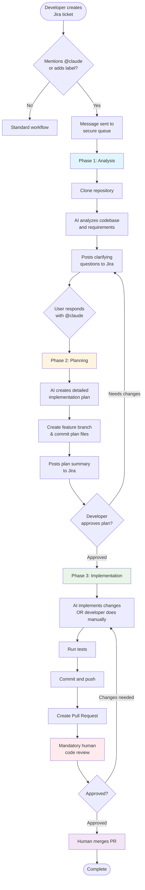

# PRFactory

> AI-powered automation that transforms Jira tickets into GitHub pull requests using Claude AI

PRFactory is an intelligent automation system that streamlines the development workflow by:
- **Analyzing** vague Jira tickets and your codebase
- **Clarifying** requirements through AI-generated questions
- **Planning** detailed implementations for developer review
- **Creating** pull requests with implemented code (optional)

**Key Principle:** AI assists, humans decide. Every step requires human approval - no automatic deployments.

## Table of Contents

- [How It Works](#how-it-works)
- [Workflow Overview](#workflow-overview)
- [Quick Start](#quick-start)
- [Documentation](#documentation)
- [Architecture](#architecture)
- [Technology Stack](#technology-stack)
- [Contributing](#contributing)

## How It Works

PRFactory integrates into your existing Jira workflow with three phases:

### Phase 1: Requirements Clarification

When you mention `@claude` in a Jira ticket or add the "Claude" label:
1. The system clones your repository and analyzes the codebase
2. Claude AI generates clarifying questions based on context
3. Questions are posted as Jira comments
4. You respond with answers, mentioning `@claude` to continue

### Phase 2: Implementation Planning

After receiving your answers:
1. Claude generates a detailed implementation plan
2. The plan is committed to a feature branch as markdown files
3. A summary with branch link is posted to Jira
4. You review and approve the plan (or request changes)

### Phase 3: Code Implementation (Optional)

Once the plan is approved:
1. Claude implements the code following the approved plan (or you can implement manually)
2. Changes are committed and pushed to the feature branch
3. A pull request is created and linked to the Jira ticket
4. **Mandatory code review** by your team before merging

## Workflow Overview



### Human Control Points

| Phase | Human Control | Can AI Proceed Alone? |
|-------|--------------|----------------------|
| Analysis | User must answer clarifying questions | No |
| Planning | Developer must approve implementation plan | No |
| Implementation | Developer must review and merge PR | No |

## Quick Start

### Prerequisites

- [.NET 10 SDK](https://dotnet.microsoft.com/download/dotnet/10.0) or later
- [Docker](https://www.docker.com/get-started) (optional, for containerized deployment)
- GitHub account with Personal Access Token
- Jira account with API access
- Anthropic API key for Claude

### Installation

1. **Clone the repository**
   ```bash
   git clone <repository-url>
   cd PRFactory
   ```

2. **Configure the application**

   Create `appsettings.json` or use environment variables:
   ```json
   {
     "ConnectionStrings": {
       "DefaultConnection": "Data Source=prfactory.db"
     },
     "Jira": {
       "BaseUrl": "https://yourcompany.atlassian.net",
       "WebhookSecret": "your-webhook-secret"
     },
     "Claude": {
       "ApiKey": "sk-ant-...",
       "Model": "claude-sonnet-4-5-20250929"
     },
     "GitHub": {
       "Token": "ghp_..."
     }
   }
   ```

3. **Run with Docker Compose** (recommended)
   ```bash
   docker-compose up --build
   ```

   Services will be available at:
   - API: http://localhost:5000
   - Swagger UI: http://localhost:5000/swagger

4. **Or run locally**
   ```bash
   # Apply database migrations
   cd src/PRFactory.Api
   dotnet ef database update

   # Start the API
   dotnet run --project src/PRFactory.Api

   # In another terminal, start the Worker
   dotnet run --project src/PRFactory.Worker
   ```

For detailed setup instructions, see [docs/SETUP.md](docs/SETUP.md).

## Documentation

- **[Setup Guide](docs/SETUP.md)** - Detailed installation and configuration
- **[Architecture](docs/ARCHITECTURE.md)** - System design and components
- **[Workflow Details](docs/WORKFLOW.md)** - In-depth workflow explanation
- **[Database Schema](docs/database-schema.md)** - Database structure and entities
- **[API Reference](docs/api/)** - REST API documentation

### Component Documentation

- [Domain Layer](src/PRFactory.Domain/README.md) - Business entities and logic
- [Infrastructure Layer](src/PRFactory.Infrastructure/README.md) - External integrations
- [API Layer](src/PRFactory.Api/README.md) - REST endpoints
- [Worker Service](src/PRFactory.Worker/README.md) - Background job processing

## Architecture

PRFactory follows **Clean Architecture** principles with clear separation of concerns:

```
┌─────────────────────────────────────────────────────────┐
│                    External Systems                     │
│         Jira Cloud  │  GitHub/GitLab  │  Claude AI      │
└────────────────────────┬────────────────────────────────┘
                         │
┌────────────────────────┴────────────────────────────────┐
│                  PRFactory System                       │
│                                                          │
│  ┌────────────────────────────────────────────────┐     │
│  │         API Layer (ASP.NET Core)               │     │
│  │  WebhookController │ TicketController          │     │
│  └──────────────────┬─────────────────────────────┘     │
│                     │                                   │
│  ┌──────────────────┴─────────────────────────────┐     │
│  │         Application Services                   │     │
│  │  TicketService │ WorkflowService │ ...         │     │
│  └──────────────────┬─────────────────────────────┘     │
│                     │                                   │
│  ┌──────────────────┴─────────────────────────────┐     │
│  │         Domain Layer                           │     │
│  │  Entities │ State Machine │ Value Objects      │     │
│  └──────────────────┬─────────────────────────────┘     │
│                     │                                   │
│  ┌──────────────────┴─────────────────────────────┐     │
│  │         Infrastructure Layer                   │     │
│  │  JiraClient │ GitService │ ClaudeClient │ DB   │     │
│  └────────────────────────────────────────────────┘     │
│                                                          │
│  ┌────────────────────────────────────────────────┐     │
│  │         Worker Service (Background Jobs)       │     │
│  │  14 Specialized Agents for Workflow Steps      │     │
│  └────────────────────────────────────────────────┘     │
└─────────────────────────────────────────────────────────┘
```

**Key Components:**

- **14 Specialized Agents** - Each handles a specific workflow step (TriggerAgent, AnalysisAgent, QuestionGenerationAgent, etc.)
- **Workflow State Machine** - 12 states with validated transitions
- **Multi-tenancy Support** - Isolated environments per customer
- **Security First** - HMAC webhook validation, encrypted credentials, read-only repo access

See [docs/ARCHITECTURE.md](docs/ARCHITECTURE.md) for detailed architecture documentation.

## Technology Stack

### Core Framework
- **.NET 10** - Core platform
- **C# 13** - Latest language features
- **ASP.NET Core** - Web API hosting
- **Entity Framework Core 10** - ORM

### Key Libraries
- **Anthropic SDK** - Claude AI integration
- **LibGit2Sharp** - Git operations
- **Octokit** - GitHub API client
- **Polly** - Resilience and retry policies
- **Serilog** - Structured logging
- **OpenTelemetry** - Distributed tracing

### Data Storage
- **SQLite** - Default database (can use SQL Server or PostgreSQL)
- **Entity Framework Core 10** - Database access

### Infrastructure
- **Docker** - Containerization
- **GitHub Actions** - CI/CD pipelines
- **Jaeger** - Distributed tracing (optional)

## Project Structure

```
PRFactory/
├── src/
│   ├── PRFactory.Api/              # REST API (webhooks, controllers)
│   ├── PRFactory.Domain/           # Domain entities and business logic
│   ├── PRFactory.Infrastructure/   # External integrations (Jira, Git, Claude)
│   └── PRFactory.Worker/           # Background job processor
├── tests/
│   └── PRFactory.Tests/           # Unit and integration tests
├── docs/                          # Documentation
├── docker-compose.yml             # Docker configuration
└── PRFactory.sln                  # Solution file
```

## Quality & Security

### Quality Guarantees

- All code changes go through **mandatory pull request review**
- **CI/CD pipelines** run automated tests and security scans
- **No automatic deployments** - humans control all merges
- Complete **audit trail** in Jira comments and git history

### Security Controls

- No direct production access
- Read-only repository access during analysis
- Write access limited to feature branches only
- Cannot merge PRs (human-only operation)
- HMAC validation for webhooks
- Encrypted credentials at rest
- Multi-tenant data isolation

## Benefits

### For Developers
- **60-80% faster** routine implementations
- Focus on complex, high-value work
- Consistent code patterns and documentation
- Automated test generation

### For Teams
- Faster feature delivery
- Better requirement clarity upfront
- Clear visibility into implementation plans
- Reduced technical debt

### For Business
- Reduced development costs
- Shorter time-to-market
- Faster developer onboarding
- More predictable timelines

## Contributing

1. Fork the repository
2. Create a feature branch (`git checkout -b feature/amazing-feature`)
3. Commit your changes (`git commit -m 'Add some amazing feature'`)
4. Push to the branch (`git push origin feature/amazing-feature`)
5. Open a Pull Request

## License

This project is licensed under the MIT License - see the LICENSE file for details.

## Support

For issues, questions, or contributions:
- Open an issue on GitHub
- Check the [documentation](docs/)
- Review the [troubleshooting guide](docs/SETUP.md#troubleshooting)

---

**Built with Claude AI** | **Powered by .NET 10**
