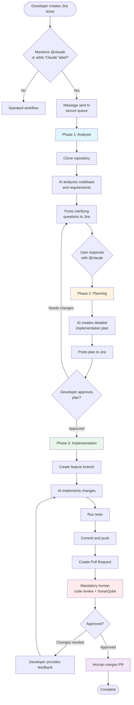
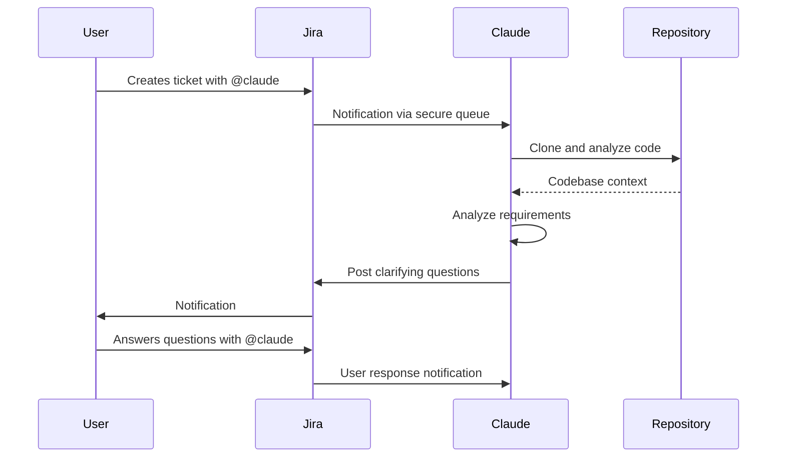
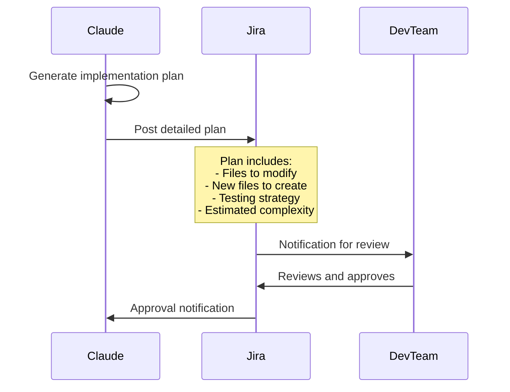
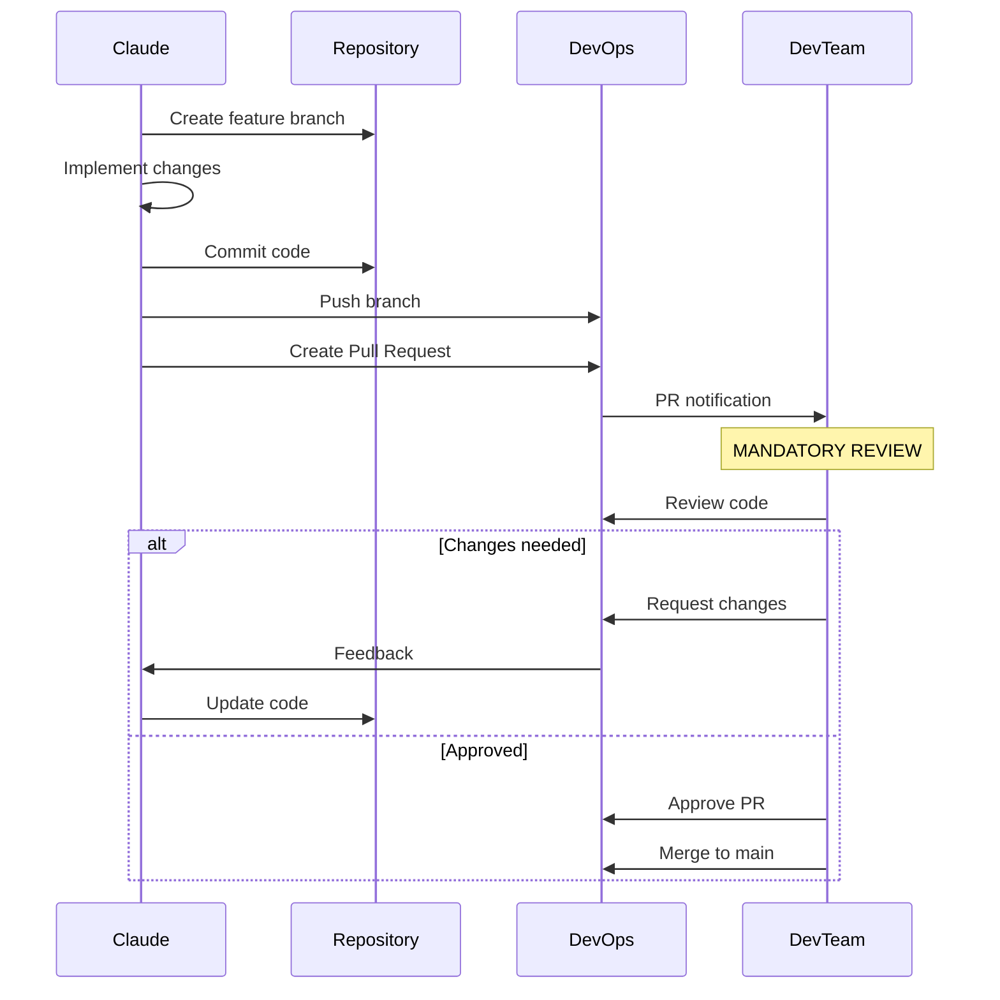
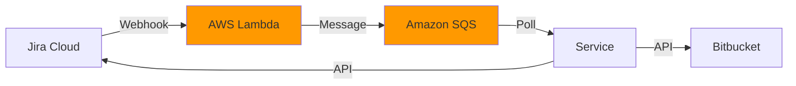
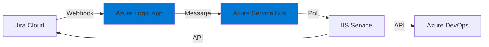
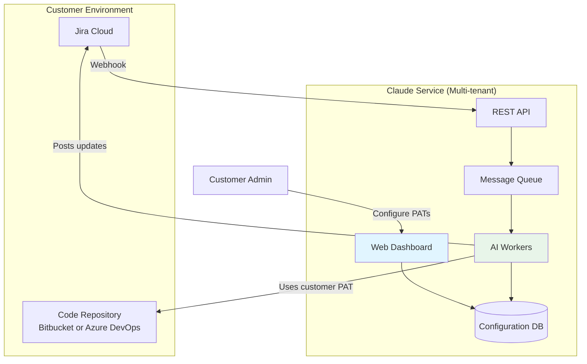

# Claude AI-Powered Development Assistant for Jira

## Executive Summary

An intelligent automation system that transforms Jira tickets into implemented code changes through AI-assisted development, reducing development time while maintaining quality control through mandatory human review.

---

## Problem Statement

### Current Challenges

**Manual Development Overhead**
- Developers spend significant time on repetitive coding tasks
- Simple feature requests take days to be prioritized and implemented
- Context switching between tickets reduces productivity

**Communication Bottlenecks**
- Requirements often lack technical clarity
- Multiple back-and-forth cycles to clarify specifications
- Implementation plans created manually for every feature

**Resource Constraints**
- Development teams overwhelmed with backlog
- Junior developers need extensive guidance
- Routine changes compete with strategic work for developer attention

---

## Our Solution

An AI assistant that integrates directly into your existing Jira workflow, automatically:

1. **Analyzes** code repositories to understand context
2. **Asks clarifying questions** to ensure requirements are clear
3. **Creates detailed implementation plans** for review
4. **Generates working code** with proper testing
5. **Opens pull requests** for mandatory developer review

### Key Principle: AI Assists, Humans Decide

**The system never deploys code automatically.** Every implementation goes through your standard PR review process, ensuring quality and team oversight.

---

## Workflow Overview



---

## Detailed Workflow

### Phase 1: Requirements Clarification


**Example Questions Claude Might Ask:**
- "Should this feature support existing users or only new registrations?"
- "What should happen if the API call fails? Retry or show error?"
- "Should we add unit tests for this validation logic?"

---

### Phase 2: Implementation Planning


**Example Implementation Plan:**
```
## Implementation Plan for PROJ-123

### Files to Modify
1. `UserService.cs` - Add email validation
2. `UserValidator.cs` - Create new validator class
3. `UserServiceTests.cs` - Add test cases

### New Dependencies
- FluentValidation.AspNetCore (v11.3.0)

### Testing Strategy
- Unit tests for validation rules
- Integration test for email format check

### Estimated Complexity: Medium (2-4 hours)
```

---

### Phase 3: Code Implementation & Review


---

## Quality & Control Guarantees

### 1. **Human-in-the-Loop at Every Stage**

| Phase | Human Control Point | Can AI Proceed Without Approval? |
|-------|-------------------|----------------------------------|
| Analysis | User must answer clarifying questions | ❌ No |
| Planning | Developer must approve implementation plan | ❌ No |
| Implementation | Developer must review and merge PR | ❌ No |

### 2. **Standard Development Practices**

- ✅ All changes go through Pull Request process
- ✅ Code review required before merge
- ✅ CI/CD pipelines run automatically
- ✅ All existing quality gates remain in place
- ✅ Branch protection rules enforced

### 3. **Audit Trail**

Every action is tracked:
- All AI interactions logged in Jira comments
- Complete git history of changes
- PR review comments and feedback
- Approval timestamps

### 4. **Security Controls**

- 🔒 No direct production access
- 🔒 Read-only access to repositories during analysis
- 🔒 Write access only to feature branches
- 🔒 Cannot merge PRs (human-only)
- 🔒 All API tokens managed securely

---

## Supported Technology Stacks

### Client A: AWS + Bitbucket + Jira


### Client B: Azure + Azure DevOps + Jira


---

## Universal Service Architecture



### Configuration Dashboard Features

**For Each Customer:**
- ✏️ Add/manage repository access tokens (PAT)
- 🗺️ Map Jira components to repositories
- ⚙️ Configure workflow preferences
- 📊 View usage analytics
- 🔐 Manage API permissions

---

## Benefits Summary

### For Development Teams
- ⏱️ **60-80% faster** for routine implementations
- 🎯 Focus on complex, high-value work
- 📚 Consistent code patterns and documentation
- 🧪 Automated test generation

### For Product/Project Managers
- 🚀 Faster feature delivery
- 📈 More predictable timelines
- 💬 Better requirement clarity upfront
- 📊 Clear visibility into implementation plans

### For the Business
- 💰 Reduced development costs
- ⚡ Shorter time-to-market
- 🎓 Reduced onboarding time for new developers
- 📉 Lower technical debt (consistent patterns)

---

## Pricing Model (Indicative)

### Option 1: Per-Ticket Pricing
- **$X per AI-assisted ticket**
- Only pay for tickets that complete Phase 3
- No commitment required

### Option 2: Monthly Subscription
- **$Y per month per team (up to Z tickets)**
- Unlimited clarifications and planning
- Priority support

### Infrastructure Costs (Customer-Borne)
- Azure Service Bus: ~$10-15/month
- OR AWS SQS: ~$5-10/month
- Anthropic API usage: Included in pricing above

---

## Next Steps

### Proof of Concept (4-6 weeks)
1. **Week 1-2**: Set up integration with one customer environment
2. **Week 3-4**: Process 5-10 real tickets with full workflow
3. **Week 5-6**: Gather feedback and refine

### Success Metrics
- ✅ 80%+ reduction in time from ticket creation to PR
- ✅ 90%+ of generated code approved without major changes
- ✅ Zero security incidents
- ✅ 100% of changes go through proper review process

### Required from Stakeholder
- ✓ Budget approval for PoC development
- ✓ Access to test Jira project and repository
- ✓ 1-2 developers for feedback during PoC
- ✓ Executive sponsor for decision-making

---

## Risk Mitigation

| Risk | Mitigation |
|------|-----------|
| AI generates poor quality code | Mandatory PR review catches issues |
| Security concerns with repository access | Read-only access + temporary PATs + audit logs |
| Developers don't trust AI code | Gradual rollout, transparency in all steps |
| Cost overruns | Usage-based pricing, clear quotas |
| Service availability | SLA guarantees, fallback to manual workflow |

---

## Questions?

**Technical Feasibility**: Proven with existing Claude API and standard DevOps tools

**Security**: Enterprise-grade, follows your existing access control policies

**Integration**: Works with your current tools - no replacement needed

**Control**: You maintain complete control - AI assists, humans decide

---

*Ready to reduce your development backlog by 60%+ while maintaining quality?*

**Let's start with a pilot project.**

# Revised Developer Workflow

This workflow is **UI-agnostic** - it can be implemented as a web UI running on the developer's machine, a CLI tool, or any other interface. The focus is on the process flow itself.

┌─────────────────────────────────────────────────────────────┐
│                    Developer Workflow                       │
├─────────────────────────────────────────────────────────────┤
│                                                             │
│  1. 📝 New Vague Jira Ticket Assigned                       │
│     └─> System detects ticket needs refinement              │
│                                                             │
│  2. 🔍 Refine Ticket                                        │
│     ├─> Agent analyzes codebase                             │
│     ├─> Identifies related files & patterns                 │
│     ├─> Generates clarifying questions                      │
│     └─> Posts questions to Jira                             │
│                                                             │
│  3. 💬 Developer Answers in Jira                            │
│     ├─> Developer provides answers                          │
│     └─> Agent collects responses                            │
│                                                             │
│  4. 📋 Generate Implementation Plan                         │
│     ├─> Agent creates feature branch                        │
│     │   (e.g., feature/PROJ-123-implementation-plan)        │
│     ├─> Agent generates plan as markdown file(s):           │
│     │   • docs/implementation-plan.md - Overall approach    │
│     │   • docs/affected-files.md - Files to modify/create   │
│     │   • docs/test-strategy.md - Testing approach          │
│     │   OR single IMPLEMENTATION_PLAN.md                    │
│     ├─> Agent commits plan(s) to branch                     │
│     ├─> Agent posts summary + branch link to Jira           │
│     └─> Status: "Plan Ready for Review"                     │
│                                                             │
│  5. ✅ Developer Reviews & Approves Plan                    │
│     ├─> Developer reviews markdown plan(s) in branch        │
│     ├─> Can comment/edit/refine plan directly               │
│     ├─> Approves in Jira when ready                         │
│     └─> Status: "Plan Approved"                             │
│                                                             │
│  6. ▶ Start Work (Agent or Developer)                       │
│     ├─> Agent implements changes per approved plan          │
│     │   OR                                                  │
│     ├─> Developer implements manually using plan as guide   │
│     └─> All work in same feature branch                     │
│                                                             │
│  7. 📤 Create PR                                            │
│     ├─> Commits and pushes implementation                   │
│     ├─> Creates Pull Request                                │
│     │   (includes both plan and implementation)             │
│     ├─> Links PR to Jira                                    │
│     └─> Status: "In Review"                                 │
│                                                             │
│  8. 👥 Code Review & Merge                                  │
│     ├─> Team reviews PR (plan + code)                       │
│     ├─> Reviewers can verify implementation matches plan    │
│     └─> Human approves and merges                           │
│                                                             │
└─────────────────────────────────────────────────────────────┘

## Key Benefits of This Approach

**Implementation Plan as Versioned Artifact**
- Plan becomes part of the git history
- Reviewable and editable before any code is written
- PR reviewers can verify implementation matches approved plan
- Serves as documentation for future reference

**Git Platform Agnostic**
- Works with GitHub, Bitbucket, Azure DevOps, GitLab, etc.
- Uses standard git operations (branch, commit, push)
- PR creation through platform APIs

**Flexible Implementation**
- Developer can choose: let agent implement OR do it manually
- Plan provides clear roadmap either way
- Hybrid approach possible (agent starts, developer finishes)
