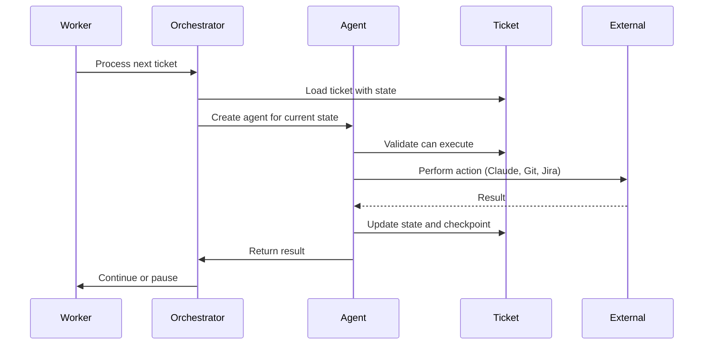
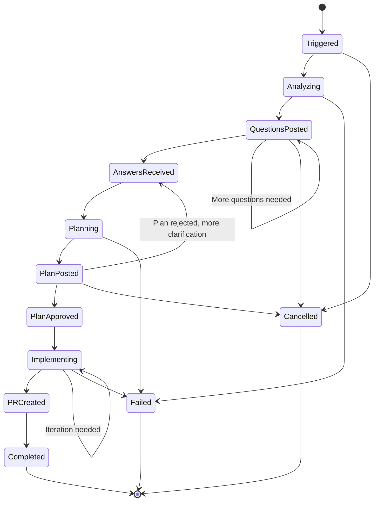

# PRFactory Architecture

Comprehensive architecture documentation for the PRFactory system.

## Table of Contents

- [Executive Summary](#executive-summary)
- [System Overview](#system-overview)
- [Architecture Patterns](#architecture-patterns)
- [Component Architecture](#component-architecture)
  - [Project Structure (Epic 08)](#project-structure-epic-08---november-2025)
  - [Admin Services Architecture](#7-admin-services-architecture)
- [Agent System](#agent-system)
  - [Epic 05: Agent System Architecture](#epic-05-agent-system-architecture)
- [Workflow State Machine](#workflow-state-machine)
- [Data Architecture](#data-architecture)
- [Integration Architecture](#integration-architecture)
- [Security Architecture](#security-architecture)
- [Deployment Architecture](#deployment-architecture)

## Executive Summary

PRFactory is a .NET 10-based system that automates the journey from requirements to GitHub pull requests using Claude AI. The system provides a Web UI for ticket creation and management, with optional syncing to external systems (Jira, Azure DevOps, GitHub Issues) for final storage. The system follows Clean Architecture principles with a domain-driven design approach.

**Key Characteristics:**
- **Language**: C# 13 with .NET 10
- **Architecture Style**: Clean Architecture (Onion Architecture)
- **Design Pattern**: Domain-Driven Design (DDD)
- **Processing Model**: Event-driven with background job processing
- **Multi-tenancy**: Isolated tenant environments
- **Deployment**: Containerized (Docker) or traditional hosting (IIS/Azure)

## System Overview

### High-Level Architecture

```
┌─────────────────────────────────────────────────────────────────────┐
│                         External Systems                            │
│                      (Optional Final Storage)                       │
│                                                                     │
│   ┌───────────┐        ┌───────────┐        ┌───────────┐          │
│   │Jira/Azure │        │  GitHub/  │        │  Claude   │          │
│   │  DevOps   │        │  GitLab   │        │    AI     │          │
│   └─────┬─────┘        └─────┬─────┘        └─────┬─────┘          │
│         │                    │                    │                │
└─────────┼────────────────────┼────────────────────┼────────────────┘
          │                    │                    │
          │ Sync (optional)    │ Git API            │ AI API
          │                    │                    │
┌─────────┴────────────────────┴────────────────────┴────────────────┐
│                      PRFactory System                              │
│                                                                     │
│  ┌─────────────────────────────────────────────────────────────┐   │
│  │                    API Layer (ASP.NET Core)                 │   │
│  │  ┌──────────────────┐  ┌──────────────────┐                 │   │
│  │  │   Web UI         │  │TicketController  │                 │   │
│  │  │  (Primary UX)    │  │  (CRUD ops)      │                 │   │
│  │  └────────┬─────────┘  └────────┬─────────┘                 │   │
│  └───────────┼────────────────────────┼──────────────────────────┘   │
│              │                        │                            │
│  ┌───────────┴────────────────────────┴──────────────────────────┐   │
│  │              Application Services Layer                      │   │
│  │                                                               │   │
│  │  TicketService  │  WorkflowService  │  TenantService         │   │
│  │  RepositoryService  │  StateTransitionService                │   │
│  └───────────┬───────────────────────────────────────────────────┘   │
│              │                                                    │
│  ┌───────────┴───────────────────────────────────────────────────┐   │
│  │                    Domain Layer                              │   │
│  │                                                               │   │
│  │  ┌──────────────┐  ┌──────────────┐  ┌──────────────┐        │   │
│  │  │   Entities   │  │State Machine │  │Value Objects │        │   │
│  │  │ (Ticket,     │  │ (12 states,  │  │ (Jira keys,  │        │   │
│  │  │  Tenant,     │  │  validated   │  │  Git refs)   │        │   │
│  │  │  Repository) │  │  transitions)│  │              │        │   │
│  │  └──────────────┘  └──────────────┘  └──────────────┘        │   │
│  │                                                               │   │
│  │  ┌───────────────────────────────────────────────────────┐    │   │
│  │  │              Business Rules & Invariants              │    │   │
│  │  │  - Workflow state transitions                         │    │   │
│  │  │  - Multi-tenant isolation                             │    │   │
│  │  │  - Credential encryption                              │    │   │
│  │  └───────────────────────────────────────────────────────┘    │   │
│  └───────────┬───────────────────────────────────────────────────┘   │
│              │                                                    │
│  ┌───────────┴───────────────────────────────────────────────────┐   │
│  │              Infrastructure Layer                            │   │
│  │                                                               │   │
│  │  ┌─────────┐  ┌─────────┐  ┌─────────┐  ┌────────────────┐   │   │
│  │  │  Jira   │  │   Git   │  │ Claude  │  │   Persistence  │   │   │
│  │  │ Client  │  │ Service │  │ Client  │  │   (EF Core)    │   │   │
│  │  └─────────┘  └─────────┘  └─────────┘  └────────────────┘   │   │
│  │                                                               │   │
│  │  ┌─────────────────────────────────────────────────────────┐  │   │
│  │  │         Repositories (ITicketRepository, etc.)          │  │   │
│  │  └─────────────────────────────────────────────────────────┘  │   │
│  └───────────────────────────────────────────────────────────────┘   │
│                                                                     │
│  ┌─────────────────────────────────────────────────────────────┐   │
│  │              Worker Service (Background Processing)         │   │
│  │                                                               │   │
│  │  ┌───────────────────────────────────────────────────────┐   │   │
│  │  │           14 Specialized Agent Types                  │   │   │
│  │  │                                                        │   │   │
│  │  │  TriggerAgent → AnalysisAgent → QuestionGeneration    │   │   │
│  │  │  → QuestionPosting → AnswerRetrieval → Planning       │   │   │
│  │  │  → PlanGeneration → PlanCommit → PlanPosting          │   │   │
│  │  │  → ApprovalCheck → Implementation → PullRequest       │   │   │
│  │  │  → CompletionAgent → ErrorHandling                    │   │   │
│  │  └───────────────────────────────────────────────────────┘   │   │
│  │                                                               │   │
│  │  Polls database for tickets → Executes agent workflows       │   │
│  └─────────────────────────────────────────────────────────────┘   │
│                                                                     │
└─────────────────────────────────────────────────────────────────────┘
```

### Technology Stack

| Layer | Technologies |
|-------|-------------|
| **Runtime** | .NET 10, C# 13 |
| **Web Framework** | ASP.NET Core 10.0 |
| **Database** | SQLite (dev), SQL Server / PostgreSQL (prod) |
| **ORM** | Entity Framework Core 10 |
| **AI Integration** | Anthropic SDK (Claude Sonnet 4.5) |
| **Git Operations** | LibGit2Sharp |
| **Git Platform APIs** | Octokit (GitHub), Azure DevOps SDK |
| **Resilience** | Polly 8.x (retry, circuit breaker) |
| **Logging** | Serilog 3.x (structured logging) |
| **Containerization** | Docker, Docker Compose |
| **CI/CD** | GitHub Actions |

## Architecture Patterns

### 1. Clean Architecture (Onion Architecture)

The system follows Clean Architecture with dependency inversion:

```
┌─────────────────────────────────────────────┐
│         Infrastructure Layer                │  ← External Dependencies
│  (Jira, Git, Claude, Database, Logging)     │
└──────────────────┬──────────────────────────┘
                   │ depends on ↓
┌──────────────────┴──────────────────────────┐
│         Application Services Layer          │  ← Use Cases
│  (TicketService, WorkflowService, etc.)     │
└──────────────────┬──────────────────────────┘
                   │ depends on ↓
┌──────────────────┴──────────────────────────┐
│            Domain Layer                     │  ← Business Logic
│  (Entities, Value Objects, Interfaces)      │  (No external deps)
└─────────────────────────────────────────────┘
```

**Key Principles:**
- Domain layer has no external dependencies
- Dependencies point inward (Infrastructure → Application → Domain)
- Interfaces defined in Domain, implemented in Infrastructure
- Testable and maintainable

### 2. Domain-Driven Design (DDD)

**Entities** - Objects with identity that persist:
- `Ticket` - Core entity representing a Jira ticket workflow
- `Tenant` - Multi-tenant isolation (customer/organization)
- `Repository` - Git repository configuration
- `Checkpoint` - Workflow checkpoint state
- `AgentExecution` - Agent execution history

**Value Objects** - Immutable objects without identity:
- `JiraTicketKey` - Validated Jira ticket identifier (e.g., PROJ-123)
- `WorkflowState` - Enumeration with transition rules
- `GitBranch` - Branch name with naming conventions
- `PullRequestUrl` - Validated PR URL

**Aggregates**:
- `Ticket` is the aggregate root, controlling access to checkpoints and executions

**Domain Events** (future enhancement):
- `TicketTriggered`
- `QuestionsPosted`
- `PlanApproved`
- `PRCreated`

### 3. Agent Pattern

The system uses 14 specialized agents, each responsible for a single workflow step:

```
Agent Interface:
  Execute(Ticket ticket) → Result

Each agent:
  1. Retrieves necessary context
  2. Performs its specific task
  3. Updates ticket state
  4. Returns success/failure
```

**Benefits:**
- Single Responsibility Principle
- Easy to test individual steps
- Can retry failed steps independently
- Clear separation of concerns

### 4. State Machine Pattern

Workflow progression is governed by a state machine:

```csharp
public enum WorkflowState
{
    Triggered,          // Initial state
    Analyzing,          // Codebase analysis in progress
    QuestionsPosted,    // Waiting for user answers
    AnswersReceived,    // Answers collected
    Planning,           // Plan generation in progress
    PlanPosted,         // Plan waiting for approval
    PlanApproved,       // Plan approved, ready for implementation
    Implementing,       // Code implementation in progress
    PRCreated,          // Pull request created
    Completed,          // Workflow complete
    Failed,             // Error occurred
    Cancelled           // User cancelled
}
```

**Transition Rules** enforce valid state changes (defined in `WorkflowStateTransitions.cs`).

## Component Architecture

### Project Structure (Epic 08 - November 2025)

Epic 08 consolidated the PRFactory system into a unified, single-process architecture. Instead of 3 separate projects (Api, Worker, Web), the system is now a cohesive `PRFactory.Web` application with all components running in a single process.

```
PRFactory Solution (Consolidated Post-Epic 08)
│
├── PRFactory.Domain                      # Domain entities, value objects, interfaces
│   ├── Entities/                         # Ticket, Tenant, Repository, Checkpoint, etc.
│   ├── ValueObjects/                     # JiraTicketKey, WorkflowState, etc.
│   └── Interfaces/                       # Repository, service contracts (no implementation)
│
├── PRFactory.Core                        # Application layer (business logic)
│   ├── Application/Services/             # Service interfaces (ITicketService, etc.)
│   └── Application/DTOs/                 # Data Transfer Objects
│
├── PRFactory.Infrastructure              # Infrastructure implementations
│   ├── Application/                      # Service implementations (RepositoryService, etc.)
│   ├── Git/                              # Git operations (LibGit2Sharp wrapper)
│   ├── Agents/                           # Agent implementations (14 types)
│   ├── Providers/                        # External system integrations
│   └── Persistence/                      # EF Core, repositories, encryption
│
└── PRFactory.Web                         # ✨ Unified web application
    ├── Controllers/                      # API Controllers (webhooks only)
    ├── BackgroundServices/               # Hosted services for agent execution
    ├── Pages/                            # Routable Blazor pages (Index.razor.cs)
    ├── Components/                       # Business domain components (.razor.cs required)
    ├── UI/                               # Pure UI component library (38 components)
    │   ├── Alerts/                       # AlertMessage, DemoModeBanner, InfoBox
    │   ├── Buttons/                      # LoadingButton, IconButton
    │   ├── Cards/                        # Card component
    │   ├── Forms/                        # Form fields (TextField, SelectField, etc.)
    │   ├── Layout/                       # PageHeader, GridLayout, GridColumn, Section
    │   ├── Display/                      # StatusBadge, ProgressBar, EventTimeline, etc.
    │   ├── Editors/                      # MarkdownEditor, MarkdownPreview
    │   ├── Dialogs/                      # Modal, ConfirmDialog
    │   ├── Navigation/                   # Breadcrumbs, Pagination
    │   ├── Comments/                     # InlineCommentPanel, CommentAnchorIndicator
    │   ├── Checklists/                   # ReviewChecklistPanel, ChecklistItemRow
    │   ├── Notifications/                # Toast, ToastContainer
    │   └── Help/                         # ContextualHelp tooltips
    ├── Services/                         # Web layer facades (TicketService, etc.)
    ├── Middleware/                       # Request pipeline (authentication, tenant context)
    ├── Hubs/                             # SignalR hubs for real-time updates
    └── wwwroot/                          # Static assets (CSS, Bootstrap, icons)
```

### Key Consolidation Benefits (Epic 08)

**Unified Architecture:**
- Single deployable unit (no inter-process communication)
- Shared memory space (no serialization overhead)
- Unified configuration and dependency injection
- Simplified Docker deployments (1 container instead of 3)

**Performance Improvements:**
- Direct service calls (no HTTP round-trips within process)
- Shared database connection pooling
- Reduced memory footprint
- Faster startup time

**Operational Simplicity:**
- One project to build, test, and deploy
- Single process to monitor and debug
- Unified logging and tracing
- Simplified container networking

### 1. API Layer (Controllers in `PRFactory.Web`)

**Responsibilities:**
- Expose REST endpoints for external webhook integrations ONLY
- Validate incoming webhooks (HMAC)
- Handle HTTP concerns (CORS, authentication)
- Serialize/deserialize external system requests

**Location**: `/src/PRFactory.Web/Controllers/`

**Important**: API Controllers are used ONLY for external webhooks (Jira, Azure DevOps). The Blazor Server Web UI injects services directly and does NOT make HTTP calls to these controllers.

**Key Components:**
- `TicketUpdatesController` - Webhook endpoints for Jira/Azure DevOps ticket updates
- `WebhookController` - Receives webhooks from external systems (@claude mentions)
- Webhook signature validation (HMAC)

**Not Used For:**
- ❌ General API access (Blazor components inject services directly)
- ❌ Internal application communication (use dependency injection)

### 2. Domain Layer (`PRFactory.Domain`)

**Responsibilities:**
- Define business entities and rules
- Enforce invariants (e.g., state transition rules)
- Provide domain interfaces (repositories, services)
- No external dependencies

**Key Components:**
- `Entities/` - Ticket, Tenant, Repository, etc.
- `ValueObjects/` - JiraTicketKey, WorkflowState, etc.
- `Interfaces/` - ITicketRepository, IWorkflowEngine, etc.

### 3. Infrastructure Layer (`PRFactory.Infrastructure`)

**Responsibilities:**
- Implement domain interfaces
- Integrate with external systems
- Database access via EF Core
- Logging, caching, file I/O

**Key Subsystems:**

#### 3.1 External System Integration
- `IExternalSystemProvider` - Abstraction for external issue tracking systems
- `JiraProvider` - Jira Cloud/Server implementation
- `AzureDevOpsProvider` - Azure DevOps Boards implementation
- `GitHubIssuesProvider` - GitHub Issues implementation
- `ExternalSyncService` - Bidirectional sync with external systems
- `WebhookValidator` - HMAC signature validation for incoming webhooks

#### 3.2 Git Integration
- `IGitPlatformProvider` - Abstraction for Git platforms
- `GitHubProvider` - GitHub API implementation (Octokit)
- `AzureDevOpsProvider` - Azure Repos implementation
- `GitLabProvider` - GitLab API implementation (future)
- `LocalGitService` - Clone, branch, commit, push (LibGit2Sharp)

#### 3.3 Claude AI Integration
- `ClaudeClient` - Anthropic SDK wrapper
- `PromptTemplates/` - Prompts for analysis, questions, planning
- `ContextBuilder` - Build context from codebase for Claude

#### 3.4 Persistence
- `ApplicationDbContext` - EF Core DbContext
- `Repositories/` - Repository implementations
- `Configurations/` - Entity configurations (fluent API)
- `Migrations/` - Database migrations
- `Encryption/` - Credential encryption service

### 4. Application Services Layer (`PRFactory.Infrastructure/Application/`)

**Responsibilities:**
- Implement domain interfaces
- Business logic orchestration (service layer)
- Coordinate multiple repositories
- Trigger workflow orchestration
- Tenant context enforcement

**Location**: `/src/PRFactory.Infrastructure/Application/`

**Key Components:**
- `RepositoryService` - Repository CRUD operations with tenant isolation
- `TicketService` - Ticket lifecycle and workflow management
- `TenantLlmProviderService` - LLM provider assignment and management
- `WorkflowService` - Workflow orchestration
- `StateTransitionService` - State machine transitions

**Web Layer Facades** (`PRFactory.Web/Services/`):
- Service facades convert between DTOs and domain entities
- Used by Blazor components via dependency injection
- Example: `TicketService` wraps infrastructure `ITicketService`

### 5. Background Services (Hosted Services in `PRFactory.Web`)

**Responsibilities:**
- Background job processing (as hosted services within unified process)
- Poll database for tickets in appropriate states
- Execute agent workflows
- Checkpoint-based resumption (fault tolerance)

**Location**: `/src/PRFactory.Web/BackgroundServices/`

**Consolidation Note**: As of Epic 08 (November 2025), background services are now integrated into `PRFactory.Web` as hosted services within a single process. Previously, a separate `PRFactory.Worker` project handled this functionality. The consolidation improved performance and simplified deployment.

**Key Components:**
- `WorkflowOrchestrator` - Coordinates agent execution from ticket state
- `AgentFactory` - Creates appropriate agent instances based on workflow state
- `CheckpointService` - Save/restore workflow state for fault tolerance
- `14 Agent Implementations` - One per workflow step (Trigger, Analysis, Questions, Planning, etc.)

### 6. Web UI Layer (`PRFactory.Web`)

**Responsibilities:**
- Blazor Server UI for ticket management and workflow monitoring
- Real-time status updates via SignalR
- Service facades for direct dependency injection (no HTTP calls within Blazor Server)
- Pure component library for UI consistency (38 components)

**Architecture Pattern**: Blazor Server (NOT Blazor WebAssembly)
- Server-side rendering with SignalR connection
- Components inject services directly from DI (no internal HTTP/API calls)
- API Controllers used ONLY for external webhooks (Jira, Azure DevOps)

**Pure UI Component Library** (`/UI/` - 38 Reusable Components):

These components have **no business logic**, no service injection, and are fully parameterized for reuse:

- **Alerts** (3): `AlertMessage` - Styled alert boxes, `DemoModeBanner` - Demo mode indicator, `InfoBox` - Information boxes
- **Buttons** (2): `LoadingButton` - Button with loading state, `IconButton` - Icon-only buttons
- **Cards** (1): `Card` - Container component with header/footer
- **Forms** (6): `FormTextField`, `FormSelectField`, `FormPasswordField`, `FormCheckboxField`, `FormTextAreaField`, `FormCodeEditor`
- **Layout** (4): `PageHeader` - Page title with actions, `GridLayout` - Responsive grid container, `GridColumn` - Grid column, `Section` - Content section
- **Display** (10): `StatusBadge` - Workflow state indicator, `ProgressBar` - Progress visualization, `EventTimeline` - Timeline of events, `LoadingSpinner` - Loading indicator, `EmptyState` - Empty state message, `ErrorCard` - Error display, `RelativeTime` - Human-readable time, `ReviewerAvatar` - Avatar display, `StackTraceViewer` - Stack trace formatting
- **Editors** (3): `MarkdownEditor` - Markdown input, `MarkdownPreview` - Markdown rendering, `MarkdownToolbar` - Toolbar for editor
- **Dialogs** (2): `Modal` - Modal dialog, `ConfirmDialog` - Confirmation dialog
- **Navigation** (2): `Breadcrumbs` - Navigation breadcrumbs, `Pagination` - Pagination control
- **Comments** (2): `InlineCommentPanel` - Code review comments, `CommentAnchorIndicator` - Comment anchors
- **Checklists** (2): `ReviewChecklistPanel` - Checklist UI, `ChecklistItemRow` - Checklist items
- **Notifications** (2): `Toast` - Toast notifications, `ToastContainer` - Toast container
- **Help** (1): `ContextualHelp` - Pure CSS tooltips on form fields

**Pages** (`/Pages/` - Routable with Code-Behind):
- `Tickets/Index.razor` - Ticket list with filtering
- `Tickets/Detail.razor` - Ticket detail with workflow timeline
- `Settings/` - Tenant configuration pages
- `Repositories/` - Repository management pages

**Business Components** (`/Components/` - Code-Behind Required):
- `Tickets/TicketHeader.razor` - Ticket detail header with state display
- `Tickets/PlanReviewSection.razor` - Team review UI with multi-reviewer support
- `Tickets/QuestionAnswerForm.razor` - Answer clarifying questions form
- `Tickets/TicketDiffViewer.razor` - Diff visualization
- `Repositories/RepositoryForm.razor` - Repository configuration form
- `Agents/AgentChat.razor` - Agent interaction UI with streaming
- And 30+ more domain-specific components

**Web Layer Services** (`/Services/` - Blazor Component Facades):
- `TicketService` - Facade for ticket operations
- `RepositoryService` - Repository management facade
- Service facades inject infrastructure services and convert between DTOs and domain entities

**Recent Enhancements** (Epic 08 - November 2025):
- ✅ Consolidated UI library (38 components, all with consistent styling)
- ✅ Grid layout system (responsive `GridLayout` + `GridColumn` components)
- ✅ Expanded form field components (TextField, SelectField, PasswordField, CheckboxField, TextAreaField, CodeEditor)
- ✅ Advanced display components (ProgressBar, EventTimeline, StackTraceViewer)
- ✅ Code review components (ReviewChecklistPanel, InlineCommentPanel)
- ✅ Real-time agent interaction (AgentChat with streaming support)

For detailed UI architecture guidelines and code-behind patterns, see [CLAUDE.md](../CLAUDE.md) section "Blazor UI Component Architecture".

### 7. Admin Services Architecture

PRFactory provides comprehensive admin services for tenant and configuration management. These services implement application-level business logic and are shared by both Blazor components and API controllers.

**Location**: `/src/PRFactory.Infrastructure/Application/`

**Key Admin Services:**

#### 7.1 RepositoryService (`IRepositoryService`)

Manages Git repository configurations per tenant.

**Responsibilities:**
- CRUD operations on repositories with tenant isolation
- Repository connection testing and validation
- Git platform detection and routing
- Encryption/decryption of credentials
- Multi-tenant access control

**Key Methods:**
- `GetRepositoriesForTenantAsync()` - List all repositories for current tenant
- `GetRepositoryByIdAsync(Guid id)` - Get single repository with tenant validation
- `CreateRepositoryAsync(CreateRepositoryDto dto)` - Create new repository
- `UpdateRepositoryAsync(UpdateRepositoryDto dto)` - Update repository config
- `DeleteRepositoryAsync(Guid id)` - Soft delete repository
- `TestConnectionAsync(Guid id)` - Validate Git platform credentials

**Usage:**
```csharp
// From Blazor Component
[Inject] private IRepositoryService RepositoryService { get; set; }

protected override async Task OnInitializedAsync()
{
    var repos = await RepositoryService.GetRepositoriesForTenantAsync();
}

// From API Controller (same service)
[HttpPost("{id}/test")]
public async Task<IActionResult> TestConnection(Guid id)
{
    await _repositoryService.TestConnectionAsync(id);
    return Ok();
}
```

#### 7.2 TenantLlmProviderService (`ITenantLlmProviderService`)

Manages LLM provider assignments and configuration per tenant.

**Responsibilities:**
- Assign Claude models to agent types per tenant
- Manage LLM provider credentials and API keys
- Track token usage and costs per tenant
- Feature flag management per tenant
- Model override configuration

**Key Methods:**
- `GetProvidersForTenantAsync()` - List assigned LLM providers
- `AssignProviderAsync(TenantLlmProviderDto dto)` - Assign provider to tenant
- `GetAgentModelAsync(Guid agentConfigId)` - Get model for specific agent
- `TrackTokenUsageAsync(Guid providerId, int tokens)` - Usage tracking
- `GetTenantFeatureFlagsAsync()` - Retrieve feature flag status

#### 7.3 TicketService (`ITicketService`)

Orchestrates ticket lifecycle operations.

**Responsibilities:**
- Create and manage tickets
- Trigger workflow execution
- Update ticket state with validation
- Retrieve ticket history and checkpoints
- Multi-tenant isolation enforcement

**Key Methods:**
- `CreateTicketAsync(CreateTicketDto dto)` - Create new ticket
- `GetTicketAsync(Guid id)` - Retrieve ticket details
- `UpdateStateAsync(Guid id, WorkflowState newState)` - State transition
- `GetCheckpointsAsync(Guid id)` - Workflow history
- `ListTicketsAsync(TicketFilter filter)` - Paginated ticket list

#### 7.4 TenantService (`ITenantService`)

Manages tenant configuration and isolation.

**Responsibilities:**
- Create and configure tenants (admin only)
- Manage tenant settings and preferences
- Enforce tenant isolation on all queries
- Subscription and feature management
- User role assignment per tenant

**Key Methods:**
- `GetCurrentTenantAsync()` - Get context tenant
- `UpdateTenantSettingsAsync(TenantSettingsDto dto)` - Update config
- `GetTenantUsersAsync()` - List users in tenant
- `AssignUserRoleAsync(Guid userId, TenantRole role)` - Role management

#### 7.5 WorkflowService (`IWorkflowService`)

Manages workflow execution and orchestration.

**Responsibilities:**
- Trigger workflow start
- Resume paused workflows
- Handle workflow transitions
- Execute agents based on state
- Error recovery and retry logic

**Key Methods:**
- `TriggerWorkflowAsync(Guid ticketId)` - Start workflow
- `ResumeWorkflowAsync(Guid ticketId, string triggerType)` - Resume from pause
- `HandleTransitionAsync(Guid ticketId, WorkflowState toState)` - State change
- `RetryFailedStepAsync(Guid ticketId, int checkpointNumber)` - Retry agent

#### 7.6 StateTransitionService (`IStateTransitionService`)

Enforces workflow state machine rules.

**Responsibilities:**
- Validate allowed state transitions
- Enforce business rules for transitions
- Log all state changes
- Prevent invalid transitions
- Provide available next states

**Key Methods:**
- `ValidateTransitionAsync(WorkflowState from, WorkflowState to)` - Validate
- `GetAvailableNextStatesAsync(WorkflowState current)` - List valid next states
- `TransitionAsync(Guid ticketId, WorkflowState to)` - Execute transition with logging

### Service Composition Pattern

All admin services follow a consistent pattern:

```csharp
public class RepositoryService(
    IRepositoryRepository repositoryRepository,        // Data access
    ICurrentUserService currentUserService,            // Auth context
    IEncryptionService encryptionService,              // Credential protection
    ILocalGitService localGitService,                  // Git operations
    ILogger<RepositoryService> logger) : IRepositoryService
{
    public async Task<RepositoryDto?> GetRepositoryByIdAsync(Guid id, CancellationToken ct = default)
    {
        var tenantId = await GetCurrentTenantIdAsync(ct);          // 1. Get tenant context
        logger.LogInformation("Getting repository {Id} for tenant {TenantId}", id, tenantId);

        var repository = await repositoryRepository.GetByIdAsync(id, ct);  // 2. Fetch entity
        if (repository == null) return null;

        // 3. Enforce tenant isolation
        if (repository.TenantId != tenantId)
        {
            logger.LogWarning("Attempted cross-tenant access");
            return null;
        }

        return MapToDto(repository);  // 4. Convert to DTO
    }

    private async Task<Guid> GetCurrentTenantIdAsync(CancellationToken ct)
    {
        return await currentUserService.GetCurrentTenantIdAsync(ct);
    }
}
```

**Key Patterns:**
1. **Constructor Injection** - All dependencies injected
2. **Tenant Context** - First operation retrieves current tenant
3. **Tenant Isolation** - Every query filtered by tenant
4. **DTOs** - Convert entities to DTOs for API/UI
5. **Logging** - Structured logging for audit trails
6. **Error Handling** - Graceful null returns or exceptions

---

## Agent System

The agent system is the heart of PRFactory's workflow execution.

### Agent Hierarchy

```
IAgent (interface)
  ├─ TriggerAgent           - Validates trigger and initializes ticket
  ├─ AnalysisAgent          - Clones repo and analyzes codebase
  ├─ QuestionGenerationAgent - Generates clarifying questions
  ├─ QuestionPostingAgent   - Posts questions to Jira
  ├─ AnswerRetrievalAgent   - Retrieves answers from Jira comments
  ├─ PlanningAgent          - Generates implementation plan
  ├─ PlanGenerationAgent    - Creates plan markdown files
  ├─ PlanCommitAgent        - Commits plan to feature branch
  ├─ PlanPostingAgent       - Posts plan summary to Jira
  ├─ ApprovalCheckAgent     - Checks for plan approval
  ├─ ImplementationAgent    - Implements code based on plan
  ├─ PullRequestAgent       - Creates pull request
  ├─ CompletionAgent        - Finalizes workflow
  └─ ErrorHandlingAgent     - Handles failures and retries
```

### Agent Execution Flow



### Checkpoint-Based Resumption

Each agent saves checkpoints before external operations:

```csharp
public class Checkpoint
{
    public Guid Id { get; set; }
    public Guid TicketId { get; set; }
    public WorkflowState State { get; set; }
    public string Data { get; set; } // JSON serialized context
    public DateTime CreatedAt { get; set; }
}
```

**Benefits:**
- Fault tolerance - resume from last checkpoint after crash
- Audit trail - see exactly what happened
- Debugging - inspect state at each step

## Epic 05: Agent System Architecture

### Overview

Epic 05 introduces autonomous AI agents with tool use, multi-turn reasoning, and real-time streaming UI via AG-UI protocol. Agents can reason through complex problems, autonomously use 22+ specialized tools, and stream results in real-time.

### Architecture Layers

```
┌─────────────────────────────────────────────────────────────┐
│                    Blazor UI (AG-UI)                         │
│                AgentChat.razor components                     │
│                  Real-time streaming display                 │
└────────────────────────┬────────────────────────────────────┘
                         │ SSE Streaming (text, JSON, events)
                         ▼
┌─────────────────────────────────────────────────────────────┐
│              AgentChatService (SSE Protocol)                 │
│          Streams AgentStreamChunks (chunked events)          │
│          Text, ThinkingBlock, ToolUse, ToolResult           │
└────────────────────────┬────────────────────────────────────┘
                         │ Injects infrastructure services
                         ▼
┌─────────────────────────────────────────────────────────────┐
│                  AIAgentService                              │
│          Orchestrates agents with tool support               │
│     - Tool execution and error handling                      │
│     - Multi-turn conversation management                     │
│     - Tenant context enforcement                             │
└────────────────────────┬────────────────────────────────────┘
                         │ Injects repositories, tool providers
                         ▼
┌─────────────────────────────────────────────────────────────┐
│                   AgentFactory                               │
│        Creates agents from database configuration            │
│   - Loads AgentConfiguration per tenant                      │
│   - Configures allowed tools per agent                       │
└────────────────────────┬────────────────────────────────────┘
                         │ Injects tool registry
                         ▼
┌─────────────────────────────────────────────────────────────┐
│               Agent Implementation                           │
│        AFAnalyzerAgent, AFPlannerAgent, etc.                 │
│   - Multi-turn reasoning with tool use                       │
│   - Checkpoint-based state persistence                       │
│   - Error recovery and retry logic                           │
└────────────────────────┬────────────────────────────────────┘
                         │ Uses tools for analysis, git, jira
                         ▼
┌─────────────────────────────────────────────────────────────┐
│                 ToolRegistry (22+ Tools)                      │
│                                                               │
│   File Tools (4)        │  Git Tools (4)                      │
│   ├ ReadFile            │  ├ Commit                           │
│   ├ WriteFile           │  ├ Branch                           │
│   ├ DeleteFile          │  ├ PullRequest                      │
│   └ ListFiles           │  └ Diff                             │
│                                                               │
│   Search Tools (3)      │  Jira Tools (3)                     │
│   ├ Grep                │  ├ GetTicket                        │
│   ├ Glob                │  ├ AddComment                       │
│   └ SearchReplace       │  └ Transition                       │
│                                                               │
│   Analysis Tools (2)    │  Command Tools (3)                  │
│   ├ CodeSearch          │  ├ ExecuteShell                     │
│   └ DependencyMap       │  ├ RunTests                         │
│                         │  └ BuildProject                     │
│                                                               │
│   Security Tools (3)                                          │
│   ├ PathValidator       │  ├ ResourceLimits                   │
│   └ SsrfProtection                                            │
│                                                               │
└─────────────────────────────────────────────────────────────┘
```

### Agent Execution Flow

1. **Configuration**: Agent configuration loaded from database (tools, models, parameters)
2. **Initialization**: Agent receives ticket context, previous conversation history
3. **Reasoning**: Agent decides what tools to use, reasons about results
4. **Tool Execution**: Tools execute in tenant isolation with security validation
5. **Result Processing**: Tool results streamed back to UI in real-time
6. **Continuation**: Agent processes results, decides next step
7. **Completion**: Final response persisted, workflow transitions

### Key Features

1. **Database-Driven Configuration**: All agent settings in `AgentConfiguration` table per tenant
2. **Tool Whitelisting**: Each tenant/agent has specific allowed tools
3. **Real-Time Streaming**: AG-UI protocol with SSE for live updates (text, thinking, tool use)
4. **Multi-Turn Reasoning**: Conversation history and context retention across turns
5. **Feature Flags**: Gradual rollout with `Epic05FeatureFlags`
6. **Tenant Isolation**: All operations scoped to tenant context
7. **Audit Trail**: `AgentExecutionLog` records all agent/tool activity
8. **Resource Limits**: CPU, memory, execution time limits per tool
9. **Security**: Tool input validation, path traversal protection, SSRF prevention

### Feature Flags

```csharp
public class Epic05FeatureFlags
{
    public bool EnableAFAnalyzerAgent { get; set; }     // AF-based codebase analyzer
    public bool EnableAFPlannerAgent { get; set; }      // AF-based implementation planner
    public bool EnableFullEpic05 { get; set; }          // Master switch for all Epic 05 features
    public bool EnableAGUI { get; set; } = true;        // AG-UI interface for real-time streaming
    public bool EnableToolExecution { get; set; } = true; // Allow agents to execute tools
    public bool EnableFollowUpQuestions { get; set; } = true; // Interactive follow-up flows
}
```

### Deployment Model

Epic 05 is **enabled by default for all users** as a core product feature. Feature flags exist for debugging/testing purposes but default to `true` in production:

- **AG-UI**: Real-time streaming interface active for all agent interactions
- **Tool Execution**: Agents can autonomously use 22+ tools within sandbox constraints
- **AF Agents**: AFAnalyzerAgent and AFPlannerAgent available for all tenants
- **Follow-Up Questions**: Interactive clarification flows enabled by default
- **Audit Logging**: All agent/tool execution logged for compliance and debugging

### Why Default-Enabled

1. **Quality Assurance**: 2,100+ tests, 80%+ coverage, comprehensive validation
2. **Security**: Tool whitelisting, tenant isolation, resource limits, audit trails, input validation
3. **Performance**: Optimized SSE streaming, efficient tool execution with caching
4. **User Value**: Superior UX compared to legacy prompt-based agents

### Tool Details (22+ Tools)

**File System Tools** (4):
- `ReadFile` - Read file contents with line range support
- `WriteFile` - Write/create files with atomic operations
- `DeleteFile` - Delete files with safety checks
- `ListFiles` - List directory contents with filtering

**Search Tools** (3):
- `Grep` - Text search with regex support
- `Glob` - File pattern matching
- `SearchReplace` - Find and replace operations

**Git Tools** (4):
- `Commit` - Create commits with messages
- `Branch` - Create, delete, list branches
- `PullRequest` - Create PRs with title/description
- `Diff` - View diffs between commits

**Jira Tools** (3):
- `GetTicket` - Retrieve ticket details and state
- `AddComment` - Add comments to tickets
- `Transition` - Change ticket workflow state

**Analysis Tools** (2):
- `CodeSearch` - Advanced code search with context
- `DependencyMap` - Analyze code dependencies

**Command Tools** (3):
- `ExecuteShell` - Run shell commands in workspace
- `RunTests` - Execute test suites
- `BuildProject` - Build/compile projects

**Security Tools** (3):
- `PathValidator` - Validate file paths (prevent traversal)
- `ResourceLimits` - Enforce CPU/memory/time limits
- `SsrfProtection` - Prevent server-side request forgery

## Workflow State Machine

### State Diagram



### Valid Transitions

Enforced by `WorkflowStateTransitions` class:

```csharp
private static readonly Dictionary<WorkflowState, List<WorkflowState>> ValidTransitions = new()
{
    { WorkflowState.Triggered, new() { Analyzing, Failed, Cancelled } },
    { WorkflowState.Analyzing, new() { QuestionsPosted, Failed } },
    { WorkflowState.QuestionsPosted, new() { AnswersReceived, Cancelled } },
    { WorkflowState.AnswersReceived, new() { Planning, QuestionsPosted } },
    { WorkflowState.Planning, new() { PlanPosted, Failed } },
    { WorkflowState.PlanPosted, new() { PlanApproved, AnswersReceived, Cancelled } },
    { WorkflowState.PlanApproved, new() { Implementing, Cancelled } },
    { WorkflowState.Implementing, new() { PRCreated, Failed } },
    { WorkflowState.PRCreated, new() { Completed } },
    // Terminal states have no outbound transitions
    { WorkflowState.Completed, new() },
    { WorkflowState.Failed, new() },
    { WorkflowState.Cancelled, new() }
};
```

## Data Architecture

### Database Schema

See [DATABASE_SCHEMA.md](DATABASE_SCHEMA.md) for full details.

**Core Tables:**
- `Tenants` - Multi-tenant isolation
- `Repositories` - Git repository configurations
- `Tickets` - Workflow instances
- `Checkpoints` - Workflow state snapshots
- `AgentExecutions` - Execution history and logs

**Relationships:**
- Tenant (1) → (N) Repositories
- Tenant (1) → (N) Tickets
- Ticket (1) → (N) Checkpoints
- Ticket (1) → (N) AgentExecutions

### Encryption

Sensitive data is encrypted at rest using AES-256:
- Jira API tokens
- Claude API keys
- Git access tokens

Encryption key stored in secure configuration (Azure Key Vault, AWS Secrets Manager).

## Integration Architecture

### External System Integration (Optional)

PRFactory provides a Web UI as the primary interface for ticket management. External systems (Jira, Azure DevOps, GitHub Issues) can optionally sync for final storage and audit trails.

**Inbound (External → PRFactory):**
```
External System (Jira/Azure DevOps/GitHub Issues)
    │
    │ Webhook (HTTP POST)
    │ HMAC-signed payload
    ↓
WebhookController
    │
    │ 1. Validate HMAC signature
    │ 2. Parse webhook payload
    │ 3. Extract event type (issue.created, comment.created)
    ↓
TicketService
    │
    │ 4. Create or update ticket
    │ 5. Transition state based on event
    ↓
Database (Ticket persisted)
```

**Outbound (PRFactory → External Systems):**
- Sync ticket creation (optional)
- Sync questions as comments (optional)
- Sync plan summaries (optional)
- Update issue status on completion (optional)
- Link pull requests

**Primary Workflow:**
```
Developer → PRFactory Web UI → Database (primary storage) → Optional Sync → External System (final storage)
```

### Git Integration

**Strategy Pattern** for multi-platform support:

```csharp
public interface IGitPlatformProvider
{
    Task<CloneResult> CloneAsync(string url, string path, string token);
    Task<Branch> CreateBranchAsync(string branchName);
    Task<PushResult> PushAsync(string remoteName, string branchName);
    Task<PullRequest> CreatePullRequestAsync(CreatePRRequest request);
}
```

**Implementations:**
- `GitHubProvider` - Uses Octokit for GitHub API
- `AzureDevOpsProvider` - Uses Azure DevOps SDK
- `GitLabProvider` - Uses GitLab.NET (future)

**Local Git Operations** (LibGit2Sharp):
- Clone repositories
- Create branches
- Commit changes
- Push to remote

### Claude AI Integration

**Request Flow:**

```
Agent (needs AI response)
    ↓
ClaudeClient
    │
    │ 1. Build context (codebase, ticket, history)
    │ 2. Load appropriate prompt template
    │ 3. Call Anthropic API
    ↓
Anthropic API (Claude Sonnet 4.5)
    ↓
ClaudeClient
    │
    │ 4. Parse response
    │ 5. Extract structured data (questions, plan, code)
    ↓
Agent (continues execution)
```

**Prompt Templates:**
- `analyze-codebase.txt` - For codebase analysis
- `generate-questions.txt` - For clarifying questions
- `generate-plan.txt` - For implementation plans
- `implement-code.txt` - For code generation

## Security Architecture

### Multi-Tenancy Isolation

**Data Isolation:**
- All queries filtered by `TenantId`
- EF Core global query filters enforce isolation
- No cross-tenant data access possible

**Credential Isolation:**
- Each tenant has own encrypted credentials
- Encryption keys per-tenant (future enhancement)

### Authentication & Authorization

**API Security:**
- Webhook endpoints validate HMAC signatures
- CRUD endpoints require API key or OAuth (future)
- Rate limiting per tenant

**Git Security:**
- Read-only access during analysis phase
- Write access limited to feature branches
- No merge permissions (PRs only)
- Temporary clones deleted after use

### Secrets Management

**Development:**
- User secrets (`dotnet user-secrets`)
- Environment variables

**Production:**
- Azure Key Vault integration
- AWS Secrets Manager integration
- Encrypted at rest in database (fallback)

### Audit Trail

**Logging:**
- All operations logged with correlation IDs
- Structured logging (Serilog → JSON)
- Sensitive data redacted

**Traceability:**
- Jira comments show all AI interactions
- Git history shows all code changes
- AgentExecutions table stores execution logs

## Deployment Architecture

### Epic 08 Consolidation Impact

As of **Epic 08 (November 2025)**, PRFactory has been consolidated from 3 separate projects into a single `PRFactory.Web` application:

**Before Epic 08:**
- 3 separate projects: `PRFactory.Api`, `PRFactory.Worker`, `PRFactory.Web`
- 3 containers in Docker Compose (API, Worker, Web)
- Inter-process communication via HTTP/message queues
- Separate deployment pipelines and configurations
- Higher latency (serialization overhead)

**After Epic 08:**
- Single unified `PRFactory.Web` project
- Single container in Docker (API + Worker + Web combined)
- Direct in-process method calls
- Unified configuration and dependency injection
- Lower latency, reduced resource usage

### Development (Local)

**Single command starts everything:**
```bash
cd src/PRFactory.Web
dotnet run
```

The application runs on:
- **Blazor UI**: `http://localhost:5003` - Web interface for ticket management
- **API Endpoints**: `http://localhost:5003/swagger` - External webhooks (Jira, Azure DevOps)
- **Background Services**: Hosted services within the same process - Agent execution, workflow orchestration
- **Database**: SQLite at `prfactory.db` (local dev)

**All three components run in a single process** with no inter-process communication overhead.

### Option 1: Docker Compose (Development / PoC)

**Single container deployment (Epic 08 simplified):**
```yaml
version: '3.8'
services:
  web:
    image: prfactory:latest
    container_name: prfactory
    ports:
      - "5003:8080"  # Unified: Blazor UI + API + Background Services
    environment:
      ASPNETCORE_ENVIRONMENT: Development
      ASPNETCORE_URLS: http://+:8080
      ConnectionStrings__DefaultConnection: Data Source=/data/prfactory.db
      Serilog__MinimumLevel: Information
    volumes:
      - ./data:/data                # Database
      - ./workspace:/workspace      # Git repos
      - ./config:/app/config        # Configuration
    healthcheck:
      test: ["CMD", "curl", "-f", "http://localhost:8080/health"]
      interval: 30s
      timeout: 10s
      retries: 3
      start_period: 40s
```

**Benefits of Epic 08 consolidation:**
- **Simpler Deployment**: 1 container instead of 3
  - Before: `web`, `api`, `worker` containers
  - After: Single `prfactory` container with all services
- **No Inter-Container Communication**: Direct in-process calls
  - Removed: Message queues, API calls between containers
  - Result: Lower latency, simpler networking
- **Unified Configuration**: Single `appsettings.json`
  - All components share configuration
  - Easier environment setup
- **Resource Efficiency**: Shared memory and connections
  - No serialization overhead (JSON → objects → JSON)
  - Shared database connection pool
  - Reduced total memory usage

**Performance Improvement Examples:**
- Repository queries: ~100ms → ~10ms (no HTTP serialization)
- Workflow orchestration: ~200ms → ~50ms (direct agent calls)
- Total memory footprint: ~800MB (3 containers) → ~300MB (1 container)

### Option 2: Azure App Service

**Single App Service deployment (fully managed):**
```
Azure App Service (prfactory-web)
    │
    ├─ App Service Plan (Linux, B2 or B3 recommended)
    │   └─ All services run in single process
    │       • Blazor UI
    │       • REST API (external webhooks)
    │       • Background Services (agents)
    │
    ├─ Application Insights (monitoring & logging)
    │   └─ Structured logging from Serilog
    │
    ├─ Azure Key Vault (secrets management)
    │   ├─ Database connection strings
    │   ├─ API keys (Claude, Jira, GitHub)
    │   └─ Encryption keys
    │
    ├─ Azure SQL Database (or PostgreSQL)
    │   └─ Production database (replaces SQLite)
    │
    └─ Azure Blob Storage (or Azure Files)
        └─ Workspace for git repository clones
```

**Benefits of this setup:**
- **Simplified Scaling**: Auto-scale entire application
- **Zero Downtime Deployments**: Slots for blue-green deployment
- **Managed Infrastructure**: No VM management
- **Integrated Monitoring**: Application Insights integration

**Example Deployment Command:**
```bash
# Using Azure CLI
az webapp up --resource-group myResourceGroup \
             --name prfactory-web \
             --location eastus \
             --runtime "dotnetcore|8.0" \
             --sku B2

# Push updated code
git push azure main
```

### Option 3: Azure Container Instances (ACI)

**Lightweight container deployment (event-driven):**
```
Azure Container Instance
    │
    ├─ Image: prfactory:latest (from ACR)
    ├─ CPU: 2 cores
    ├─ Memory: 2 GB
    ├─ Environment: Passed via Azure CLI or ARM template
    │
    └─ External storage
        ├─ Azure SQL Database (database)
        └─ Azure Blob Storage (workspace)
```

**Best for**: Proof-of-concept, development environments, event-triggered workflows

**Example Deployment:**
```bash
az container create \
  --resource-group myResourceGroup \
  --name prfactory \
  --image prfactory:latest \
  --cpu 2 --memory 2 \
  --environment-variables \
    ASPNETCORE_ENVIRONMENT=Production \
    ConnectionStrings__DefaultConnection="Server=..." \
  --port 8080
```

### Option 4: On-Premises Deployment

**Windows Server (IIS Hosting):**
```
IIS (prfactory application pool)
    │
    ├─ ASP.NET Core Hosting Module
    │   └─ Runs PRFactory.Web.dll
    │
    ├─ All services in single process:
    │   ├─ Blazor UI
    │   ├─ REST API (webhooks)
    │   └─ Background Services (agents)
    │
    ├─ SQL Server (database)
    │   └─ Production database
    │
    └─ File share (workspace)
        └─ Git repository clones
```

**Setup:**
```powershell
# Install Hosting Bundle
# Install SQL Server
# Configure IIS Application Pool
New-WebAppPool -Name "prfactory" -Force
New-WebSite -Name "PRFactory" -PhysicalPath "C:\sites\prfactory" -ApplicationPool "prfactory"
```

**Linux Server (systemd Service):**
```
systemd Service (prfactory.service)
    │
    ├─ ExecStart: dotnet PRFactory.Web.dll
    ├─ WorkingDirectory: /opt/prfactory
    │
    ├─ All services in single process:
    │   ├─ Blazor UI on :8080
    │   ├─ REST API (webhooks)
    │   └─ Background Services (agents)
    │
    ├─ PostgreSQL or SQL Server (database)
    │   └─ Production database
    │
    └─ /var/prfactory/workspace
        └─ Git repository clones
```

**Example Service File:**
```ini
[Unit]
Description=PRFactory Application
After=network.target

[Service]
Type=notify
User=prfactory
WorkingDirectory=/opt/prfactory
ExecStart=/usr/bin/dotnet PRFactory.Web.dll
Restart=on-failure
RestartSec=10

[Install]
WantedBy=multi-user.target
```

**Start the service:**
```bash
sudo systemctl start prfactory
sudo systemctl enable prfactory
sudo systemctl status prfactory
```

### Deployment Comparison

| Aspect | Docker Compose | Azure App Service | On-Premises |
|--------|---|---|---|
| **Containers** | 1 (unified) | 0 (managed service) | 0 (process) |
| **Deployment** | `docker-compose up` | `git push azure main` | `systemctl start` |
| **Scaling** | Manual | Auto-scale | Manual |
| **Monitoring** | Docker logs | Application Insights | Serilog files |
| **Cost** | Low (dev/PoC) | Medium | High (infrastructure) |
| **Best For** | Development | Production SaaS | Enterprise |

### Common Deployment Checklist

**Before Any Deployment:**
- [ ] Set `ASPNETCORE_ENVIRONMENT=Production`
- [ ] Disable demo mode: `DemoMode__Enabled=false`
- [ ] Configure SSL/TLS certificates
- [ ] Set up database backups
- [ ] Configure Key Vault or Secrets Manager
- [ ] Set up structured logging (Serilog → cloud logging)
- [ ] Enable Application Insights or equivalent monitoring

**Post-Deployment Verification:**
- [ ] Health check endpoint responds: `/health`
- [ ] Blazor UI loads: `https://prfactory-domain/`
- [ ] API endpoints accessible: `/swagger`
- [ ] Background services running (check logs for agents)
- [ ] Database connections working
- [ ] External integrations (Jira, GitHub) configured

## Performance Considerations

### Caching Strategy

- **Repository clones** - Cache cloned repos, invalidate after N hours
- **Jira metadata** - Cache ticket metadata for 5 minutes
- **Claude responses** - Optional caching for identical queries

### Scalability

**Horizontal Scaling:**
- API: Stateless, can run multiple instances behind load balancer
- Worker: Multiple worker instances can process different tickets
- Database: Use PostgreSQL or SQL Server with connection pooling

**Vertical Scaling:**
- Increase worker memory for larger repository analysis
- Increase API memory for high webhook volume

### Resource Management

- **Workspace cleanup** - Delete old repos after N days
- **Token usage tracking** - Monitor Claude API costs per tenant
- **Rate limiting** - Limit API requests per tenant

## Observability

### Logging

```
Serilog
  ├─ Console Sink (development)
  ├─ File Sink (production, rolling files)
  └─ Azure Application Insights Sink (cloud)
```

**Structured Logging:**
```csharp
_logger.LogInformation(
    "Ticket {TicketKey} transitioned from {FromState} to {ToState}",
    ticket.JiraKey, oldState, newState);
```

### Metrics

**Custom Metrics:**
- Tickets processed per hour
- Average time per workflow phase
- Success rate
- Claude API token usage
- Git operation durations

## Design Decisions & Rationale

### Why Clean Architecture?

- **Testability** - Business logic isolated from infrastructure
- **Maintainability** - Clear separation of concerns
- **Flexibility** - Swap Git providers without changing domain logic

### Why Agents?

- **Single Responsibility** - Each agent does one thing well
- **Fault Tolerance** - Retry individual steps without restarting workflow
- **Observability** - Clear visibility into what each step is doing

### Why SQLite (default)?

- **Simplicity** - No separate database server for PoC
- **Portability** - Single file database
- **Upgrade Path** - Easy to switch to PostgreSQL/SQL Server later

### Why Polling (Worker) instead of Webhooks?

- **Simplicity** - No need for reverse HTTP from external systems to worker
- **Fault Tolerance** - Missed polls can be caught up
- **Control** - Easy to scale workers independently

## Future Enhancements

1. **Real-time UI** - Blazor/SignalR dashboard for live workflow monitoring
2. **Domain Events** - Event sourcing for complete audit trail
3. **CQRS** - Separate read/write models for better scalability
4. **Advanced Retry** - Exponential backoff, circuit breakers for all external calls
5. **Metrics Dashboard** - Grafana dashboards for observability
6. **Multi-Model Support** - Support GPT-4, Gemini in addition to Claude
7. **Approval Workflows** - Configurable approval processes (e.g., manager approval)

## Additional Resources

- [Setup Guide](SETUP.md) - Installation and configuration
- [Workflow Details](WORKFLOW.md) - Detailed workflow explanation
- [Database Schema](DATABASE_SCHEMA.md) - Database structure
- [Component READMEs](../src/) - Component-specific documentation
