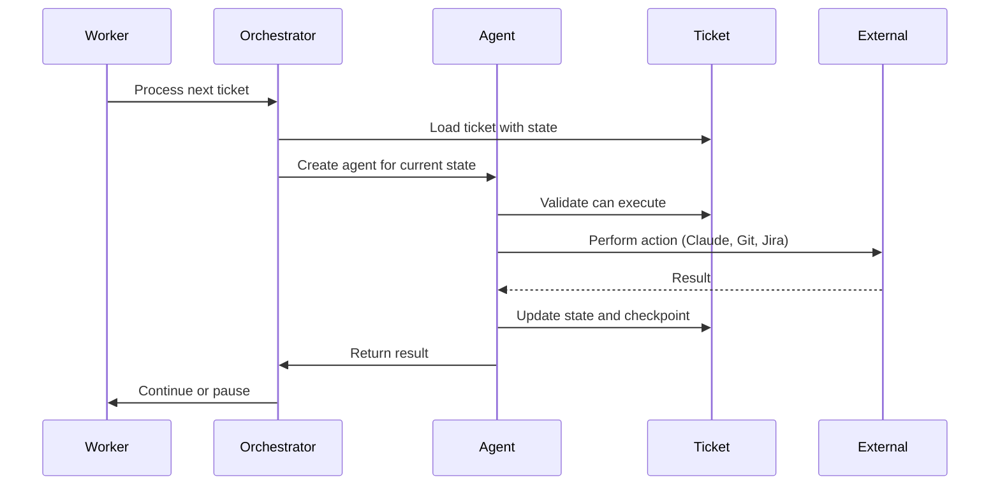
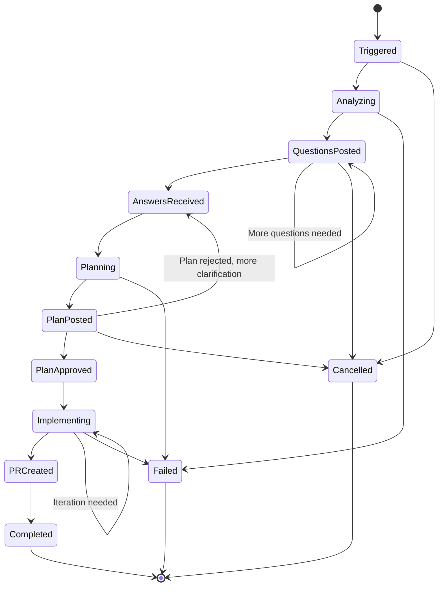

# PRFactory Architecture

Comprehensive architecture documentation for the PRFactory system.

## Table of Contents

- [Executive Summary](#executive-summary)
- [System Overview](#system-overview)
- [Architecture Patterns](#architecture-patterns)
- [Component Architecture](#component-architecture)
- [Agent System](#agent-system)
- [Workflow State Machine](#workflow-state-machine)
- [Data Architecture](#data-architecture)
- [Integration Architecture](#integration-architecture)
- [Security Architecture](#security-architecture)
- [Deployment Architecture](#deployment-architecture)

## Executive Summary

PRFactory is a .NET 10-based system that automates the journey from requirements to GitHub pull requests using Claude AI. The system provides a Web UI for ticket creation and management, with optional syncing to external systems (Jira, Azure DevOps, GitHub Issues) for final storage. The system follows Clean Architecture principles with a domain-driven design approach.

**Key Characteristics:**
- **Language**: C# 13 with .NET 10
- **Architecture Style**: Clean Architecture (Onion Architecture)
- **Design Pattern**: Domain-Driven Design (DDD)
- **Processing Model**: Event-driven with background job processing
- **Multi-tenancy**: Isolated tenant environments
- **Deployment**: Containerized (Docker) or traditional hosting (IIS/Azure)

## System Overview

### High-Level Architecture

```
┌─────────────────────────────────────────────────────────────────────┐
│                         External Systems                            │
│                      (Optional Final Storage)                       │
│                                                                     │
│   ┌───────────┐        ┌───────────┐        ┌───────────┐          │
│   │Jira/Azure │        │  GitHub/  │        │  Claude   │          │
│   │  DevOps   │        │  GitLab   │        │    AI     │          │
│   └─────┬─────┘        └─────┬─────┘        └─────┬─────┘          │
│         │                    │                    │                │
└─────────┼────────────────────┼────────────────────┼────────────────┘
          │                    │                    │
          │ Sync (optional)    │ Git API            │ AI API
          │                    │                    │
┌─────────┴────────────────────┴────────────────────┴────────────────┐
│                      PRFactory System                              │
│                                                                     │
│  ┌─────────────────────────────────────────────────────────────┐   │
│  │                    API Layer (ASP.NET Core)                 │   │
│  │  ┌──────────────────┐  ┌──────────────────┐                 │   │
│  │  │   Web UI         │  │TicketController  │                 │   │
│  │  │  (Primary UX)    │  │  (CRUD ops)      │                 │   │
│  │  └────────┬─────────┘  └────────┬─────────┘                 │   │
│  └───────────┼────────────────────────┼──────────────────────────┘   │
│              │                        │                            │
│  ┌───────────┴────────────────────────┴──────────────────────────┐   │
│  │              Application Services Layer                      │   │
│  │                                                               │   │
│  │  TicketService  │  WorkflowService  │  TenantService         │   │
│  │  RepositoryService  │  StateTransitionService                │   │
│  └───────────┬───────────────────────────────────────────────────┘   │
│              │                                                    │
│  ┌───────────┴───────────────────────────────────────────────────┐   │
│  │                    Domain Layer                              │   │
│  │                                                               │   │
│  │  ┌──────────────┐  ┌──────────────┐  ┌──────────────┐        │   │
│  │  │   Entities   │  │State Machine │  │Value Objects │        │   │
│  │  │ (Ticket,     │  │ (12 states,  │  │ (Jira keys,  │        │   │
│  │  │  Tenant,     │  │  validated   │  │  Git refs)   │        │   │
│  │  │  Repository) │  │  transitions)│  │              │        │   │
│  │  └──────────────┘  └──────────────┘  └──────────────┘        │   │
│  │                                                               │   │
│  │  ┌───────────────────────────────────────────────────────┐    │   │
│  │  │              Business Rules & Invariants              │    │   │
│  │  │  - Workflow state transitions                         │    │   │
│  │  │  - Multi-tenant isolation                             │    │   │
│  │  │  - Credential encryption                              │    │   │
│  │  └───────────────────────────────────────────────────────┘    │   │
│  └───────────┬───────────────────────────────────────────────────┘   │
│              │                                                    │
│  ┌───────────┴───────────────────────────────────────────────────┐   │
│  │              Infrastructure Layer                            │   │
│  │                                                               │   │
│  │  ┌─────────┐  ┌─────────┐  ┌─────────┐  ┌────────────────┐   │   │
│  │  │  Jira   │  │   Git   │  │ Claude  │  │   Persistence  │   │   │
│  │  │ Client  │  │ Service │  │ Client  │  │   (EF Core)    │   │   │
│  │  └─────────┘  └─────────┘  └─────────┘  └────────────────┘   │   │
│  │                                                               │   │
│  │  ┌─────────────────────────────────────────────────────────┐  │   │
│  │  │         Repositories (ITicketRepository, etc.)          │  │   │
│  │  └─────────────────────────────────────────────────────────┘  │   │
│  └───────────────────────────────────────────────────────────────┘   │
│                                                                     │
│  ┌─────────────────────────────────────────────────────────────┐   │
│  │              Worker Service (Background Processing)         │   │
│  │                                                               │   │
│  │  ┌───────────────────────────────────────────────────────┐   │   │
│  │  │           14 Specialized Agent Types                  │   │   │
│  │  │                                                        │   │   │
│  │  │  TriggerAgent → AnalysisAgent → QuestionGeneration    │   │   │
│  │  │  → QuestionPosting → AnswerRetrieval → Planning       │   │   │
│  │  │  → PlanGeneration → PlanCommit → PlanPosting          │   │   │
│  │  │  → ApprovalCheck → Implementation → PullRequest       │   │   │
│  │  │  → CompletionAgent → ErrorHandling                    │   │   │
│  │  └───────────────────────────────────────────────────────┘   │   │
│  │                                                               │   │
│  │  Polls database for tickets → Executes agent workflows       │   │
│  └─────────────────────────────────────────────────────────────┘   │
│                                                                     │
└─────────────────────────────────────────────────────────────────────┘
```

### Technology Stack

| Layer | Technologies |
|-------|-------------|
| **Runtime** | .NET 10, C# 13 |
| **Web Framework** | ASP.NET Core 10.0 |
| **Database** | SQLite (dev), SQL Server / PostgreSQL (prod) |
| **ORM** | Entity Framework Core 10 |
| **AI Integration** | Anthropic SDK (Claude Sonnet 4.5) |
| **Git Operations** | LibGit2Sharp |
| **Git Platform APIs** | Octokit (GitHub), Azure DevOps SDK |
| **Resilience** | Polly 8.x (retry, circuit breaker) |
| **Logging** | Serilog 3.x (structured logging) |
| **Containerization** | Docker, Docker Compose |
| **CI/CD** | GitHub Actions |

## Architecture Patterns

### 1. Clean Architecture (Onion Architecture)

The system follows Clean Architecture with dependency inversion:

```
┌─────────────────────────────────────────────┐
│         Infrastructure Layer                │  ← External Dependencies
│  (Jira, Git, Claude, Database, Logging)     │
└──────────────────┬──────────────────────────┘
                   │ depends on ↓
┌──────────────────┴──────────────────────────┐
│         Application Services Layer          │  ← Use Cases
│  (TicketService, WorkflowService, etc.)     │
└──────────────────┬──────────────────────────┘
                   │ depends on ↓
┌──────────────────┴──────────────────────────┐
│            Domain Layer                     │  ← Business Logic
│  (Entities, Value Objects, Interfaces)      │  (No external deps)
└─────────────────────────────────────────────┘
```

**Key Principles:**
- Domain layer has no external dependencies
- Dependencies point inward (Infrastructure → Application → Domain)
- Interfaces defined in Domain, implemented in Infrastructure
- Testable and maintainable

### 2. Domain-Driven Design (DDD)

**Entities** - Objects with identity that persist:
- `Ticket` - Core entity representing a Jira ticket workflow
- `Tenant` - Multi-tenant isolation (customer/organization)
- `Repository` - Git repository configuration
- `Checkpoint` - Workflow checkpoint state
- `AgentExecution` - Agent execution history

**Value Objects** - Immutable objects without identity:
- `JiraTicketKey` - Validated Jira ticket identifier (e.g., PROJ-123)
- `WorkflowState` - Enumeration with transition rules
- `GitBranch` - Branch name with naming conventions
- `PullRequestUrl` - Validated PR URL

**Aggregates**:
- `Ticket` is the aggregate root, controlling access to checkpoints and executions

**Domain Events** (future enhancement):
- `TicketTriggered`
- `QuestionsPosted`
- `PlanApproved`
- `PRCreated`

### 3. Agent Pattern

The system uses 14 specialized agents, each responsible for a single workflow step:

```
Agent Interface:
  Execute(Ticket ticket) → Result

Each agent:
  1. Retrieves necessary context
  2. Performs its specific task
  3. Updates ticket state
  4. Returns success/failure
```

**Benefits:**
- Single Responsibility Principle
- Easy to test individual steps
- Can retry failed steps independently
- Clear separation of concerns

### 4. State Machine Pattern

Workflow progression is governed by a state machine:

```csharp
public enum WorkflowState
{
    Triggered,          // Initial state
    Analyzing,          // Codebase analysis in progress
    QuestionsPosted,    // Waiting for user answers
    AnswersReceived,    // Answers collected
    Planning,           // Plan generation in progress
    PlanPosted,         // Plan waiting for approval
    PlanApproved,       // Plan approved, ready for implementation
    Implementing,       // Code implementation in progress
    PRCreated,          // Pull request created
    Completed,          // Workflow complete
    Failed,             // Error occurred
    Cancelled           // User cancelled
}
```

**Transition Rules** enforce valid state changes (defined in `WorkflowStateTransitions.cs`).

## Component Architecture

**Project Structure** (as of Epic 08 - November 2025):

```
PRFactory Solution
├── PRFactory.Domain          # Domain entities, interfaces
├── PRFactory.Infrastructure  # Services, repositories, agents
├── PRFactory.Core            # Application services, DTOs
└── PRFactory.Web             # ✨ Consolidated application
    ├── Controllers/          # API endpoints (from former PRFactory.Api)
    ├── BackgroundServices/   # Agent execution (from former PRFactory.Worker)
    ├── Pages/                # Blazor pages
    ├── Components/           # Business components
    ├── UI/                   # Pure UI library (38 components)
    ├── Middleware/           # Request pipeline
    ├── Hubs/                 # SignalR
    └── Services/             # Web facades
```

**Note**: Prior to Epic 08, PRFactory had 3 separate projects (Api, Worker, Web). These have been consolidated into a single `PRFactory.Web` project for simplified deployment.

### 1. API Layer (Controllers in `PRFactory.Web`)

**Responsibilities:**
- Expose REST endpoints for external webhook integrations ONLY
- Validate incoming webhooks (HMAC)
- Handle HTTP concerns (CORS, authentication)
- Serialize/deserialize external system requests

**Location**: `/src/PRFactory.Web/Controllers/`

**Important**: API Controllers are used ONLY for external webhooks (Jira, Azure DevOps). The Blazor Server Web UI injects services directly and does NOT make HTTP calls to these controllers.

**Key Components:**
- `TicketUpdatesController` - Webhook endpoints for Jira/Azure DevOps ticket updates
- `WebhookController` - Receives webhooks from external systems (@claude mentions)
- Webhook signature validation (HMAC)

**Not Used For:**
- ❌ General API access (Blazor components inject services directly)
- ❌ Internal application communication (use dependency injection)

### 2. Domain Layer (`PRFactory.Domain`)

**Responsibilities:**
- Define business entities and rules
- Enforce invariants (e.g., state transition rules)
- Provide domain interfaces (repositories, services)
- No external dependencies

**Key Components:**
- `Entities/` - Ticket, Tenant, Repository, etc.
- `ValueObjects/` - JiraTicketKey, WorkflowState, etc.
- `Interfaces/` - ITicketRepository, IWorkflowEngine, etc.

### 3. Infrastructure Layer (`PRFactory.Infrastructure`)

**Responsibilities:**
- Implement domain interfaces
- Integrate with external systems
- Database access via EF Core
- Logging, caching, file I/O

**Key Subsystems:**

#### 3.1 External System Integration
- `IExternalSystemProvider` - Abstraction for external issue tracking systems
- `JiraProvider` - Jira Cloud/Server implementation
- `AzureDevOpsProvider` - Azure DevOps Boards implementation
- `GitHubIssuesProvider` - GitHub Issues implementation
- `ExternalSyncService` - Bidirectional sync with external systems
- `WebhookValidator` - HMAC signature validation for incoming webhooks

#### 3.2 Git Integration
- `IGitPlatformProvider` - Abstraction for Git platforms
- `GitHubProvider` - GitHub API implementation (Octokit)
- `AzureDevOpsProvider` - Azure Repos implementation
- `GitLabProvider` - GitLab API implementation (future)
- `LocalGitService` - Clone, branch, commit, push (LibGit2Sharp)

#### 3.3 Claude AI Integration
- `ClaudeClient` - Anthropic SDK wrapper
- `PromptTemplates/` - Prompts for analysis, questions, planning
- `ContextBuilder` - Build context from codebase for Claude

#### 3.4 Persistence
- `ApplicationDbContext` - EF Core DbContext
- `Repositories/` - Repository implementations
- `Configurations/` - Entity configurations (fluent API)
- `Migrations/` - Database migrations
- `Encryption/` - Credential encryption service

### 4. Background Services (in `PRFactory.Web`)

**Responsibilities:**
- Background job processing
- Poll database for tickets in appropriate states
- Execute agent workflows
- Checkpoint-based resumption (fault tolerance)

**Location**: `/src/PRFactory.Web/BackgroundServices/`

**Note**: Prior to Epic 08, this was a separate `PRFactory.Worker` project. Now consolidated into `PRFactory.Web` as hosted services.

**Key Components:**
- `WorkflowOrchestrator` - Coordinates agent execution
- `AgentFactory` - Creates appropriate agent instances
- `CheckpointService` - Save/restore workflow state
- `14 Agent Implementations` - One per workflow step

### 5. Web UI Layer (`PRFactory.Web`)

**Responsibilities:**
- Blazor Server UI for ticket management and workflow monitoring
- User onboarding and contextual help
- Real-time status updates via SignalR
- Service facades for direct dependency injection (no HTTP calls within Blazor Server)

**Architecture Pattern**: Blazor Server (NOT Blazor WebAssembly)
- Server-side rendering with SignalR connection
- Components inject services directly (no internal HTTP/API calls)
- API Controllers used ONLY for external webhooks (Jira, Azure DevOps)

**Key Components:**

**Pages** (`/Pages/`):
- `Tickets/Index.razor` - Ticket list with filtering
- `Tickets/Detail.razor` - Ticket detail with workflow timeline
- `GettingStarted.razor` - Onboarding page with sample templates (PR #45)

**Pure UI Components** (`/UI/`):
- `DemoModeBanner.razor` - Demo mode indicator with dismissible banner (PR #45)
- `ContextualHelp.razor` - Pure CSS tooltip help system (PR #45)
- `StatusBadge.razor` - Workflow state badges with user-friendly names (PR #45)
- `AlertMessage.razor`, `LoadingButton.razor`, `Card.razor`, etc. - Reusable UI components

**Business Components** (`/Components/`):
- `TicketHeader.razor` - Ticket detail header
- `PlanReviewSection.razor` - Team review UI with multi-reviewer support
- `QuestionAnswerForm.razor` - Answer clarifying questions
- `WorkflowTimeline.razor` - Visual workflow progress

**Services** (`/Services/`):
- `TicketService` - Facade for ticket operations (injects ITicketRepository, ITicketUpdateService)
- Service facades convert between DTOs and domain entities

**Recent Enhancements** (PR #45 - Nov 10, 2025):
- ✅ Getting Started page with bug fix, feature, and refactoring templates
- ✅ Demo Mode indicators (banner + navigation badge)
- ✅ Contextual Help system (tooltips on all form fields, pure CSS, no JavaScript)
- ✅ User-friendly workflow state names ("Reviewing Plan" vs "PlanUnderReview")
- ✅ 50+ SonarCloud code quality fixes (IDisposable, async/await, static methods)

For detailed UI architecture guidelines, see [CLAUDE.md](../CLAUDE.md) section "Blazor UI Component Architecture".

---

## Agent System

The agent system is the heart of PRFactory's workflow execution.

### Agent Hierarchy

```
IAgent (interface)
  ├─ TriggerAgent           - Validates trigger and initializes ticket
  ├─ AnalysisAgent          - Clones repo and analyzes codebase
  ├─ QuestionGenerationAgent - Generates clarifying questions
  ├─ QuestionPostingAgent   - Posts questions to Jira
  ├─ AnswerRetrievalAgent   - Retrieves answers from Jira comments
  ├─ PlanningAgent          - Generates implementation plan
  ├─ PlanGenerationAgent    - Creates plan markdown files
  ├─ PlanCommitAgent        - Commits plan to feature branch
  ├─ PlanPostingAgent       - Posts plan summary to Jira
  ├─ ApprovalCheckAgent     - Checks for plan approval
  ├─ ImplementationAgent    - Implements code based on plan
  ├─ PullRequestAgent       - Creates pull request
  ├─ CompletionAgent        - Finalizes workflow
  └─ ErrorHandlingAgent     - Handles failures and retries
```

### Agent Execution Flow



### Checkpoint-Based Resumption

Each agent saves checkpoints before external operations:

```csharp
public class Checkpoint
{
    public Guid Id { get; set; }
    public Guid TicketId { get; set; }
    public WorkflowState State { get; set; }
    public string Data { get; set; } // JSON serialized context
    public DateTime CreatedAt { get; set; }
}
```

**Benefits:**
- Fault tolerance - resume from last checkpoint after crash
- Audit trail - see exactly what happened
- Debugging - inspect state at each step

## Epic 05: Agent System Architecture

### Overview

Epic 05 introduces autonomous AI agents with tool use, multi-turn reasoning, and real-time streaming UI via AG-UI protocol.

### Architecture Layers

```
┌─────────────────────────────────────────────────────────────┐
│                    Blazor UI (AG-UI)                         │
│                AgentChat.razor components                     │
└────────────────────────┬────────────────────────────────────┘
                         │ SSE Streaming
                         ▼
┌─────────────────────────────────────────────────────────────┐
│              AgentChatService (SSE Protocol)                 │
│          Streams AgentStreamChunks via HTTP                  │
└────────────────────────┬────────────────────────────────────┘
                         │
                         ▼
┌─────────────────────────────────────────────────────────────┐
│                  AIAgentService                              │
│          Executes agents with tool support                   │
└────────────────────────┬────────────────────────────────────┘
                         │
                         ▼
┌─────────────────────────────────────────────────────────────┐
│                   AgentFactory                               │
│        Creates agents from database configuration            │
└────────────────────────┬────────────────────────────────────┘
                         │
                         ▼
┌─────────────────────────────────────────────────────────────┐
│               AFAnalyzerAgent (Example)                      │
│      Autonomous agent with tool use capabilities             │
└────────────────────────┬────────────────────────────────────┘
                         │
                         ▼
┌─────────────────────────────────────────────────────────────┐
│                   ToolRegistry                               │
│    22 tools: File, Git, Jira, Analysis, Command, Search    │
└─────────────────────────────────────────────────────────────┘
```

### Key Features

1. **Database-Driven Configuration**: All agent settings in AgentConfiguration table
2. **Tool Whitelisting**: Agents only access enabled tools per tenant
3. **Real-Time Streaming**: AG-UI protocol with SSE for live updates
4. **Multi-Turn Reasoning**: Conversation history and context retention
5. **Feature Flags**: Gradual rollout with Epic05FeatureFlags
6. **Tenant Isolation**: All operations scoped to tenant context
7. **Audit Trail**: AgentExecutionLog records all agent/tool activity

### Feature Flags

```csharp
public class Epic05FeatureFlags
{
    public bool EnableAFAnalyzerAgent { get; set; }     // AF-based analyzer
    public bool EnableAFPlannerAgent { get; set; }      // AF-based planner
    public bool EnableFullEpic05 { get; set; }          // Master switch
    public bool EnableAGUI { get; set; } = true;        // AG-UI interface
    public bool EnableToolExecution { get; set; } = true; // Tool execution
    public bool EnableFollowUpQuestions { get; set; } = true; // Follow-up flows
}
```

### Deployment Model

Epic 05 is **enabled by default for all users** as a core product feature. Feature flags exist for debugging/testing purposes but default to `true` in production:

- **AG-UI**: Real-time streaming interface active for all tickets
- **Tool Execution**: Agents can autonomously use 22 tools
- **AF Agents**: AFAnalyzerAgent and AFPlannerAgent replace legacy agents
- **Follow-Up Questions**: Interactive clarification flows enabled
- **Audit Logging**: All agent/tool execution logged for compliance

### Why Default-Enabled

1. **Quality Assurance**: 2,100+ tests, 80%+ coverage, comprehensive validation
2. **Security**: Tool whitelisting, tenant isolation, resource limits, audit trails
3. **Performance**: Optimized SSE streaming, efficient tool execution
4. **User Value**: Superior UX compared to legacy prompt-based agents

### Tool Categories

**File System Tools** (4):
- ReadFile, WriteFile, DeleteFile, ListFiles

**Search Tools** (3):
- Grep, Glob, SearchReplace

**Git Tools** (4):
- Commit, Branch, PullRequest, Diff

**Jira Tools** (3):
- GetTicket, AddComment, Transition

**Analysis Tools** (2):
- CodeSearch, DependencyMap

**Command Tools** (3):
- ExecuteShell, RunTests, BuildProject

**Security Tools** (3):
- PathValidator, ResourceLimits, SsrfProtection

## Workflow State Machine

### State Diagram



### Valid Transitions

Enforced by `WorkflowStateTransitions` class:

```csharp
private static readonly Dictionary<WorkflowState, List<WorkflowState>> ValidTransitions = new()
{
    { WorkflowState.Triggered, new() { Analyzing, Failed, Cancelled } },
    { WorkflowState.Analyzing, new() { QuestionsPosted, Failed } },
    { WorkflowState.QuestionsPosted, new() { AnswersReceived, Cancelled } },
    { WorkflowState.AnswersReceived, new() { Planning, QuestionsPosted } },
    { WorkflowState.Planning, new() { PlanPosted, Failed } },
    { WorkflowState.PlanPosted, new() { PlanApproved, AnswersReceived, Cancelled } },
    { WorkflowState.PlanApproved, new() { Implementing, Cancelled } },
    { WorkflowState.Implementing, new() { PRCreated, Failed } },
    { WorkflowState.PRCreated, new() { Completed } },
    // Terminal states have no outbound transitions
    { WorkflowState.Completed, new() },
    { WorkflowState.Failed, new() },
    { WorkflowState.Cancelled, new() }
};
```

## Data Architecture

### Database Schema

See [database-schema.md](database-schema.md) for full details.

**Core Tables:**
- `Tenants` - Multi-tenant isolation
- `Repositories` - Git repository configurations
- `Tickets` - Workflow instances
- `Checkpoints` - Workflow state snapshots
- `AgentExecutions` - Execution history and logs

**Relationships:**
- Tenant (1) → (N) Repositories
- Tenant (1) → (N) Tickets
- Ticket (1) → (N) Checkpoints
- Ticket (1) → (N) AgentExecutions

### Encryption

Sensitive data is encrypted at rest using AES-256:
- Jira API tokens
- Claude API keys
- Git access tokens

Encryption key stored in secure configuration (Azure Key Vault, AWS Secrets Manager).

## Integration Architecture

### External System Integration (Optional)

PRFactory provides a Web UI as the primary interface for ticket management. External systems (Jira, Azure DevOps, GitHub Issues) can optionally sync for final storage and audit trails.

**Inbound (External → PRFactory):**
```
External System (Jira/Azure DevOps/GitHub Issues)
    │
    │ Webhook (HTTP POST)
    │ HMAC-signed payload
    ↓
WebhookController
    │
    │ 1. Validate HMAC signature
    │ 2. Parse webhook payload
    │ 3. Extract event type (issue.created, comment.created)
    ↓
TicketService
    │
    │ 4. Create or update ticket
    │ 5. Transition state based on event
    ↓
Database (Ticket persisted)
```

**Outbound (PRFactory → External Systems):**
- Sync ticket creation (optional)
- Sync questions as comments (optional)
- Sync plan summaries (optional)
- Update issue status on completion (optional)
- Link pull requests

**Primary Workflow:**
```
Developer → PRFactory Web UI → Database (primary storage) → Optional Sync → External System (final storage)
```

### Git Integration

**Strategy Pattern** for multi-platform support:

```csharp
public interface IGitPlatformProvider
{
    Task<CloneResult> CloneAsync(string url, string path, string token);
    Task<Branch> CreateBranchAsync(string branchName);
    Task<PushResult> PushAsync(string remoteName, string branchName);
    Task<PullRequest> CreatePullRequestAsync(CreatePRRequest request);
}
```

**Implementations:**
- `GitHubProvider` - Uses Octokit for GitHub API
- `AzureDevOpsProvider` - Uses Azure DevOps SDK
- `GitLabProvider` - Uses GitLab.NET (future)

**Local Git Operations** (LibGit2Sharp):
- Clone repositories
- Create branches
- Commit changes
- Push to remote

### Claude AI Integration

**Request Flow:**

```
Agent (needs AI response)
    ↓
ClaudeClient
    │
    │ 1. Build context (codebase, ticket, history)
    │ 2. Load appropriate prompt template
    │ 3. Call Anthropic API
    ↓
Anthropic API (Claude Sonnet 4.5)
    ↓
ClaudeClient
    │
    │ 4. Parse response
    │ 5. Extract structured data (questions, plan, code)
    ↓
Agent (continues execution)
```

**Prompt Templates:**
- `analyze-codebase.txt` - For codebase analysis
- `generate-questions.txt` - For clarifying questions
- `generate-plan.txt` - For implementation plans
- `implement-code.txt` - For code generation

## Security Architecture

### Multi-Tenancy Isolation

**Data Isolation:**
- All queries filtered by `TenantId`
- EF Core global query filters enforce isolation
- No cross-tenant data access possible

**Credential Isolation:**
- Each tenant has own encrypted credentials
- Encryption keys per-tenant (future enhancement)

### Authentication & Authorization

**API Security:**
- Webhook endpoints validate HMAC signatures
- CRUD endpoints require API key or OAuth (future)
- Rate limiting per tenant

**Git Security:**
- Read-only access during analysis phase
- Write access limited to feature branches
- No merge permissions (PRs only)
- Temporary clones deleted after use

### Secrets Management

**Development:**
- User secrets (`dotnet user-secrets`)
- Environment variables

**Production:**
- Azure Key Vault integration
- AWS Secrets Manager integration
- Encrypted at rest in database (fallback)

### Audit Trail

**Logging:**
- All operations logged with correlation IDs
- Structured logging (Serilog → JSON)
- Sensitive data redacted

**Traceability:**
- Jira comments show all AI interactions
- Git history shows all code changes
- AgentExecutions table stores execution logs

## Deployment Architecture

**Note**: As of Epic 08 (November 2025), PRFactory has been consolidated from 3 separate projects (Api, Worker, Web) into a single `PRFactory.Web` application. This simplifies deployment significantly.

### Development (Local)

**Single command starts everything:**
```bash
cd src/PRFactory.Web
dotnet run
```

The application runs on:
- Blazor UI: `http://localhost:5003`
- API endpoints: `http://localhost:5000/swagger`
- Background services: Hosted services within the same process

### Option 1: Docker Compose (Development / PoC)

**Single container deployment:**
```yaml
services:
  web:
    image: prfactory:latest
    ports:
      - "5003:8080"  # Blazor UI + API + Background Services (all-in-one)
    environment:
      - ConnectionStrings__DefaultConnection=Data Source=/data/prfactory.db
      - ASPNETCORE_ENVIRONMENT=Development
    volumes:
      - ./data:/data
      - ./workspace:/workspace
```

**Benefits of consolidation:**
- 66% fewer containers (3 → 1)
- Simpler networking (no inter-container communication)
- Single deployment unit
- Shared memory/process (no serialization overhead)

### Option 2: Azure App Service

**Single App Service deployment:**
```
Azure App Service (PRFactory.Web)
    │
    ├─ App Service Plan (Linux, B1 or higher)
    ├─ Application Insights (monitoring)
    ├─ Blazor UI (port 8080)
    ├─ API Controllers (same process)
    ├─ Background Services (hosted services)
    └─ Azure Key Vault (secrets)

Azure Files or Blob Storage (workspace)
    │
    └─ Shared file storage for git repos

Azure SQL Database (production)
    │
    └─ Replaces SQLite
```

**Benefits:**
- Single App Service deployment
- No coordination between separate services
- Simplified scaling (scale entire app together)

### Option 3: Azure Container Instances (ACI)

**Single container:**
```
Azure Container Instance
    │
    ├─ prfactory:latest image
    ├─ CPU: 2 cores, Memory: 4GB
    └─ All services in one container
```

### Option 4: On-Premises (Windows Server or Linux)

**Windows Server (IIS):**
```
IIS (hosts PRFactory.Web)
    │
    ├─ ASP.NET Core Module
    ├─ Blazor UI
    ├─ API Controllers
    └─ Background Services (hosted services)

SQL Server (database)

Network share (workspace for git repos)
```

**Linux Server (systemd):**
```
systemd service (prfactory.service)
    │
    ├─ Runs dotnet PRFactory.Web.dll
    ├─ Listens on port 5003
    └─ All services in one process

PostgreSQL or SQL Server (database)

Local directory (workspace for git repos)
```

## Performance Considerations

### Caching Strategy

- **Repository clones** - Cache cloned repos, invalidate after N hours
- **Jira metadata** - Cache ticket metadata for 5 minutes
- **Claude responses** - Optional caching for identical queries

### Scalability

**Horizontal Scaling:**
- API: Stateless, can run multiple instances behind load balancer
- Worker: Multiple worker instances can process different tickets
- Database: Use PostgreSQL or SQL Server with connection pooling

**Vertical Scaling:**
- Increase worker memory for larger repository analysis
- Increase API memory for high webhook volume

### Resource Management

- **Workspace cleanup** - Delete old repos after N days
- **Token usage tracking** - Monitor Claude API costs per tenant
- **Rate limiting** - Limit API requests per tenant

## Observability

### Logging

```
Serilog
  ├─ Console Sink (development)
  ├─ File Sink (production, rolling files)
  └─ Azure Application Insights Sink (cloud)
```

**Structured Logging:**
```csharp
_logger.LogInformation(
    "Ticket {TicketKey} transitioned from {FromState} to {ToState}",
    ticket.JiraKey, oldState, newState);
```

### Metrics

**Custom Metrics:**
- Tickets processed per hour
- Average time per workflow phase
- Success rate
- Claude API token usage
- Git operation durations

## Design Decisions & Rationale

### Why Clean Architecture?

- **Testability** - Business logic isolated from infrastructure
- **Maintainability** - Clear separation of concerns
- **Flexibility** - Swap Git providers without changing domain logic

### Why Agents?

- **Single Responsibility** - Each agent does one thing well
- **Fault Tolerance** - Retry individual steps without restarting workflow
- **Observability** - Clear visibility into what each step is doing

### Why SQLite (default)?

- **Simplicity** - No separate database server for PoC
- **Portability** - Single file database
- **Upgrade Path** - Easy to switch to PostgreSQL/SQL Server later

### Why Polling (Worker) instead of Webhooks?

- **Simplicity** - No need for reverse HTTP from external systems to worker
- **Fault Tolerance** - Missed polls can be caught up
- **Control** - Easy to scale workers independently

## Future Enhancements

1. **Real-time UI** - Blazor/SignalR dashboard for live workflow monitoring
2. **Domain Events** - Event sourcing for complete audit trail
3. **CQRS** - Separate read/write models for better scalability
4. **Advanced Retry** - Exponential backoff, circuit breakers for all external calls
5. **Metrics Dashboard** - Grafana dashboards for observability
6. **Multi-Model Support** - Support GPT-4, Gemini in addition to Claude
7. **Approval Workflows** - Configurable approval processes (e.g., manager approval)

## Additional Resources

- [Setup Guide](SETUP.md) - Installation and configuration
- [Workflow Details](WORKFLOW.md) - Detailed workflow explanation
- [Database Schema](database-schema.md) - Database structure
- [Component READMEs](../src/) - Component-specific documentation
