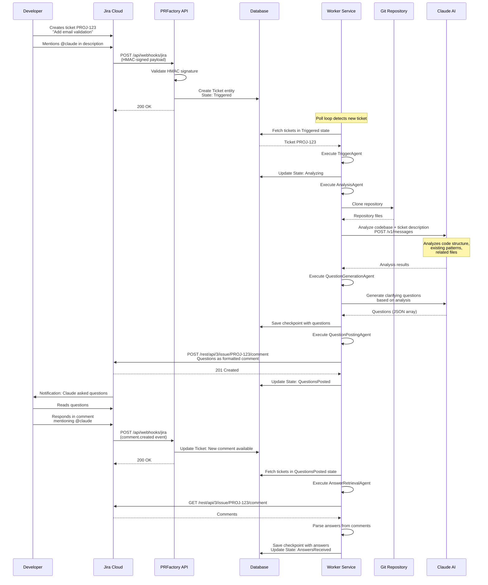
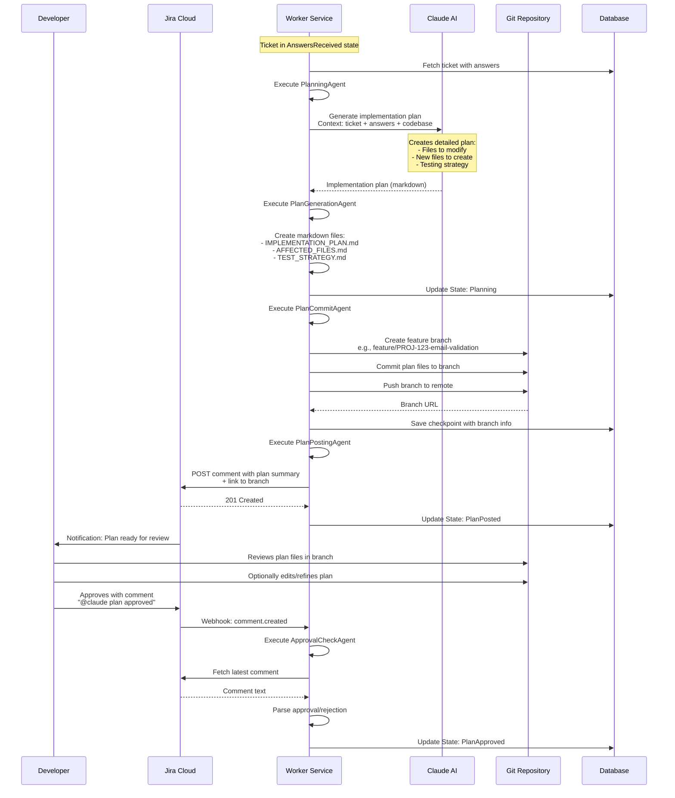
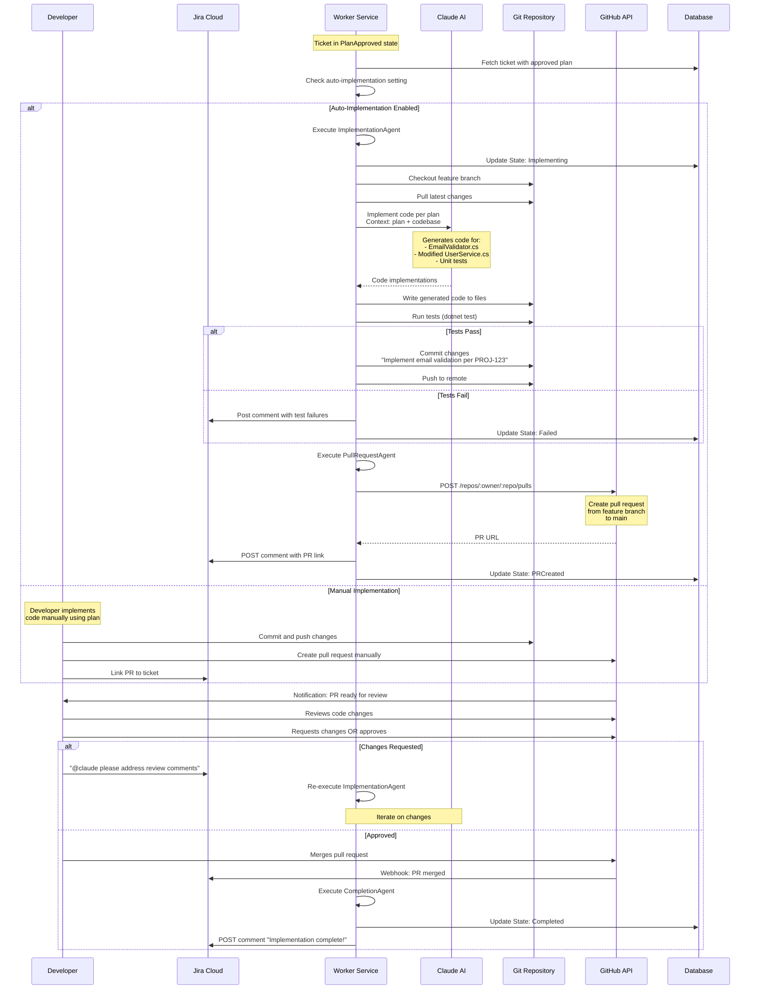
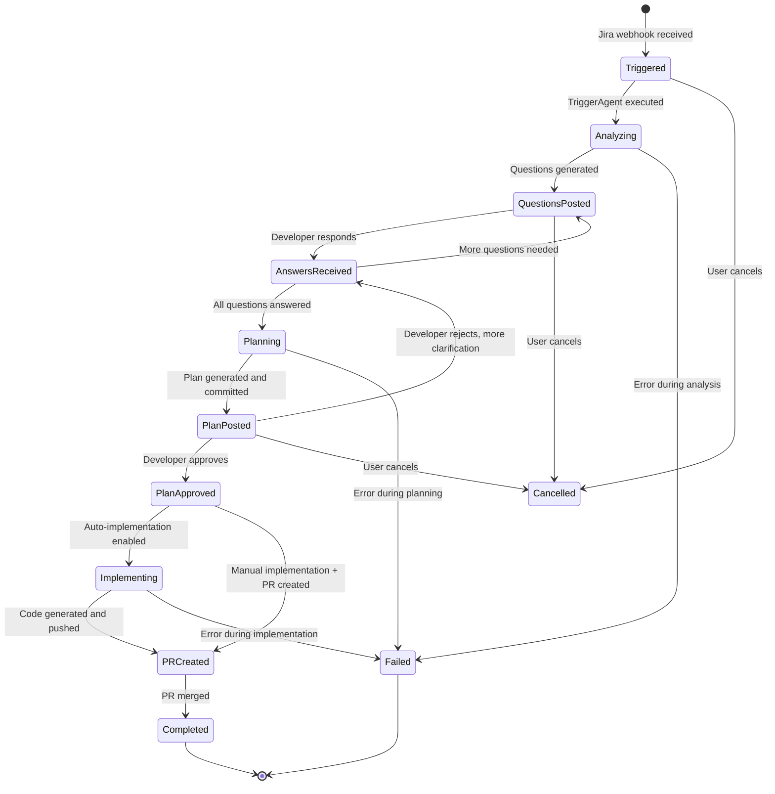

# PRFactory Workflow Details

Comprehensive guide to the PRFactory workflow from Jira ticket to pull request.

## Table of Contents

- [Overview](#overview)
- [Workflow Phases](#workflow-phases)
- [Phase 1: Trigger & Analysis](#phase-1-trigger--analysis)
- [Phase 2: Planning](#phase-2-planning)
- [Phase 3: Implementation](#phase-3-implementation)
- [State Transitions](#state-transitions)
- [Error Handling](#error-handling)
- [Example Walkthrough](#example-walkthrough)

## Overview

PRFactory transforms Jira tickets into pull requests through a three-phase workflow with mandatory human checkpoints:

```
Phase 1: Trigger & Analysis
  ↓ (human responds with answers)
Phase 2: Planning
  ↓ (human approves plan)
Phase 3: Implementation
  ↓ (human reviews PR)
Merge & Complete
```

**Key Principle:** The AI cannot proceed to the next phase without explicit human approval.

## Workflow Phases

### Complete Workflow Diagram

```mermaid
flowchart TB
    Start([Developer creates<br/>Jira ticket]) --> Trigger{Mentions @claude<br/>or adds label?}
    Trigger -- No --> Manual[Standard workflow]
    Trigger -- Yes --> Webhook[Jira webhook<br/>triggered]

    Webhook --> Validate[Validate HMAC<br/>signature]
    Validate --> CreateTicket[Create Ticket<br/>entity in DB]
    CreateTicket --> State1[State: Triggered]

    State1 --> Agent1[TriggerAgent]
    Agent1 --> State2[State: Analyzing]
    State2 --> Agent2[AnalysisAgent]

    Agent2 --> Clone[Clone repository<br/>to workspace]
    Clone --> Analyze[Analyze codebase<br/>with Claude AI]
    Analyze --> Agent3[QuestionGenerationAgent]

    Agent3 --> GenQuestions[Generate clarifying<br/>questions]
    GenQuestions --> Agent4[QuestionPostingAgent]
    Agent4 --> PostQ[Post questions<br/>to Jira]
    PostQ --> State3[State: QuestionsPosted]

    State3 --> Wait1[Wait for user<br/>response]
    Wait1 --> UserReply1[User responds<br/>with @claude]
    UserReply1 --> Webhook2[Jira webhook<br/>triggered]

    Webhook2 --> Agent5[AnswerRetrievalAgent]
    Agent5 --> GetAnswers[Extract answers<br/>from comments]
    GetAnswers --> State4[State: AnswersReceived]

    State4 --> CheckAnswers{All questions<br/>answered?}
    CheckAnswers -- No --> Agent3
    CheckAnswers -- Yes --> Agent6[PlanningAgent]

    Agent6 --> State5[State: Planning]
    State5 --> GenPlan[Generate detailed<br/>implementation plan]
    GenPlan --> Agent7[PlanGenerationAgent]

    Agent7 --> CreatePlanFiles[Create plan<br/>markdown files]
    CreatePlanFiles --> Agent8[PlanCommitAgent]

    Agent8 --> Branch[Create feature<br/>branch]
    Branch --> CommitPlan[Commit plan<br/>files to branch]
    CommitPlan --> PushPlan[Push branch<br/>to remote]
    PushPlan --> Agent9[PlanPostingAgent]

    Agent9 --> PostPlan[Post plan summary<br/>+ branch link to Jira]
    PostPlan --> State6[State: PlanPosted]

    State6 --> Wait2[Wait for<br/>approval]
    Wait2 --> UserReply2[User responds with<br/>approval or rejection]
    UserReply2 --> Webhook3[Jira webhook<br/>triggered]

    Webhook3 --> Agent10[ApprovalCheckAgent]
    Agent10 --> CheckApproval{Plan<br/>approved?}
    CheckApproval -- Rejected --> State4
    CheckApproval -- Approved --> State7[State: PlanApproved]

    State7 --> Optional{Auto-implement<br/>enabled?}
    Optional -- No --> Manual2[Developer implements<br/>manually using plan]
    Optional -- Yes --> Agent11[ImplementationAgent]

    Agent11 --> State8[State: Implementing]
    State8 --> ImplCode[Implement code<br/>using Claude]
    ImplCode --> RunTests[Run tests]
    RunTests --> CommitCode[Commit code<br/>to branch]
    CommitCode --> PushCode[Push code<br/>to remote]
    PushCode --> Agent12[PullRequestAgent]

    Manual2 --> Agent12

    Agent12 --> CreatePR[Create pull<br/>request]
    CreatePR --> LinkPR[Link PR<br/>to Jira ticket]
    LinkPR --> State9[State: PRCreated]

    State9 --> Review[Mandatory human<br/>code review]
    Review --> ReviewDecision{PR<br/>approved?}
    ReviewDecision -- Changes needed --> Feedback[Developer provides<br/>feedback in PR]
    Feedback --> ImplCode

    ReviewDecision -- Approved --> HumanMerge[Human merges PR]
    HumanMerge --> Agent13[CompletionAgent]
    Agent13 --> State10[State: Completed]
    State10 --> Done([Workflow complete])

    style State1 fill:#e1f5ff
    style State2 fill:#e1f5ff
    style State3 fill:#e1f5ff
    style State4 fill:#fff4e1
    style State5 fill:#fff4e1
    style State6 fill:#fff4e1
    style State7 fill:#e8f5e9
    style State8 fill:#e8f5e9
    style State9 fill:#e8f5e9
    style Review fill:#ffebee
    style HumanMerge fill:#f3e5f5
```



## Phase 1: Trigger & Analysis

**Goal:** Understand the requirement and ask clarifying questions.

### Detailed Sequence Diagram



### Key Steps

1. **Trigger Detection**
   - Jira webhook fires when ticket created/updated with `@claude` mention
   - API validates HMAC signature
   - Ticket entity created in database with `Triggered` state

2. **Repository Analysis**
   - Worker clones repository to temporary workspace
   - Claude analyzes codebase structure
   - Identifies relevant files, patterns, conventions

3. **Question Generation**
   - Claude generates clarifying questions based on:
     - Ticket description
     - Codebase analysis
     - Missing requirements
   - Questions formatted as Jira comment

4. **Await Developer Response**
   - System transitions to `QuestionsPosted` state
   - Waits for developer to respond
   - Developer must mention `@claude` to trigger next phase

### Example Questions

For ticket: "Add email validation to user registration"

Claude might ask:
```markdown
## Clarifying Questions

Before I create an implementation plan, I need some clarifications:

1. **Validation Scope**
   - Should we validate email format only, or also check if domain exists (MX record)?
   - Should we prevent disposable email addresses (e.g., from temp-mail.org)?

2. **Existing Users**
   - Should we validate emails for existing users retroactively?
   - What should happen if an existing user has an invalid email?

3. **Error Handling**
   - Should we show an error immediately on form submission, or during typing?
   - What error message should we display?

4. **Testing**
   - Should I add unit tests for the validation logic?
   - Should I add integration tests for the API endpoint?

Please answer by replying to this comment with @claude.
```

## Phase 2: Planning

**Goal:** Create a detailed, reviewable implementation plan.

### Detailed Sequence Diagram



### Key Steps

1. **Plan Generation**
   - Claude creates detailed plan based on:
     - Original ticket
     - Developer's answers
     - Codebase analysis
   - Plan includes:
     - Files to modify
     - New files to create
     - Code structure
     - Testing strategy
     - Estimated complexity

2. **Plan Commitment**
   - Create feature branch: `feature/PROJ-123-description`
   - Commit plan as markdown files
   - Push to remote repository

3. **Plan Review**
   - Post summary to Jira with branch link
   - Developer reviews plan in git
   - Developer can edit plan directly
   - Developer approves via Jira comment

### Example Plan

**Branch:** `feature/PROJ-123-email-validation`

**File:** `docs/IMPLEMENTATION_PLAN.md`

```markdown
# Implementation Plan: Email Validation for User Registration

## Summary
Add comprehensive email validation to user registration flow.

## Files to Modify

### 1. `src/Services/UserService.cs`
**Changes:**
- Add email validation before user creation
- Call new `EmailValidator` class
- Return validation errors to controller

**Estimated LOC:** ~15 lines

### 2. `src/Controllers/UserController.cs`
**Changes:**
- Return 400 Bad Request with validation errors
- Update API documentation comments

**Estimated LOC:** ~10 lines

## Files to Create

### 1. `src/Validators/EmailValidator.cs`
**Purpose:** Email format and domain validation
**Methods:**
- `IsValidFormat(string email)` - Regex validation
- `IsDisposableDomain(string email)` - Check against disposable email list
- `ValidateAsync(string email)` - Main validation method

**Estimated LOC:** ~80 lines

### 2. `tests/Validators/EmailValidatorTests.cs`
**Purpose:** Unit tests for EmailValidator
**Test Cases:**
- Valid email formats
- Invalid email formats
- Disposable email detection
- Edge cases (empty, null, very long)

**Estimated LOC:** ~100 lines

## Dependencies
- **New:** `EmailValidation` NuGet package (v1.0.4)
- **New:** Disposable email domains list (embedded resource)

## Testing Strategy
1. **Unit Tests:**
   - EmailValidator with 15+ test cases
   - UserService with mocked validator

2. **Integration Tests:**
   - POST /api/users with valid email → 201 Created
   - POST /api/users with invalid email → 400 Bad Request
   - Error message format validation

## Deployment Considerations
- No database migration needed
- No breaking changes to API
- Backward compatible (existing users unaffected)

## Estimated Effort
**2-3 hours** (Medium complexity)

## Rollout Plan
1. Deploy to staging
2. Run integration tests
3. Manual testing with disposable emails
4. Deploy to production
5. Monitor for validation errors

## Approval
Please review and approve this plan by commenting "@claude plan approved"
or request changes by commenting "@claude" with your feedback.
```

## Phase 3: Implementation

**Goal:** Implement the approved plan and create a pull request.

### Detailed Sequence Diagram



### Key Steps

1. **Implementation** (if auto-enabled)
   - Claude generates code based on approved plan
   - Code written to appropriate files
   - Tests run automatically
   - Changes committed to feature branch

2. **Pull Request Creation**
   - PR created via GitHub API
   - Description includes:
     - Link to Jira ticket
     - Summary of changes
     - Reference to implementation plan
   - PR linked to Jira ticket

3. **Code Review** (Mandatory)
   - Team reviews PR
   - CI/CD pipelines run
   - Security scans execute
   - Human approves changes

4. **Merge** (Human-only)
   - Developer merges PR
   - System detects merge
   - Ticket marked as Completed

### Example Pull Request

**Title:** `[PROJ-123] Add email validation to user registration`

**Description:**
```markdown
## Summary
Implements email validation for user registration per approved plan.

## Related Issue
Jira: [PROJ-123](https://company.atlassian.net/browse/PROJ-123)

## Implementation Plan
See plan in branch commit history: `docs/IMPLEMENTATION_PLAN.md`

## Changes
- ✨ Added `EmailValidator` class with format and disposable domain checks
- 🔧 Modified `UserService` to validate emails before user creation
- 🧪 Added 15 unit tests for email validation
- 📝 Updated API documentation

## Testing
- [x] Unit tests pass (15/15)
- [x] Integration tests pass (3/3)
- [x] Tested with disposable emails (rejected correctly)
- [x] Tested with valid emails (accepted correctly)

## Checklist
- [x] Code follows project style guidelines
- [x] Self-review completed
- [x] Comments added for complex logic
- [x] Tests added/updated
- [x] Documentation updated
- [ ] Reviewed by team (pending)
- [ ] CI/CD pipelines pass (running)

## Screenshots
N/A (backend changes only)

---

Generated by PRFactory with Claude AI
Requires human review and approval before merge
```

## State Transitions

### State Transition Rules



### Transition Triggers

| From State | To State | Trigger |
|------------|----------|---------|
| Triggered | Analyzing | TriggerAgent execution |
| Analyzing | QuestionsPosted | Questions generated and posted |
| QuestionsPosted | AnswersReceived | Developer responds with @claude |
| AnswersReceived | Planning | All questions sufficiently answered |
| AnswersReceived | QuestionsPosted | More clarification needed |
| Planning | PlanPosted | Plan committed to branch |
| PlanPosted | PlanApproved | Developer approves with "@claude plan approved" |
| PlanPosted | AnswersReceived | Developer rejects, needs more info |
| PlanApproved | Implementing | Auto-implementation enabled |
| PlanApproved | PRCreated | Manual implementation, PR created |
| Implementing | PRCreated | Code generated, tests pass, PR created |
| PRCreated | Completed | PR merged by human |
| Any | Cancelled | Developer explicitly cancels |
| Any | Failed | Unrecoverable error occurs |

## Error Handling

### Retry Strategy

PRFactory uses checkpoint-based recovery:

1. **Checkpoint Before External Operation**
   ```csharp
   await _checkpointService.SaveAsync(ticket, "BeforeClaudeAPICall", context);
   ```

2. **External Operation** (Claude API, Git, Jira)

3. **Checkpoint After Success**
   ```csharp
   await _checkpointService.SaveAsync(ticket, "AfterClaudeAPICall", result);
   ```

4. **On Failure:**
   - Load last successful checkpoint
   - Retry operation (with exponential backoff)
   - After N retries, transition to `Failed` state

### Failure Scenarios

| Scenario | Handling |
|----------|----------|
| **Claude API timeout** | Retry 3x with backoff, then fail |
| **Git clone failed** | Retry 3x, check credentials, then fail |
| **Jira API error** | Retry 3x, log error, then fail |
| **Test failures** | Post failures to Jira, transition to Failed, await developer fix |
| **Invalid HMAC** | Reject webhook, log security event |
| **Malformed webhook** | Reject webhook, log error |

### Error Notification

When errors occur:
1. Ticket transitions to `Failed` state
2. Error details posted to Jira as comment
3. AgentExecution record created with stack trace
4. Developer notified via Jira

Example error comment:
```markdown
## ⚠️ Implementation Failed

An error occurred during the implementation phase:

**Error:** Test failures in EmailValidatorTests
**Details:**
- Test "ShouldRejectDisposableEmails" failed
- Expected: false, Actual: true

**Next Steps:**
I'll need human assistance to resolve this. Please review the test failure and either:
1. Fix the test expectations
2. Fix the EmailValidator implementation
3. Provide guidance via "@claude [instructions]"

**Full logs:** [View in Worker Service logs]
```

## Example Walkthrough

### Complete Flow: Add Email Validation

**Initial Jira Ticket:**
```
Title: PROJ-123 - Add email validation
Description:
We need to add email validation to prevent invalid email addresses
during user registration.

@claude please help with this
```

**Phase 1: Analysis (5 minutes)**

1. ✅ Webhook received, ticket created
2. ✅ Repository cloned
3. ✅ Codebase analyzed
4. ✅ Questions posted:
   ```
   1. Should we validate format only or also check domain?
   2. Should we prevent disposable emails?
   3. What about existing users?
   4. What tests should we add?
   ```

**Developer Response (2 minutes)**
```
@claude
1. Validate format AND check domain
2. Yes, prevent disposable emails
3. Leave existing users as-is
4. Add unit tests and integration tests
```

**Phase 2: Planning (3 minutes)**

1. ✅ Answers processed
2. ✅ Plan generated
3. ✅ Branch created: `feature/PROJ-123-email-validation`
4. ✅ Plan committed to branch
5. ✅ Plan summary posted to Jira

**Developer Review (5 minutes)**
- Reviews plan in GitHub
- Verifies files to be changed
- Checks testing strategy
- Approves in Jira: `@claude plan approved`

**Phase 3: Implementation (10 minutes)**

1. ✅ Code generated by Claude
2. ✅ Tests written
3. ✅ Tests executed (all pass)
4. ✅ Code committed
5. ✅ PR created: #456

**Code Review (15 minutes)**
- Team reviews PR
- CI/CD pipelines pass
- Security scan passes
- Approve PR

**Merge (1 minute)**
- Developer merges PR
- Ticket marked Completed

**Total Time: ~40 minutes** (vs. manual ~3-4 hours)

## Summary

The PRFactory workflow provides:
- ✅ **Automated** requirement clarification
- ✅ **Reviewable** implementation plans
- ✅ **Optional** code generation
- ✅ **Mandatory** human oversight
- ✅ **Transparent** audit trail
- ✅ **Fault-tolerant** checkpoint-based execution

Every phase requires human approval, ensuring AI assists but humans decide.

## Next Steps

- Review [Architecture](ARCHITECTURE.md) for system design details
- Check [Setup Guide](SETUP.md) for installation
- Explore [Database Schema](database-schema.md) for data model
