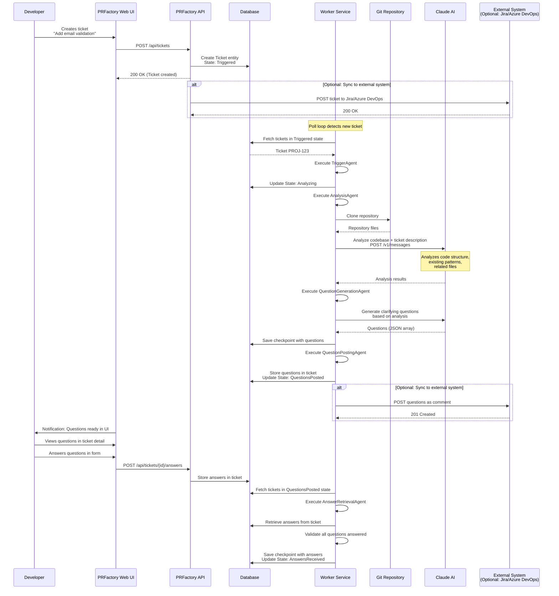
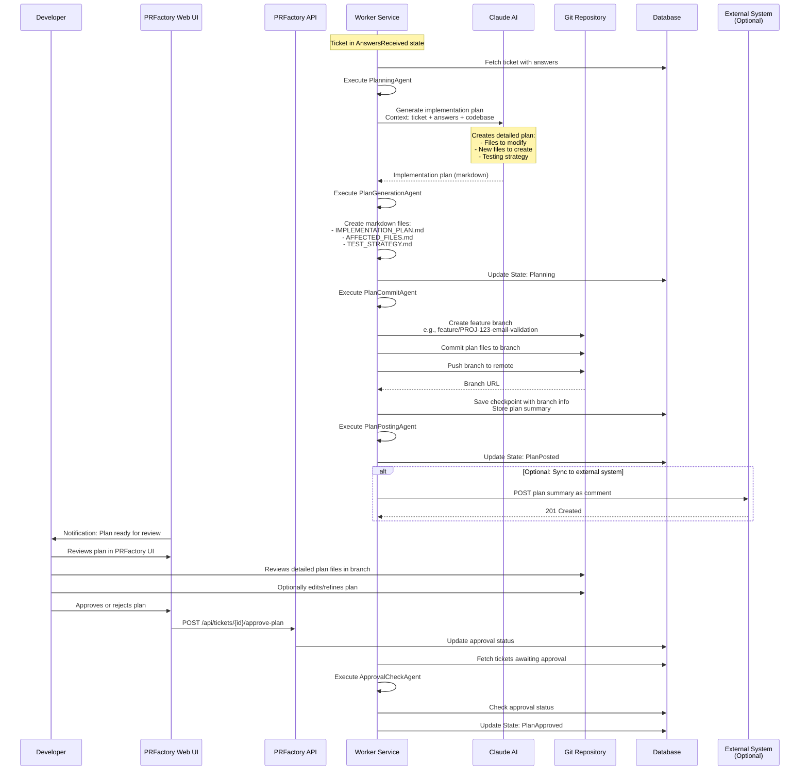
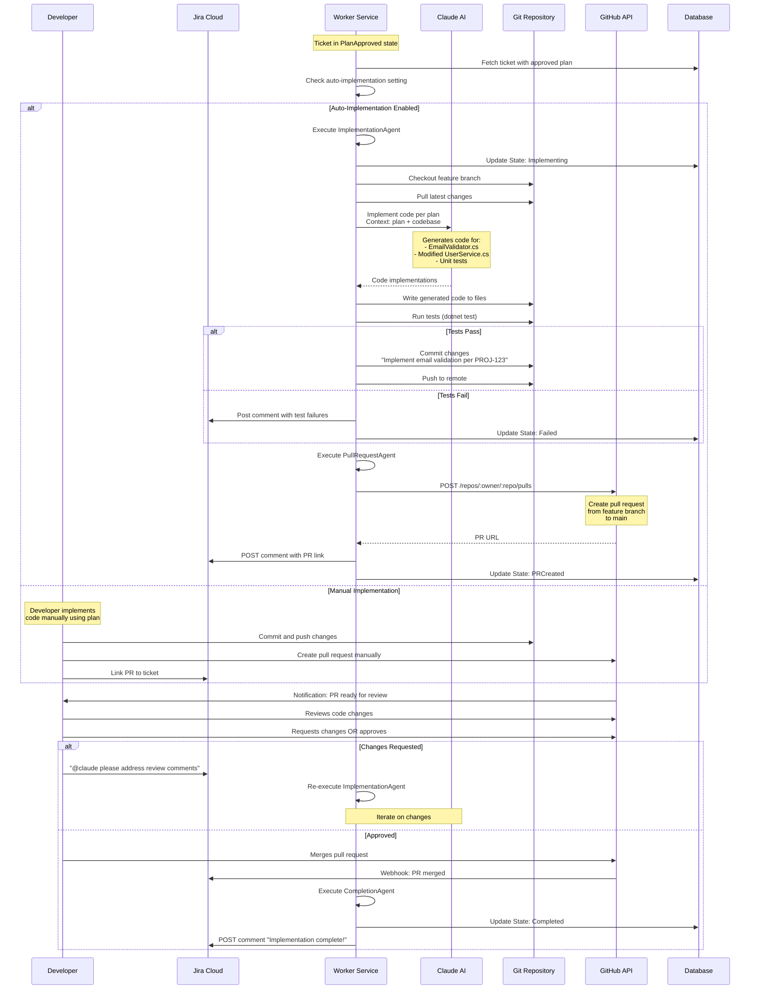

# PRFactory Workflow Details

Comprehensive guide to the PRFactory workflow from Jira ticket to pull request.

## Table of Contents

- [Overview](#overview)
- [Workflow Phases](#workflow-phases)
- [Phase 1: Trigger & Analysis](#phase-1-trigger--analysis)
- [Phase 2: Planning](#phase-2-planning)
- [Phase 3: Implementation](#phase-3-implementation)
- [Interactive Agent Chat Flows](#interactive-agent-chat-flows)
- [Rich Markdown Planning Phase](#rich-markdown-planning-phase)
- [Inline Comments & Review Checklists](#inline-comments--review-checklists)
- [State Transitions](#state-transitions)
- [Error Handling](#error-handling)
- [Example Walkthrough](#example-walkthrough)

## Overview

PRFactory transforms requirements into pull requests through a three-phase workflow with mandatory human checkpoints. Requirements can be created directly in PRFactory's Web UI or synced from external systems (Jira, Azure DevOps, GitHub Issues).

```
Ticket Creation (PRFactory UI or external sync)
  ↓
Phase 1: Trigger & Analysis
  ↓ (human responds with answers in UI)
Phase 2: Planning
  ↓ (human approves plan in UI)
Phase 3: Implementation
  ↓ (human reviews PR in Git platform)
Merge & Complete
  ↓ (sync to external systems)
```

**Key Principle:** The AI cannot proceed to the next phase without explicit human approval. PRFactory UI is the primary interface for ongoing work, while external systems serve as final storage.

## Workflow Phases

### Complete Workflow Diagram

```mermaid
flowchart TB
    Start([Developer creates ticket]) --> Source{Ticket<br/>source?}
    Source -- PRFactory UI --> DirectCreate[Create ticket<br/>directly in UI]
    Source -- External Sync --> SyncIn[Sync from Jira/<br/>Azure DevOps/GitHub]

    DirectCreate --> CreateTicket[Create Ticket<br/>entity in DB]
    SyncIn --> Webhook[Webhook received<br/>from external system]
    Webhook --> Validate[Validate HMAC<br/>signature]
    Validate --> CreateTicket

    CreateTicket --> State1[State: Triggered]

    State1 --> Agent1[TriggerAgent]
    Agent1 --> State2[State: Analyzing]
    State2 --> Agent2[AnalysisAgent]

    Agent2 --> Clone[Clone repository<br/>to workspace]
    Clone --> Analyze[Analyze codebase<br/>with Claude AI]
    Analyze --> Agent3[QuestionGenerationAgent]

    Agent3 --> GenQuestions[Generate clarifying<br/>questions]
    GenQuestions --> Agent4[QuestionPostingAgent]
    Agent4 --> PostQ[Display questions<br/>in PRFactory UI]
    PostQ --> OptionalJira1[Optionally sync<br/>to external system]
    OptionalJira1 --> State3[State: QuestionsPosted]

    State3 --> Wait1[Wait for user<br/>response in UI]
    Wait1 --> UserReply1[User responds<br/>in PRFactory UI]
    UserReply1 --> Webhook2[UI triggers<br/>state transition]

    Webhook2 --> Agent5[AnswerRetrievalAgent]
    Agent5 --> GetAnswers[Extract answers<br/>from comments]
    GetAnswers --> State4[State: AnswersReceived]

    State4 --> CheckAnswers{All questions<br/>answered?}
    CheckAnswers -- No --> Agent3
    CheckAnswers -- Yes --> Agent6[PlanningAgent]

    Agent6 --> State5[State: Planning]
    State5 --> GenPlan[Generate detailed<br/>implementation plan]
    GenPlan --> Agent7[PlanGenerationAgent]

    Agent7 --> CreatePlanFiles[Create plan<br/>markdown files]
    CreatePlanFiles --> Agent8[PlanCommitAgent]

    Agent8 --> Branch[Create feature<br/>branch]
    Branch --> CommitPlan[Commit plan<br/>files to branch]
    CommitPlan --> PushPlan[Push branch<br/>to remote]
    PushPlan --> Agent9[PlanPostingAgent]

    Agent9 --> PostPlan[Display plan in<br/>PRFactory UI]
    PostPlan --> OptionalJira2[Optionally sync<br/>to external system]
    OptionalJira2 --> State6[State: PlanPosted]

    State6 --> Wait2[Wait for approval<br/>in UI]
    Wait2 --> UserReply2[User approves/rejects<br/>in PRFactory UI]
    UserReply2 --> Webhook3[UI triggers<br/>state transition]

    Webhook3 --> Agent10[ApprovalCheckAgent]
    Agent10 --> CheckApproval{Plan<br/>approved?}
    CheckApproval -- Rejected & Regenerate --> State4
    CheckApproval -- Refined with Instructions --> Agent6
    CheckApproval -- Approved --> State7[State: PlanApproved]

    State7 --> Optional{Auto-implement<br/>enabled?}
    Optional -- No --> Manual2[Developer implements<br/>manually using plan]
    Optional -- Yes --> Agent11[ImplementationAgent]

    Agent11 --> State8[State: Implementing]
    State8 --> ImplCode[Implement code<br/>using Claude]
    ImplCode --> RunTests[Run tests]
    RunTests --> CommitCode[Commit code<br/>to branch]
    CommitCode --> PushCode[Push code<br/>to remote]
    PushCode --> Agent12[PullRequestAgent]

    Manual2 --> Agent12

    Agent12 --> CreatePR[Create pull<br/>request]
    CreatePR --> LinkPR[Link PR in<br/>PRFactory UI]
    LinkPR --> State9[State: PRCreated]

    State9 --> Review[Mandatory human<br/>code review in Git platform]
    Review --> ReviewDecision{PR<br/>approved?}
    ReviewDecision -- Changes needed --> Feedback[Developer provides<br/>feedback in PR]
    Feedback --> ImplCode

    ReviewDecision -- Approved --> HumanMerge[Human merges PR]
    HumanMerge --> Agent13[CompletionAgent]
    Agent13 --> SyncOut[Sync completed work<br/>to external systems]
    SyncOut --> State10[State: Completed]
    State10 --> Done([Workflow complete])

    style State1 fill:#e1f5ff
    style State2 fill:#e1f5ff
    style State3 fill:#e1f5ff
    style State4 fill:#fff4e1
    style State5 fill:#fff4e1
    style State6 fill:#fff4e1
    style State7 fill:#e8f5e9
    style State8 fill:#e8f5e9
    style State9 fill:#e8f5e9
    style Review fill:#ffebee
    style HumanMerge fill:#f3e5f5
```



## Phase 1: Trigger & Analysis

**Goal:** Understand the requirement and ask clarifying questions.

### Detailed Sequence Diagram



### Key Steps

1. **Ticket Creation**
   - Developer creates ticket directly in PRFactory Web UI
   - OR webhook receives ticket from external system (Jira, Azure DevOps, GitHub Issues)
   - Ticket entity created in database with `Triggered` state
   - Optionally sync new ticket to external systems for tracking

2. **Repository Analysis**
   - Worker clones repository to temporary workspace
   - Claude analyzes codebase structure
   - Identifies relevant files, patterns, conventions

3. **Question Generation**
   - Claude generates clarifying questions based on:
     - Ticket description
     - Codebase analysis
     - Missing requirements
   - Questions stored in database and displayed in PRFactory UI
   - Optionally sync questions to external systems as comments

4. **Await Developer Response**
   - System transitions to `QuestionsPosted` state
   - Questions displayed in PRFactory UI
   - Developer answers questions in UI form
   - Answers stored in database and validated

### Example Questions

For ticket: "Add email validation to user registration"

Claude might ask (displayed in PRFactory UI as a form):

**Question 1: Validation Scope**
- Should we validate email format only, or also check if domain exists (MX record)?
- Should we prevent disposable email addresses (e.g., from temp-mail.org)?

**Question 2: Existing Users**
- Should we validate emails for existing users retroactively?
- What should happen if an existing user has an invalid email?

**Question 3: Error Handling**
- Should we show an error immediately on form submission, or during typing?
- What error message should we display?

**Question 4: Testing**
- Should I add unit tests for the validation logic?
- Should I add integration tests for the API endpoint?

Developer answers these in the UI, and the workflow continues automatically.

## Phase 2: Planning

**Goal:** Create a detailed, reviewable implementation plan.

### Detailed Sequence Diagram



### Key Steps

1. **Plan Generation**
   - Claude creates detailed plan based on:
     - Original ticket
     - Developer's answers
     - Codebase analysis
   - Plan includes:
     - Files to modify
     - New files to create
     - Code structure
     - Testing strategy
     - Estimated complexity

2. **Plan Commitment**
   - Create feature branch: `feature/PROJ-123-description`
   - Commit plan as markdown files
   - Push to remote repository

3. **Plan Review**
   - Plan summary displayed in PRFactory UI
   - Developer reviews plan in UI and detailed files in git branch
   - Developer has three options:
     - **Approve**: Proceed with implementation using this plan
     - **Refine**: Provide specific instructions to improve the plan (e.g., "Add database migration steps", "Use dependency injection instead of static classes")
     - **Reject & Regenerate**: Completely regenerate the plan from scratch with feedback
   - Optionally sync plan summary to external systems

### Example Plan

**Branch:** `feature/PROJ-123-email-validation`

**File:** `docs/IMPLEMENTATION_PLAN.md`

```markdown
# Implementation Plan: Email Validation for User Registration

## Summary
Add comprehensive email validation to user registration flow.

## Files to Modify

### 1. `src/Services/UserService.cs`
**Changes:**
- Add email validation before user creation
- Call new `EmailValidator` class
- Return validation errors to controller

**Estimated LOC:** ~15 lines

### 2. `src/Controllers/UserController.cs`
**Changes:**
- Return 400 Bad Request with validation errors
- Update API documentation comments

**Estimated LOC:** ~10 lines

## Files to Create

### 1. `src/Validators/EmailValidator.cs`
**Purpose:** Email format and domain validation
**Methods:**
- `IsValidFormat(string email)` - Regex validation
- `IsDisposableDomain(string email)` - Check against disposable email list
- `ValidateAsync(string email)` - Main validation method

**Estimated LOC:** ~80 lines

### 2. `tests/Validators/EmailValidatorTests.cs`
**Purpose:** Unit tests for EmailValidator
**Test Cases:**
- Valid email formats
- Invalid email formats
- Disposable email detection
- Edge cases (empty, null, very long)

**Estimated LOC:** ~100 lines

## Dependencies
- **New:** `EmailValidation` NuGet package (v1.0.4)
- **New:** Disposable email domains list (embedded resource)

## Testing Strategy
1. **Unit Tests:**
   - EmailValidator with 15+ test cases
   - UserService with mocked validator

2. **Integration Tests:**
   - POST /api/users with valid email → 201 Created
   - POST /api/users with invalid email → 400 Bad Request
   - Error message format validation

## Deployment Considerations
- No database migration needed
- No breaking changes to API
- Backward compatible (existing users unaffected)

## Estimated Effort
**2-3 hours** (Medium complexity)

## Rollout Plan
1. Deploy to staging
2. Run integration tests
3. Manual testing with disposable emails
4. Deploy to production
5. Monitor for validation errors

## Approval
Please review and approve this plan in the PRFactory UI.
You can also edit the plan files directly in the git branch before approving.
```

## Phase 3: Implementation

**Goal:** Implement the approved plan and create a pull request.

### Detailed Sequence Diagram



### Key Steps

1. **Implementation** (if auto-enabled)
   - Claude generates code based on approved plan
   - Code written to appropriate files
   - Tests run automatically
   - Changes committed to feature branch

2. **Pull Request Creation**
   - PR created via GitHub API
   - Description includes:
     - Link to Jira ticket
     - Summary of changes
     - Reference to implementation plan
   - PR linked to Jira ticket

3. **Code Review** (Mandatory)
   - Team reviews PR
   - CI/CD pipelines run
   - Security scans execute
   - Human approves changes

4. **Merge** (Human-only)
   - Developer merges PR
   - System detects merge
   - Ticket marked as Completed

### Example Pull Request

**Title:** `[PROJ-123] Add email validation to user registration`

**Description:**
```markdown
## Summary
Implements email validation for user registration per approved plan.

## Related Issue
Jira: [PROJ-123](https://company.atlassian.net/browse/PROJ-123)

## Implementation Plan
See plan in branch commit history: `docs/IMPLEMENTATION_PLAN.md`

## Changes
- ✨ Added `EmailValidator` class with format and disposable domain checks
- 🔧 Modified `UserService` to validate emails before user creation
- 🧪 Added 15 unit tests for email validation
- 📝 Updated API documentation

## Testing
- [x] Unit tests pass (15/15)
- [x] Integration tests pass (3/3)
- [x] Tested with disposable emails (rejected correctly)
- [x] Tested with valid emails (accepted correctly)

## Checklist
- [x] Code follows project style guidelines
- [x] Self-review completed
- [x] Comments added for complex logic
- [x] Tests added/updated
- [x] Documentation updated
- [ ] Reviewed by team (pending)
- [ ] CI/CD pipelines pass (running)

## Screenshots
N/A (backend changes only)

---

Generated by PRFactory with Claude AI
Requires human review and approval before merge
```

## Interactive Agent Chat Flows

**Available:** Epic 05 (AG-UI Integration)

Interactive Agent Chat enables real-time conversations with Claude AI directly on the ticket detail page, providing flexible guidance and assistance beyond the structured question-answer format of Phase 1.

### When to Use Agent Chat vs Traditional Workflow

**Use Traditional Workflow (Phase 1-3) When:**
- Requirements are clear and well-defined
- You need a formal, structured analysis and approval process
- You want a reviewable, committed implementation plan
- You require explicit human checkpoints between phases
- You want automatic plan and code generation (optional)
- You need audit trail for compliance

**Use Interactive Agent Chat When:**
- You want to explore ideas and have a conversation
- Requirements are evolving or need clarification
- You want immediate feedback without waiting for phases to complete
- You want to ask follow-up questions without formal structure
- You're brainstorming solutions or discussing trade-offs
- You want to see tool execution and API calls in real-time

### Agent Chat Interface

Agent Chat appears as an interactive panel on the ticket detail page:

```
┌─────────────────────────────────────────────────────────────┐
│  Ticket Detail: PROJ-123 - Add Email Validation             │
├─────────────────────────────────────────────────────────────┤
│                                                              │
│ [Ticket Questions]  [Agent Chat] ← You are here            │
│                                                              │
├─────────────────────────────────────────────────────────────┤
│                                                              │
│  Assistant: I've analyzed your ticket. I see this involves  │
│  email validation in the user registration flow. I have a   │
│  few questions to help me understand the requirements...    │
│                                                              │
│  Developer: Can you look at the current UserService        │
│  implementation?                                            │
│                                                              │
│  Assistant: I'll examine the UserService class...           │
│  ▌ Analyzing codebase (15% complete)                        │
│                                                              │
│  [Showing recent tool calls...]                             │
│  • get_files: src/Services/UserService.cs                  │
│  • get_file_content: src/Services/UserService.cs           │
│  • search_files: email.*validation.*regex                  │
│                                                              │
│  ┌─────────────────────────────────────────────────────┐   │
│  │ Input your follow-up question...                    │   │
│  │ [Send]                                              │   │
│  └─────────────────────────────────────────────────────┘   │
└─────────────────────────────────────────────────────────────┘
```

### How Agent Chat Works

1. **Initiate Conversation**
   - Open ticket detail page
   - Click "Agent Chat" tab
   - Claude AI is already aware of the ticket context (title, description)

2. **Send Messages & Follow-up Questions**
   - Type natural language questions or requests
   - Agent responds in real-time via SSE (Server-Sent Events)
   - Stream shows text being generated character-by-character
   - No need to wait for entire response before reading

3. **Tool Execution Visibility**
   - Agent uses tools to analyze codebase (search, read files, execute commands)
   - Tool calls appear inline as they execute
   - See exact files being examined and commands run
   - Full transparency into agent's investigation process

4. **Agent Context**
   - Agent has access to ticket details (title, description, state)
   - Agent can read files from the repository
   - Agent can search the codebase for patterns
   - Agent understands the existing code architecture
   - Agent cannot modify code (read-only access)

### SSE Streaming Behavior

Agent Chat uses Server-Sent Events (SSE) to stream responses from the server:

- **Streaming Starts Immediately** - Response begins appearing as soon as server starts generating
- **No Page Reload** - Conversation persists on the page during the session
- **Real-Time Tool Calls** - Tool invocations show in real-time with results
- **Graceful Handling** - If connection drops, messages are preserved in chat history
- **Token Awareness** - Agent shows when approaching context limits

**Example SSE Flow:**
```
Developer: Can you estimate the effort for this feature?

[Stream starts...]
Assistant: Based on my analysis...
  ▌ (analyzing)

[Tool call begins]
↳ Examining: src/Services/UserService.cs
  (reading... 1200 lines)

[Tool complete, streaming resumes]
...I estimate this will take 2-3 hours...
```

### Agent Tools Available

The agent has access to these tools during chat:

| Tool | Purpose | Example Use |
|------|---------|-------------|
| `get_files` | List files matching pattern | "Show me all validators in src/" |
| `get_file_content` | Read specific file | "What does UserService currently do?" |
| `search_files` | Search codebase | "Where is email validation happening?" |
| `grep_files` | Pattern search with context | "Find all async methods in controllers" |

### Conversation History

- Chat history persists during ticket viewing session
- Clear chat history button available to start fresh
- Closing the ticket or navigating away ends the session
- No persistent chat history across sessions (each conversation is ephemeral)

### Limitations

Agent Chat is **read-only** and **conversational**:

- Cannot modify code or files
- Cannot create branches or commits
- Cannot trigger Phase 1-3 workflow automatically
- Cannot approve or update ticket state
- Cannot access external systems (Jira, external repos)

To move from exploration to formal implementation:
- Use insights from Agent Chat to refine Phase 1 requirements
- Provide feedback to the formal workflow phases
- Approve auto-generation in Phase 3 once confident in approach

### Example Agent Chat Session

**Scenario:** Developer exploring email validation approach

Assistant: I can see several validation patterns in your codebase:

↳ Found: src/Validators/PasswordValidator.cs (checks complexity rules)
↳ Found: src/Validators/PhoneValidator.cs (E.164 format)
↳ Found: src/Services/ValidatorFactory.cs (factory pattern)

Let me examine the PasswordValidator to show the style...
```

This example shows how Agent Chat provides real-time exploration without waiting for formal workflow phases.

---

## Rich Markdown Planning Phase

**Available:** Epic 07 (Markdown Editor & Inline Comments)

The Planning Phase (Phase 2) now includes a rich editing interface with split-view markdown editing, live preview, and inline commenting capabilities that enable detailed collaborative refinement of implementation plans before approval.

### Split-View Markdown Editor

When reviewing an implementation plan in Phase 2, the interface provides:

```
┌──────────────────────────────────────────────────────────────┐
│  Plan Review: PROJ-123 - Email Validation                    │
├──────────────────────────────────────────────────────────────┤
│                                                               │
│  [View Plan] [Edit Plan] [Discussion] [Approve/Reject]       │
│                                                               │
├─────────────────────────────────────────────────────────────┤
│                      │                                        │
│  Edit Pane           │     Live Preview Pane                 │
│  ────────────────────│──────────────────────────────────     │
│                      │                                        │
│  # Implementation    │  Implementation Plan                   │
│  Plan                │  ==================                    │
│                      │                                        │
│  ## Files to Modify  │  Files to Modify                       │
│  - src/Service...    │  • src/Services/UserService.cs         │
│    * Add validation  │    - Add email validation before...    │
│    * Update return   │    - Update return type to include...  │
│                      │                                        │
│  Formatting:         │                                        │
│  [B] [I] [Code]      │  Other Sections:                      │
│  [Link] [List] [▼]   │  - Testing Strategy                   │
│                      │  - Dependencies                       │
│                      │  - Rollout Plan                       │
└────────────────────────────────────────────────────────────────┘
```

### Formatting Toolbar

The editing pane includes a toolbar for common markdown formatting:

| Button | Format | Keyboard |
|--------|--------|----------|
| **B** | **Bold** | Ctrl+B |
| *I* | *Italic* | Ctrl+I |
| `Code` | Inline code | Ctrl+` |
| [Link] | [Link text](URL) | Ctrl+L |
| • List | Unordered list | Ctrl+U |
| 1. List | Ordered list | Ctrl+O |
| > Quote | Block quote | Ctrl+Q |
| ``` | Code block | Ctrl+Shift+C |

### Live Preview Behavior

- **Real-Time Rendering** - Preview updates as you type
- **Syntax Highlighting** - Code blocks display with language highlighting
- **Table Support** - Markdown tables render with proper formatting
- **Link Preview** - Links show hover preview
- **Scroll Sync** - Editor and preview scroll together (optional toggle)

### Using the Editor

**To Edit the Plan:**
1. Click "Edit Plan" tab in the PRFactory UI
2. Modify markdown in the left pane
3. See live preview on the right
4. Use formatting toolbar or keyboard shortcuts
5. Save changes (auto-saved every 30 seconds)

**Plan Sections You Can Edit:**
- `## Files to Modify` - Add/remove files or refine descriptions
- `## Files to Create` - Modify new file plans
- `## Testing Strategy` - Refine test approach
- `## Deployment Considerations` - Add deployment notes
- `## Estimated Effort` - Update time estimates
- Any custom notes or sections

**What You Cannot Edit:**
- Generated codebase analysis (read-only sections)
- Phase-generated metadata (timestamps, agent info)
- File hashes and verification data

---

## Inline Comments & Review Checklists

**Available:** Epic 07 (Discussion Threads & Architecture Checklists)

Inline commenting enables detailed discussion anchored to specific lines of the implementation plan, with architecture-specific checklists that guide implementation review.

### Anchoring Comments to Plan Lines

Comments can be anchored to specific lines in the plan:

```
Plan Content:                          │  Comment Thread (anchored to this line)
                                       │
### 1. src/Services/UserService.cs     │  💬 Need to confirm email regex
**Changes:**                           │
- Add email validation               ├─ John: Should we use System.Net.Mail.MailAddress
- Call new EmailValidator            │         for validation, or a custom regex?
- Return validation errors           │
                                      ├─ Sarah: MailAddress is good but might be
Estimated LOC:** ~15 lines             │          too permissive. Let's also check
                                       │          against disposable email list
                                       │
                                       └─ Claude: I recommend System.Net.Mail.MailAddress
                                                   for format + custom list for disposables
```

### Visual Indicators for Commented Sections

Plan lines with comments show a visual indicator:

- **Blue Dot (●)** - Active discussion (unresolved)
- **Green Dot (●)** - Resolved comment
- **Comment Count** - Shows "3 comments" next to the dot
- **Expand/Collapse** - Click to show/hide comment thread

### Discussion Threads

Each comment thread includes:

```
Plan Line: "### 1. src/Services/UserService.cs"

Comment 1:
├─ John (Developer) - 2 hours ago
│  "Should we use System.Net.Mail.MailAddress for validation?"
│
│  [Reply]  [Mark Resolved]  [React: 👍]

Comment 2:
├─ Sarah (Developer) - 1 hour ago
│  "Good idea, but we should also check disposable email domains.
│   That's not handled by MailAddress."
│
│  [Reply]  [Mark Resolved]  [React: 👍 ❤️]

Comment 3:
└─ Claude (Agent) - 30 minutes ago
   "I recommend: Use System.Net.Mail.MailAddress for format validation
    AND check against our disposable email domain list.

    Here's the implementation approach:

    ```csharp
    public async Task ValidateEmailAsync(string email)
    {
        // First: Format validation
        var address = new MailAddress(email);

        // Second: Disposable check
        return !await _disposableService.IsDisposableAsync(address.Host);
    }
    ```"

   [Reply]  [Mark Resolved]  [React: 👍]
```

### Architecture-Type Checklists

When the plan is posted, PRFactory generates checklists based on the repository's architecture type. These checklists guide the review and implementation:

**For Web UI (Blazor/React/Vue repositories):**
```
Web UI Implementation Checklist:
☐ Frontend component(s) created/updated
☐ Input validation added to form
☐ Error messages displayed appropriately
☐ Loading states handled during API calls
☐ Accessibility requirements met (ARIA labels, etc.)
☐ Responsive design verified (mobile/tablet/desktop)
☐ Unit tests for component logic
☐ Storybook stories added (if applicable)
```

**For REST API (ASP.NET/Express/FastAPI repositories):**
```
REST API Implementation Checklist:
☐ New endpoint(s) created or existing endpoints modified
☐ Request validation implemented
☐ Response DTO(s) defined
☐ Error handling with proper HTTP status codes
☐ OpenAPI/Swagger documentation updated
☐ Authentication/Authorization verified
☐ Unit tests for business logic
☐ Integration tests for endpoint(s)
☐ Performance tested (for critical paths)
```

**For Database (MySQL/PostgreSQL/SQL Server repositories):**
```
Database Implementation Checklist:
☐ Schema migration created
☐ Migration is backward compatible (or explicit rollback planned)
☐ Indexes added for performance-critical queries
☐ Foreign key constraints verified
☐ Data validation constraints enforced
☐ Stored procedures updated (if applicable)
☐ Database unit tests added
☐ Backup/restore tested
☐ Performance impact assessed
```

**For Background Jobs (Job queue/worker repositories):**
```
Background Job Implementation Checklist:
☐ Job handler created or modified
☐ Job parameters serialization safe
☐ Retry logic implemented
☐ Dead letter handling for failed jobs
☐ Idempotency verified (safe to retry)
☐ Logging and monitoring added
☐ Job triggering mechanism tested
☐ Performance tested with load
☐ Timeout handling verified
```

### Checking Off Checklist Items

During implementation review:

1. **Open Checklist** - Click checkbox next to each item
2. **Mark Complete** - Check off items as they're verified
3. **Add Comments** - Click item to discuss or explain
4. **Track Progress** - See "3/8 items completed" as you work

```
Database Implementation Checklist:

☑ Schema migration created (3 hours ago by John)
☐ Migration is backward compatible
  └─ Comment: Need to verify rollback procedure for prod

☑ Indexes added for performance-critical queries
☑ Foreign key constraints verified

☐ Data validation constraints enforced
  └─ Comment: Waiting on DB team approval
```

### Impact on Plan Approval Process

The plan approval decision flow incorporates comments and checklists:

```
Developer Reviews Plan
  │
  ├─ [If questions]: Add inline comments
  │   └─ Agent responds in thread
  │
  ├─ [If significant changes needed]: Request refinement
  │   └─ Plan goes back to Planning phase
  │
  ├─ [If ready but want checklist guidance]: Review checklists
  │   └─ Use checklist during implementation
  │
  └─ [If fully approved]: Click "Approve Plan"
     └─ Transition to Implementation phase
```

**Plan Approval Options:**

1. **Approve** - Accept plan as-is, proceed to implementation
   - Checklists are shown during implementation phase
   - Comments marked "resolved"
   - Plan locked (read-only)

2. **Request Refinement** - Ask Agent to improve specific areas
   - Provide comments on specific plan lines
   - Agent regenerates/refines those sections
   - Return to this review step

3. **Reject & Regenerate** - Complete restart with new feedback
   - Provide overall feedback to Agent
   - Plan goes back to Phase 1 answers
   - Agent regenerates entire plan from scratch

---

### Example: Email Validation Plan with Comments

**Plan Section:**
```markdown
## Files to Modify

### 1. `src/Services/UserService.cs`

**Changes:**
- Add email validation before user creation
- Call new `EmailValidator` class
- Return validation errors to controller

**Estimated LOC:** ~15 lines
```

**With Inline Comments:**
```
💬 John - 1 day ago:
"I'm concerned about performance. Email validation might block
registration if the disposable email check is slow. Should we
make this async or cache the domain list?"

  👉 Sarah - 20 hours ago:
  "Good point. I found we already have an async email verification
  service in EmailServices. We should use that instead of creating
  a new one."

    👉 Claude - 18 hours ago:
    "I recommend using the existing EmailServices.VerifyAsync().
    It's already cached and optimized. Updated the plan to reference
    this service. See updated plan section..."
```

---

## State Transitions

PRFactory uses a 17-state workflow state machine to track ticket progress. For the complete state machine design including valid transitions and code examples, see [ARCHITECTURE.md - Workflow State Machine](ARCHITECTURE.md#workflow-state-machine).

### Common Transition Triggers

| From State | To State | Trigger |
|------------|----------|---------|
| Triggered | Analyzing | TriggerAgent execution |
| Analyzing | QuestionsPosted | Questions generated and posted |
| QuestionsPosted | AnswersReceived | Developer responds with @claude |
| AnswersReceived | Planning | All questions sufficiently answered |
| AnswersReceived | QuestionsPosted | More clarification needed |
| Planning | PlanPosted | Plan committed to branch |
| PlanPosted | PlanApproved | Developer approves plan in PRFactory UI |
| PlanPosted | Planning | Developer refines plan with specific instructions in PRFactory UI |
| PlanPosted | AnswersReceived | Developer rejects & regenerates completely in PRFactory UI |
| PlanApproved | Implementing | Auto-implementation enabled |
| PlanApproved | PRCreated | Manual implementation, PR created |
| Implementing | PRCreated | Code generated, tests pass, PR created |
| PRCreated | Completed | PR merged by human |
| Any | Cancelled | Developer explicitly cancels |
| Any | Failed | Unrecoverable error occurs |

---

## Error Handling

### Retry Strategy

PRFactory uses checkpoint-based recovery:

1. **Checkpoint Before External Operation**
   ```csharp
   await _checkpointService.SaveAsync(ticket, "BeforeClaudeAPICall", context);
   ```

2. **External Operation** (Claude API, Git, Jira)

3. **Checkpoint After Success**
   ```csharp
   await _checkpointService.SaveAsync(ticket, "AfterClaudeAPICall", result);
   ```

4. **On Failure:**
   - Load last successful checkpoint
   - Retry operation (with exponential backoff)
   - After N retries, transition to `Failed` state

### Failure Scenarios

| Scenario | Handling |
|----------|----------|
| **Claude API timeout** | Retry 3x with backoff, then fail |
| **Git clone failed** | Retry 3x, check credentials, then fail |
| **Jira API error** | Retry 3x, log error, then fail |
| **Test failures** | Post failures to Jira, transition to Failed, await developer fix |
| **Invalid HMAC** | Reject webhook, log security event |
| **Malformed webhook** | Reject webhook, log error |

### Error Notification

When errors occur:
1. Ticket transitions to `Failed` state
2. Error details posted to Jira as comment
3. AgentExecution record created with stack trace
4. Developer notified via Jira

Example error comment:
```markdown
## ⚠️ Implementation Failed

An error occurred during the implementation phase:

**Error:** Test failures in EmailValidatorTests
**Details:**
- Test "ShouldRejectDisposableEmails" failed
- Expected: false, Actual: true

**Next Steps:**
I'll need human assistance to resolve this. Please review the test failure and either:
1. Fix the test expectations
2. Fix the EmailValidator implementation
3. Provide guidance via "@claude [instructions]"

**Full logs:** [View in Worker Service logs]
```

## Example Walkthrough

### Complete Flow: Add Email Validation

**Initial Jira Ticket:**
```
Title: PROJ-123 - Add email validation
Description:
We need to add email validation to prevent invalid email addresses
during user registration.

@claude please help with this
```

**Phase 1: Analysis (5 minutes)**

1. ✅ Webhook received, ticket created
2. ✅ Repository cloned
3. ✅ Codebase analyzed
4. ✅ Questions posted:
   ```
   1. Should we validate format only or also check domain?
   2. Should we prevent disposable emails?
   3. What about existing users?
   4. What tests should we add?
   ```

**Developer Response (2 minutes)**
```
@claude
1. Validate format AND check domain
2. Yes, prevent disposable emails
3. Leave existing users as-is
4. Add unit tests and integration tests
```

**Phase 2: Planning (3 minutes)**

1. ✅ Answers processed
2. ✅ Plan generated
3. ✅ Branch created: `feature/PROJ-123-email-validation`
4. ✅ Plan committed to branch
5. ✅ Plan summary posted to Jira

**Developer Review (5 minutes)**
- Reviews plan in GitHub
- Verifies files to be changed
- Checks testing strategy
- Adds inline comment: "Use existing EmailService instead of new validator"
- Agent responds in comment thread
- Approves in Jira: `@claude plan approved`

**Phase 3: Implementation (10 minutes)**

1. ✅ Code generated by Claude
2. ✅ Tests written
3. ✅ Tests executed (all pass)
4. ✅ Code committed
5. ✅ PR created: #456

**Code Review (15 minutes)**
- Team reviews PR
- CI/CD pipelines pass
- Security scan passes
- Approve PR

**Merge (1 minute)**
- Developer merges PR
- Ticket marked Completed

**Total Time: ~40 minutes** (vs. manual ~3-4 hours)

---

## Summary

The PRFactory workflow provides:
- ✅ **Automated** requirement clarification
- ✅ **Reviewable** implementation plans
- ✅ **Optional** code generation
- ✅ **Mandatory** human oversight
- ✅ **Transparent** audit trail
- ✅ **Fault-tolerant** checkpoint-based execution
- ✅ **Interactive** agent chat for exploration
- ✅ **Rich editing** with markdown and inline comments
- ✅ **Guided implementation** with architecture-specific checklists

Every phase requires human approval, ensuring AI assists but humans decide.

## Next Steps

- Review [Architecture](ARCHITECTURE.md) for system design details
- Check [Setup Guide](SETUP.md) for installation
- Explore [Database Schema](DATABASE_SCHEMA.md) for data model
