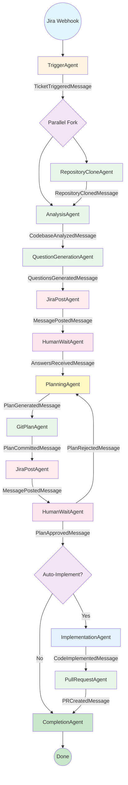

# Microsoft Agent Framework Integration Plan for PRFactory

**Version:** 1.0
**Date:** 2025-11-04
**Status:** Proposal

---

## Table of Contents

1. [Executive Summary](#executive-summary)
2. [Microsoft Agent Framework Overview](#microsoft-agent-framework-overview)
3. [Current Architecture Analysis](#current-architecture-analysis)
4. [Proposed Agent-Based Architecture](#proposed-agent-based-architecture)
5. [Agent Definitions](#agent-definitions)
6. [Agent Graph and Workflow Design](#agent-graph-and-workflow-design)
7. [Migration Strategy](#migration-strategy)
8. [Backward Compatibility Plan](#backward-compatibility-plan)
9. [Implementation Phases](#implementation-phases)
10. [Testing Strategy](#testing-strategy)
11. [Observability and Monitoring](#observability-and-monitoring)
12. [Risk Assessment and Mitigation](#risk-assessment-and-mitigation)

---

## Executive Summary

This document outlines a comprehensive plan to integrate **Microsoft Agent Framework** (MAF) into PRFactory, transforming the current Hangfire-based job processing system into a sophisticated multi-agent orchestration platform.

### Key Benefits

- **Enhanced Orchestration**: Graph-based workflows with checkpointing enable complex, resumable agent interactions
- **Better Observability**: Built-in OpenTelemetry support provides deep insights into agent behavior
- **Improved Reliability**: Automatic state management and recovery from failures
- **Scalability**: Native support for multi-agent parallelism and distributed execution
- **Maintainability**: Clear agent boundaries and responsibilities simplify code organization

### High-Level Changes

- **Replace** Hangfire background jobs with Agent Framework agents
- **Transform** linear state machine into graph-based agent workflow
- **Enhance** observability with OpenTelemetry instrumentation
- **Preserve** existing integrations (Jira, Git, Claude) with minimal changes
- **Maintain** backward compatibility during phased migration

---

## Microsoft Agent Framework Overview

### Core Capabilities

**Microsoft.Agents.AI** is a .NET framework for building multi-agent systems with:

1. **Agent Abstraction**: Define autonomous agents with specific responsibilities
2. **Graph-Based Workflows**: Connect agents in directed graphs with conditional routing
3. **State Management**: Automatic checkpointing and state persistence
4. **Message Passing**: Strongly-typed communication between agents
5. **Middleware Pipeline**: Extensible pipeline for cross-cutting concerns
6. **OpenTelemetry Integration**: Native distributed tracing and metrics

### Key Concepts

```
Agent: Autonomous unit that processes messages and produces results
Graph: Collection of agents connected by edges (data flow)
State: Persistent snapshot of workflow execution
Checkpoint: Saved state that enables resumption
Message: Strongly-typed communication between agents
Middleware: Pluggable components for logging, retry, auth, etc.
```

### Framework Architecture

```
┌─────────────────────────────────────────────────────────┐
│                   Agent Application                     │
│  ┌───────────────────────────────────────────────────┐  │
│  │           Agent Graph Definition                  │  │
│  │  ┌─────────┐  ┌─────────┐  ┌─────────┐          │  │
│  │  │ Agent A ├─→│ Agent B ├─→│ Agent C │          │  │
│  │  └─────────┘  └─────────┘  └─────────┘          │  │
│  └───────────────────┬───────────────────────────────┘  │
│                      │                                   │
│  ┌───────────────────▼───────────────────────────────┐  │
│  │          Agent Runtime Engine                     │  │
│  │  • State Management  • Checkpointing              │  │
│  │  • Message Routing   • Middleware Pipeline        │  │
│  └───────────────────┬───────────────────────────────┘  │
│                      │                                   │
│  ┌───────────────────▼───────────────────────────────┐  │
│  │           Storage & Observability                 │  │
│  │  • State Store    • OpenTelemetry                 │  │
│  │  • Message Queue  • Metrics & Traces              │  │
│  └───────────────────────────────────────────────────┘  │
└─────────────────────────────────────────────────────────┘
```

---

## Current Architecture Analysis

### Existing Workflow States

```csharp
public enum WorkflowState
{
    Triggered,           // Entry point
    Analyzing,           // Codebase analysis in progress
    QuestionsPosted,     // Questions sent to Jira
    AwaitingAnswers,     // Waiting for developer
    AnswersReceived,     // Developer responded
    Planning,            // Generating implementation plan
    PlanPosted,          // Plan committed to branch
    PlanUnderReview,     // Awaiting approval
    PlanApproved,        // Plan approved by developer
    PlanRejected,        // Plan needs revision
    Implementing,        // Code generation in progress
    ImplementationFailed,// Implementation error
    PRCreated,           // Pull request created
    InReview,            // PR under review
    Completed,           // Terminal state: success
    Cancelled,           // Terminal state: cancelled
    Failed               // Terminal state: error
}
```

### Current Hangfire Jobs

```csharp
1. RefineTicketJob
   - Clones repository
   - Analyzes codebase with Claude
   - Generates questions
   - Posts to Jira

2. GeneratePlanJob
   - Retrieves ticket context
   - Generates implementation plan with Claude
   - Creates feature branch
   - Commits plan files
   - Posts summary to Jira

3. ImplementPlanJob (Optional)
   - Loads approved plan
   - Generates code with Claude
   - Commits implementation
   - Creates pull request
```

### Limitations of Current Approach

1. **Linear Execution**: Jobs execute sequentially; no parallelism
2. **Limited Retry Logic**: Hangfire retry is all-or-nothing per job
3. **Coarse-Grained State**: State transitions are at job boundaries only
4. **Manual Coordination**: Developer approval requires webhook handling
5. **Limited Observability**: Hangfire dashboard shows job status, but not internal progress
6. **No Partial Resume**: If job fails mid-execution, must restart from beginning

---

## Proposed Agent-Based Architecture

### Architecture Diagram

```
┌─────────────────────────────────────────────────────────────────────────────┐
│                           PRFactory Application                             │
│                                                                             │
│  ┌───────────────────────────────────────────────────────────────────────┐  │
│  │                      API Layer (ASP.NET Core)                         │  │
│  │  ┌─────────────────┐  ┌──────────────────┐  ┌──────────────────┐    │  │
│  │  │ Jira Webhooks   │  │  Blazor UI       │  │  REST API        │    │  │
│  │  └────────┬────────┘  └────────┬─────────┘  └────────┬─────────┘    │  │
│  └───────────┼─────────────────────┼─────────────────────┼───────────────┘  │
│              │                     │                     │                   │
│  ┌───────────▼─────────────────────▼─────────────────────▼───────────────┐  │
│  │                     Agent Orchestrator Service                        │  │
│  │  • Workflow initiation    • Agent graph management                    │  │
│  │  • State coordination     • Event publishing                          │  │
│  └───────────────────────────┬───────────────────────────────────────────┘  │
│                              │                                               │
│  ┌───────────────────────────▼───────────────────────────────────────────┐  │
│  │                  Microsoft Agent Framework Runtime                    │  │
│  │                                                                        │  │
│  │  ┌──────────────────────────────────────────────────────────────────┐ │  │
│  │  │                      Agent Graph                                 │ │  │
│  │  │                                                                  │ │  │
│  │  │   ┌────────────┐      ┌─────────────┐     ┌────────────────┐   │ │  │
│  │  │   │  Trigger   │      │  Analysis   │     │  Repository    │   │ │  │
│  │  │   │   Agent    │─────→│   Agent     │────→│  Clone Agent   │   │ │  │
│  │  │   └────────────┘      └──────┬──────┘     └────────────────┘   │ │  │
│  │  │                              │                                  │ │  │
│  │  │                              ▼                                  │ │  │
│  │  │                       ┌─────────────┐                           │ │  │
│  │  │                       │  Question   │                           │ │  │
│  │  │                       │ Generation  │                           │ │  │
│  │  │                       │   Agent     │                           │ │  │
│  │  │                       └──────┬──────┘                           │ │  │
│  │  │                              │                                  │ │  │
│  │  │                              ▼                                  │ │  │
│  │  │                       ┌─────────────┐                           │ │  │
│  │  │                       │  Jira Post  │                           │ │  │
│  │  │              ┌───────→│   Agent     │                           │ │  │
│  │  │              │        └──────┬──────┘                           │ │  │
│  │  │              │               │                                  │ │  │
│  │  │              │               ▼                                  │ │  │
│  │  │              │        ┌─────────────┐                           │ │  │
│  │  │              │        │ Human Wait  │                           │ │  │
│  │  │              │        │   Agent     │←─────────┐                │ │  │
│  │  │              │        └──────┬──────┘          │                │ │  │
│  │  │              │               │              [Approval]          │ │  │
│  │  │              │               ▼              [Rejection]         │ │  │
│  │  │              │        ┌─────────────┐          │                │ │  │
│  │  │              │        │  Planning   │          │                │ │  │
│  │  │              │        │   Agent     │──────────┘                │ │  │
│  │  │              │        └──────┬──────┘                           │ │  │
│  │  │              │               │                                  │ │  │
│  │  │              │               ▼                                  │ │  │
│  │  │              │        ┌─────────────┐                           │ │  │
│  │  │              │        │  Git Plan   │                           │ │  │
│  │  │              └────────┤   Agent     │                           │ │  │
│  │  │                       └──────┬──────┘                           │ │  │
│  │  │                              │                                  │ │  │
│  │  │                              ▼                                  │ │  │
│  │  │                       ┌─────────────┐                           │ │  │
│  │  │                       │Implementation│                          │ │  │
│  │  │                       │   Agent     │                           │ │  │
│  │  │                       │  (Optional) │                           │ │  │
│  │  │                       └──────┬──────┘                           │ │  │
│  │  │                              │                                  │ │  │
│  │  │                              ▼                                  │ │  │
│  │  │                       ┌─────────────┐                           │ │  │
│  │  │                       │  PR Create  │                           │ │  │
│  │  │                       │   Agent     │                           │ │  │
│  │  │                       └─────────────┘                           │ │  │
│  │  │                                                                  │ │  │
│  │  └──────────────────────────────────────────────────────────────────┘ │  │
│  │                                                                        │  │
│  │  ┌──────────────────────────────────────────────────────────────────┐ │  │
│  │  │                    Middleware Pipeline                          │ │  │
│  │  │  • Logging  • Retry  • Auth  • Validation  • Telemetry         │ │  │
│  │  └──────────────────────────────────────────────────────────────────┘ │  │
│  │                                                                        │  │
│  │  ┌──────────────────────────────────────────────────────────────────┐ │  │
│  │  │                    State Management                             │ │  │
│  │  │  • Checkpointing  • Resume  • History  • Rollback               │ │  │
│  │  └──────────────────────────────────────────────────────────────────┘ │  │
│  └────────────────────────────────────────────────────────────────────────┘  │
│                              │                                               │
│  ┌───────────────────────────▼───────────────────────────────────────────┐  │
│  │                    Infrastructure Layer                               │  │
│  │  ┌──────────┐  ┌──────────┐  ┌──────────┐  ┌──────────────────────┐  │  │
│  │  │   Jira   │  │   Git    │  │  Claude  │  │  State Store (DB)    │  │  │
│  │  │  Client  │  │  Client  │  │  Client  │  │  • Checkpoints       │  │  │
│  │  └──────────┘  └──────────┘  └──────────┘  │  • Message Queue     │  │  │
│  │                                             └──────────────────────┘  │  │
│  └───────────────────────────────────────────────────────────────────────┘  │
│                              │                                               │
│  ┌───────────────────────────▼───────────────────────────────────────────┐  │
│  │                     Observability Layer                               │  │
│  │  ┌──────────────┐  ┌──────────────┐  ┌──────────────┐               │  │
│  │  │ OpenTelemetry│  │   Metrics    │  │    Logs      │               │  │
│  │  │   Traces     │  │   (Prometheus│  │  (Serilog)   │               │  │
│  │  └──────────────┘  └──────────────┘  └──────────────┘               │  │
│  └───────────────────────────────────────────────────────────────────────┘  │
└─────────────────────────────────────────────────────────────────────────────┘
```

### Key Architectural Changes

1. **Agent-Based Composition**: Replace monolithic jobs with specialized agents
2. **Graph-Based Workflow**: Explicit agent dependencies and data flow
3. **Checkpoint-Based Resume**: Any agent can fail and resume from last checkpoint
4. **Parallel Execution**: Independent agents (e.g., analysis + repo clone) run concurrently
5. **Middleware Pipeline**: Cross-cutting concerns handled declaratively
6. **Event-Driven State**: Agent completion triggers downstream agents automatically

---

## Agent Definitions

### 1. TriggerAgent

**Responsibility**: Initialize workflow when ticket is triggered

**Input Message**: `TriggerTicketMessage`
```csharp
public record TriggerTicketMessage(
    string TicketKey,
    Guid TenantId,
    Guid RepositoryId,
    string TicketSystem  // "Jira" or "AzureDevOps"
);
```

**Output Message**: `TicketTriggeredMessage`
```csharp
public record TicketTriggeredMessage(
    Guid TicketId,
    string TicketKey,
    string Title,
    string Description,
    Guid RepositoryId
);
```

**Operations**:
- Create Ticket entity
- Fetch ticket details from Jira/Azure DevOps
- Transition state to `Analyzing`
- Publish `TicketTriggeredMessage`

**Checkpoint**: After ticket creation

---

### 2. RepositoryCloneAgent

**Responsibility**: Clone repository to local workspace

**Input Message**: `TicketTriggeredMessage`

**Output Message**: `RepositoryClonedMessage`
```csharp
public record RepositoryClonedMessage(
    Guid TicketId,
    string LocalPath,
    string DefaultBranch
);
```

**Operations**:
- Check cache for existing clone
- Clone repository using LibGit2Sharp
- Cache repository path
- Publish `RepositoryClonedMessage`

**Checkpoint**: After successful clone

**Retry Policy**: 3 attempts with exponential backoff

---

### 3. AnalysisAgent

**Responsibility**: Analyze codebase and ticket requirements

**Input Messages**:
- `TicketTriggeredMessage`
- `RepositoryClonedMessage`

**Output Message**: `CodebaseAnalyzedMessage`
```csharp
public record CodebaseAnalyzedMessage(
    Guid TicketId,
    List<string> RelevantFiles,
    string Architecture,
    List<string> Patterns,
    Dictionary<string, string> FileContents
);
```

**Operations**:
- Build context from repository
- Call Claude AI for codebase analysis
- Extract relevant files and patterns
- Publish `CodebaseAnalyzedMessage`

**Checkpoint**: After Claude analysis

**Retry Policy**: 3 attempts (handles transient Claude API errors)

---

### 4. QuestionGenerationAgent

**Responsibility**: Generate clarifying questions based on analysis

**Input Message**: `CodebaseAnalyzedMessage`

**Output Message**: `QuestionsGeneratedMessage`
```csharp
public record QuestionsGeneratedMessage(
    Guid TicketId,
    List<Question> Questions
);
```

**Operations**:
- Build question generation prompt
- Call Claude AI
- Parse and validate questions
- Store questions in Ticket entity
- Publish `QuestionsGeneratedMessage`

**Checkpoint**: After question generation

---

### 5. JiraPostAgent

**Responsibility**: Post messages to Jira/Azure DevOps

**Input Messages**:
- `QuestionsGeneratedMessage`
- `PlanGeneratedMessage`

**Output Message**: `MessagePostedMessage`
```csharp
public record MessagePostedMessage(
    Guid TicketId,
    string MessageType,  // "Questions", "Plan", "PR"
    DateTime PostedAt
);
```

**Operations**:
- Format message for target system
- Post comment via Jira/Azure DevOps API
- Update ticket state
- Publish `MessagePostedMessage`

**Checkpoint**: After successful post

**Retry Policy**: 5 attempts (Jira can be rate-limited)

---

### 6. HumanWaitAgent

**Responsibility**: Wait for human input (answers, approval, rejection)

**Input Message**: `MessagePostedMessage`

**Output Messages**:
- `AnswersReceivedMessage`
- `PlanApprovedMessage`
- `PlanRejectedMessage`

```csharp
public record AnswersReceivedMessage(
    Guid TicketId,
    Dictionary<string, string> Answers
);

public record PlanApprovedMessage(
    Guid TicketId,
    DateTime ApprovedAt,
    string ApprovedBy
);

public record PlanRejectedMessage(
    Guid TicketId,
    string Reason
);
```

**Operations**:
- Enter suspended state
- Wait for webhook event
- Validate response
- Publish appropriate message based on response type

**Checkpoint**: After receiving human input

**Special Behavior**: This agent suspends execution and resumes via webhook

---

### 7. PlanningAgent

**Responsibility**: Generate implementation plan

**Input Message**: `AnswersReceivedMessage`

**Output Message**: `PlanGeneratedMessage`
```csharp
public record PlanGeneratedMessage(
    Guid TicketId,
    string MainPlan,
    string AffectedFiles,
    string TestStrategy,
    int EstimatedComplexity
);
```

**Operations**:
- Build planning context with Q&A
- Call Claude AI for plan generation
- Parse and structure plan
- Publish `PlanGeneratedMessage`

**Checkpoint**: After plan generation

**Conditional Routing**: On `PlanRejectedMessage`, loops back to this agent

---

### 8. GitPlanAgent

**Responsibility**: Commit implementation plan to feature branch

**Input Message**: `PlanGeneratedMessage`

**Output Message**: `PlanCommittedMessage`
```csharp
public record PlanCommittedMessage(
    Guid TicketId,
    string BranchName,
    string CommitSha,
    string BranchUrl
);
```

**Operations**:
- Create feature branch
- Write plan files
- Commit and push branch
- Publish `PlanCommittedMessage`

**Checkpoint**: After successful push

---

### 9. ImplementationAgent

**Responsibility**: Generate code based on approved plan (optional)

**Input Message**: `PlanApprovedMessage`

**Output Message**: `CodeImplementedMessage`
```csharp
public record CodeImplementedMessage(
    Guid TicketId,
    Dictionary<string, string> ModifiedFiles,
    List<string> CreatedFiles,
    string Summary
);
```

**Operations**:
- Load approved plan from branch
- Call Claude AI for code generation
- Validate generated code
- Publish `CodeImplementedMessage`

**Checkpoint**: After code generation

**Conditional Execution**: Only runs if tenant config enables auto-implementation

---

### 10. PullRequestAgent

**Responsibility**: Create pull request with implementation

**Input Message**: `CodeImplementedMessage`

**Output Message**: `PRCreatedMessage`
```csharp
public record PRCreatedMessage(
    Guid TicketId,
    int PullRequestNumber,
    string PullRequestUrl,
    DateTime CreatedAt
);
```

**Operations**:
- Commit code changes to branch
- Push branch to remote
- Create PR via Git platform API
- Link PR to Jira ticket
- Publish `PRCreatedMessage`

**Checkpoint**: After PR creation

---

### 11. CompletionAgent

**Responsibility**: Finalize workflow and cleanup

**Input Message**: `PRCreatedMessage`

**Output Message**: `WorkflowCompletedMessage`
```csharp
public record WorkflowCompletedMessage(
    Guid TicketId,
    WorkflowState FinalState,
    TimeSpan TotalDuration,
    Dictionary<string, object> Metrics
);
```

**Operations**:
- Transition ticket to `Completed` state
- Record metrics (tokens used, duration, etc.)
- Trigger cleanup job
- Publish `WorkflowCompletedMessage`

**Checkpoint**: Final checkpoint

---

## Agent Graph and Workflow Design

### Graph Definition (C# DSL)

```csharp
// PRFactory.Core/Agents/WorkflowAgentGraph.cs
public class WorkflowAgentGraph : AgentGraph
{
    public WorkflowAgentGraph(IServiceProvider services) : base(services)
    {
        var triggerAgent = CreateAgent<TriggerAgent>();
        var cloneAgent = CreateAgent<RepositoryCloneAgent>();
        var analysisAgent = CreateAgent<AnalysisAgent>();
        var questionAgent = CreateAgent<QuestionGenerationAgent>();
        var jiraPostAgent = CreateAgent<JiraPostAgent>();
        var humanWaitAgent = CreateAgent<HumanWaitAgent>();
        var planningAgent = CreateAgent<PlanningAgent>();
        var gitPlanAgent = CreateAgent<GitPlanAgent>();
        var implementationAgent = CreateAgent<ImplementationAgent>();
        var prAgent = CreateAgent<PullRequestAgent>();
        var completionAgent = CreateAgent<CompletionAgent>();

        // Define graph edges (data flow)

        // Entry point: Trigger → Clone + Analysis (parallel)
        triggerAgent
            .ConnectTo(cloneAgent)
            .ConnectTo(analysisAgent);

        // Clone completes → feed to Analysis
        cloneAgent.ConnectTo(analysisAgent);

        // Analysis → Question Generation
        analysisAgent.ConnectTo(questionAgent);

        // Questions → Post to Jira
        questionAgent.ConnectTo(jiraPostAgent);

        // Posted → Wait for human
        jiraPostAgent
            .Where(msg => msg.MessageType == "Questions")
            .ConnectTo(humanWaitAgent);

        // Human answered → Planning
        humanWaitAgent
            .Where<AnswersReceivedMessage>()
            .ConnectTo(planningAgent);

        // Planning → Commit plan
        planningAgent.ConnectTo(gitPlanAgent);

        // Plan committed → Post to Jira
        gitPlanAgent.ConnectTo(jiraPostAgent);

        // Plan posted → Wait for approval
        jiraPostAgent
            .Where(msg => msg.MessageType == "Plan")
            .ConnectTo(humanWaitAgent);

        // Plan rejected → Loop back to Planning
        humanWaitAgent
            .Where<PlanRejectedMessage>()
            .ConnectTo(planningAgent);

        // Plan approved → Implementation (conditional)
        humanWaitAgent
            .Where<PlanApprovedMessage>()
            .ConnectToConditional(
                implementationAgent,
                condition: ctx => ctx.Ticket.Tenant.Configuration.AutoImplementAfterPlanApproval
            );

        // Implementation → PR Creation
        implementationAgent.ConnectTo(prAgent);

        // PR Created → Completion
        prAgent.ConnectTo(completionAgent);

        // Also: Plan approved (manual impl) → skip to Completion
        humanWaitAgent
            .Where<PlanApprovedMessage>()
            .WhereNot(ctx => ctx.Ticket.Tenant.Configuration.AutoImplementAfterPlanApproval)
            .ConnectTo(completionAgent);

        // Set entry point
        SetEntryPoint(triggerAgent);
    }
}
```

### Message Flow Diagram



### State Persistence and Checkpointing

**Checkpoint Strategy**:
- After each agent completes successfully
- Before and after external API calls
- When entering/exiting suspended state (HumanWaitAgent)

**State Schema**:
```csharp
public class WorkflowCheckpoint
{
    public Guid CheckpointId { get; set; }
    public Guid TicketId { get; set; }
    public string CurrentAgentId { get; set; }
    public DateTime CheckpointedAt { get; set; }

    // Serialized agent state
    public Dictionary<string, object> AgentState { get; set; }

    // Messages in transit
    public List<SerializedMessage> PendingMessages { get; set; }

    // Workflow context
    public WorkflowContext Context { get; set; }
}

public class WorkflowContext
{
    public Guid TicketId { get; set; }
    public WorkflowState CurrentState { get; set; }
    public Dictionary<string, object> Metadata { get; set; }

    // Accumulated results from agents
    public CodebaseAnalysis? Analysis { get; set; }
    public List<Question>? Questions { get; set; }
    public ImplementationPlan? Plan { get; set; }
    public string? LocalRepoPath { get; set; }
}
```

---

## Migration Strategy

### Phase 1: Parallel Infrastructure (Weeks 1-2)

**Goal**: Set up Agent Framework alongside existing Hangfire system

**Tasks**:
1. Add NuGet packages:
   ```xml
   <PackageReference Include="Microsoft.Agents.AI" Version="1.0.0" />
   <PackageReference Include="Microsoft.Agents.Storage.EntityFramework" Version="1.0.0" />
   <PackageReference Include="OpenTelemetry.Extensions.Hosting" Version="1.7.0" />
   ```

2. Create `PRFactory.Agents` project:
   ```
   PRFactory.Agents/
   ├── AgentBase.cs
   ├── Messages/
   │   ├── TriggerTicketMessage.cs
   │   ├── CodebaseAnalyzedMessage.cs
   │   └── ...
   ├── Agents/
   │   ├── TriggerAgent.cs
   │   ├── AnalysisAgent.cs
   │   └── ...
   ├── Middleware/
   │   ├── LoggingMiddleware.cs
   │   ├── RetryMiddleware.cs
   │   └── TelemetryMiddleware.cs
   ├── Storage/
   │   ├── CheckpointStore.cs
   │   └── MessageQueue.cs
   └── WorkflowAgentGraph.cs
   ```

3. Set up database schema for checkpoints:
   ```csharp
   public class AgentCheckpoint
   {
       public Guid Id { get; set; }
       public Guid TicketId { get; set; }
       public string AgentId { get; set; }
       public string State { get; set; }  // JSON
       public DateTime CreatedAt { get; set; }
   }

   public class AgentMessage
   {
       public Guid Id { get; set; }
       public Guid TicketId { get; set; }
       public string MessageType { get; set; }
       public string Payload { get; set; }  // JSON
       public DateTime CreatedAt { get; set; }
       public DateTime? ProcessedAt { get; set; }
   }
   ```

4. Configure OpenTelemetry:
   ```csharp
   services.AddOpenTelemetry()
       .WithTracing(builder => builder
           .AddSource("PRFactory.Agents")
           .AddAspNetCoreInstrumentation()
           .AddHttpClientInstrumentation()
           .AddEntityFrameworkCoreInstrumentation()
           .AddConsoleExporter()
           .AddOtlpExporter(options =>
           {
               options.Endpoint = new Uri("http://localhost:4317");
           }))
       .WithMetrics(builder => builder
           .AddMeter("PRFactory.Agents")
           .AddAspNetCoreInstrumentation()
           .AddPrometheusExporter());
   ```

**Outcome**: Infrastructure ready; no production traffic yet

---

### Phase 2: Implement Core Agents (Weeks 3-5)

**Goal**: Build and test individual agents

**Week 3**: Foundation agents
- TriggerAgent
- RepositoryCloneAgent
- AnalysisAgent

**Week 4**: Question & Planning agents
- QuestionGenerationAgent
- JiraPostAgent
- PlanningAgent
- GitPlanAgent

**Week 5**: Implementation & PR agents
- ImplementationAgent
- PullRequestAgent
- CompletionAgent

**Testing Approach per Agent**:
```csharp
[Fact]
public async Task AnalysisAgent_WithValidInput_ProducesAnalysis()
{
    // Arrange
    var mockClaudeService = new Mock<IClaudeService>();
    mockClaudeService
        .Setup(x => x.AnalyzeCodebaseAsync(It.IsAny<Ticket>(), It.IsAny<string>(), default))
        .ReturnsAsync(new CodebaseAnalysis(...));

    var agent = new AnalysisAgent(mockClaudeService.Object, ...);
    var input = new TicketTriggeredMessage(...);
    var context = new AgentContext { TicketId = ticketId };

    // Act
    var output = await agent.ExecuteAsync(input, context);

    // Assert
    Assert.NotNull(output);
    Assert.IsType<CodebaseAnalyzedMessage>(output);
    Assert.NotEmpty(output.RelevantFiles);
}
```

**Outcome**: All agents implemented and unit tested

---

### Phase 3: Integrate Agent Graph (Week 6)

**Goal**: Wire agents together in graph and test end-to-end

**Tasks**:
1. Implement `WorkflowAgentGraph` class
2. Create `AgentOrchestrator` service:
   ```csharp
   public interface IAgentOrchestrator
   {
       Task<Guid> StartWorkflowAsync(TriggerTicketMessage message);
       Task ResumeWorkflowAsync(Guid ticketId, object message);
       Task<WorkflowStatus> GetWorkflowStatusAsync(Guid ticketId);
       Task CancelWorkflowAsync(Guid ticketId);
   }
   ```

3. Implement checkpoint storage and recovery
4. Build webhook handler to resume suspended workflows:
   ```csharp
   [HttpPost("jira")]
   public async Task<IActionResult> ReceiveJiraWebhook(...)
   {
       // ... validation ...

       if (payload.WebhookEvent == "comment_created")
       {
           var ticket = await _ticketRepository.GetByTicketKeyAsync(payload.Issue.Key);
           if (ticket != null && ticket.State == WorkflowState.AwaitingAnswers)
           {
               var answers = _commentParser.ParseAnswers(payload.Comment.Body, ticket.Questions);
               var message = new AnswersReceivedMessage(ticket.Id, answers);

               // Resume agent workflow
               await _orchestrator.ResumeWorkflowAsync(ticket.Id, message);
           }
       }

       return Ok();
   }
   ```

5. End-to-end integration tests with test Jira instance

**Outcome**: Complete agent-based workflow functional

---

### Phase 4: Feature Flag Rollout (Weeks 7-8)

**Goal**: Deploy to production with feature flag; gradually shift traffic

**Feature Flag Configuration**:
```csharp
public class WorkflowFeatureFlags
{
    public bool UseAgentFramework { get; set; } = false;
    public double AgentFrameworkTrafficPercentage { get; set; } = 0.0;
    public List<Guid> AgentFrameworkTenantWhitelist { get; set; } = new();
}
```

**Traffic Routing Logic**:
```csharp
public async Task<Result<Guid>> TriggerTicketAsync(
    string ticketKey,
    Guid tenantId,
    Guid repositoryId,
    CancellationToken ct)
{
    var flags = _featureFlagService.GetFlags();

    // Determine which workflow to use
    bool useAgentFramework = ShouldUseAgentFramework(tenantId, flags);

    if (useAgentFramework)
    {
        _logger.LogInformation("Using Agent Framework for ticket {TicketKey}", ticketKey);
        var message = new TriggerTicketMessage(ticketKey, tenantId, repositoryId, "Jira");
        return await _agentOrchestrator.StartWorkflowAsync(message);
    }
    else
    {
        _logger.LogInformation("Using Hangfire for ticket {TicketKey}", ticketKey);
        // Existing Hangfire logic
        var ticket = Ticket.Create(ticketKey, tenantId, repositoryId);
        await _workflowEngine.TransitionAsync(ticket, WorkflowState.Analyzing);
        await _ticketRepository.AddAsync(ticket, ct);
        _jobClient.Enqueue<RefineTicketJob>(job => job.ExecuteAsync(ticket.Id, CancellationToken.None));
        return Result.Success(ticket.Id);
    }
}

private bool ShouldUseAgentFramework(Guid tenantId, WorkflowFeatureFlags flags)
{
    // Whitelist takes priority
    if (flags.AgentFrameworkTenantWhitelist.Contains(tenantId))
        return true;

    // Then check if feature is enabled globally
    if (!flags.UseAgentFramework)
        return false;

    // Finally, percentage-based rollout
    var random = new Random().NextDouble();
    return random < flags.AgentFrameworkTrafficPercentage;
}
```

**Rollout Schedule**:
- Week 7, Day 1: 5% traffic (internal test tenants)
- Week 7, Day 3: 10% traffic
- Week 7, Day 5: 25% traffic
- Week 8, Day 2: 50% traffic
- Week 8, Day 4: 75% traffic
- Week 8, Day 7: 100% traffic

**Monitoring During Rollout**:
- Compare success rates: Hangfire vs. Agent Framework
- Compare latency: end-to-end workflow duration
- Monitor error rates and types
- Track checkpoint storage growth

**Rollback Criteria**:
- Error rate > 5% higher than Hangfire
- 3+ critical bugs in Agent Framework path
- Checkpoint storage issues

**Outcome**: Agent Framework serving 100% of production traffic

---

### Phase 5: Hangfire Deprecation (Week 9-10)

**Goal**: Remove Hangfire code and dependencies

**Tasks**:
1. Disable Hangfire server
2. Remove Hangfire job classes:
   - `RefineTicketJob`
   - `GeneratePlanJob`
   - `ImplementPlanJob`
3. Remove Hangfire NuGet package
4. Remove Hangfire database tables
5. Update documentation
6. Remove feature flag code

**Outcome**: Clean codebase with only Agent Framework

---

## Backward Compatibility Plan

### Database Schema Compatibility

**Requirement**: Agent-based workflow must read/write same `Ticket` entity

**Strategy**:
- Keep existing `Ticket` entity unchanged
- Add new `WorkflowCheckpoint` and `AgentMessage` tables
- Both systems share `WorkflowState` enum

**Migration**:
```csharp
public class AddAgentFrameworkTables : Migration
{
    protected override void Up(MigrationBuilder migrationBuilder)
    {
        migrationBuilder.CreateTable(
            name: "AgentCheckpoints",
            columns: table => new
            {
                Id = table.Column<Guid>(nullable: false),
                TicketId = table.Column<Guid>(nullable: false),
                AgentId = table.Column<string>(nullable: false),
                State = table.Column<string>(type: "jsonb", nullable: false),
                CreatedAt = table.Column<DateTime>(nullable: false)
            },
            constraints: table =>
            {
                table.PrimaryKey("PK_AgentCheckpoints", x => x.Id);
                table.ForeignKey("FK_AgentCheckpoints_Tickets", x => x.TicketId, "Tickets", "Id");
            });

        // Similar for AgentMessages table
    }
}
```

### API Compatibility

**Requirement**: External webhooks and REST API remain unchanged

**Strategy**:
- Webhook endpoints stay the same
- Controller logic branches to Hangfire or Agent Framework based on feature flag
- Response format identical

**Example**:
```csharp
[HttpPost("api/webhooks/jira")]
public async Task<IActionResult> ReceiveJiraWebhook(...)
{
    // Same validation logic
    if (!_validator.ValidateSignature(...)) return Unauthorized();

    // Same parsing logic
    var issueKey = payload.Issue.Key;

    // Route to appropriate backend
    if (_featureFlags.UseAgentFramework)
    {
        await _agentOrchestrator.StartWorkflowAsync(...);
    }
    else
    {
        await _ticketService.TriggerTicketAsync(...);
    }

    // Same response
    return Ok();
}
```

### UI Compatibility

**Requirement**: Blazor dashboard works for both Hangfire and Agent Framework tickets

**Strategy**:
- UI queries `Ticket` entity (unchanged)
- Display logic adapts based on `WorkflowState`
- Add "Agent Execution" tab showing agent graph progress (only for agent-based tickets)

**Example**:
```razor
@if (ticket.ExecutionMode == "AgentFramework")
{
    <AgentGraphVisualization TicketId="@ticket.Id" />
}
else
{
    <HangfireJobStatus TicketId="@ticket.Id" />
}
```

---

## Implementation Phases

### Phase 0: Preparation (Week 0)

**Deliverables**:
- [ ] Review Microsoft Agent Framework documentation
- [ ] Spike: Build "Hello World" agent graph
- [ ] Architecture review meeting
- [ ] Approval to proceed

**Duration**: 1 week

---

### Phase 1: Infrastructure Setup (Weeks 1-2)

**Deliverables**:
- [ ] Create `PRFactory.Agents` project
- [ ] Add NuGet packages
- [ ] Set up database migrations for checkpoints
- [ ] Configure OpenTelemetry
- [ ] Implement base `Agent<TInput, TOutput>` class
- [ ] Create message definitions (all `*Message` records)
- [ ] Set up unit test project

**Duration**: 2 weeks
**Risk**: Low

---

### Phase 2: Core Agent Development (Weeks 3-5)

#### Week 3: Foundation Agents
**Deliverables**:
- [ ] Implement `TriggerAgent`
- [ ] Implement `RepositoryCloneAgent`
- [ ] Implement `AnalysisAgent`
- [ ] Unit tests for above agents (80%+ coverage)
- [ ] Integration test: Trigger → Clone → Analyze

**Week 4: Question & Planning Agents**
**Deliverables**:
- [ ] Implement `QuestionGenerationAgent`
- [ ] Implement `JiraPostAgent`
- [ ] Implement `PlanningAgent`
- [ ] Implement `GitPlanAgent`
- [ ] Unit tests for above agents
- [ ] Integration test: Full refinement flow

**Week 5: Implementation & PR Agents**
**Deliverables**:
- [ ] Implement `HumanWaitAgent`
- [ ] Implement `ImplementationAgent`
- [ ] Implement `PullRequestAgent`
- [ ] Implement `CompletionAgent`
- [ ] Unit tests for above agents
- [ ] Integration test: Approved plan → Implementation → PR

**Duration**: 3 weeks
**Risk**: Medium (agent complexity)

---

### Phase 3: Agent Graph Integration (Week 6)

**Deliverables**:
- [ ] Implement `WorkflowAgentGraph`
- [ ] Implement `AgentOrchestrator` service
- [ ] Implement checkpoint storage and recovery
- [ ] Implement webhook resume logic
- [ ] End-to-end integration tests with test Jira
- [ ] Performance benchmarks vs. Hangfire
- [ ] Load testing (100 concurrent workflows)

**Duration**: 1 week
**Risk**: High (complex orchestration logic)

---

### Phase 4: Feature Flag Rollout (Weeks 7-8)

**Deliverables**:
- [ ] Implement feature flag service
- [ ] Add traffic routing logic
- [ ] Deploy to staging environment
- [ ] Smoke tests in staging
- [ ] Deploy to production with 5% traffic
- [ ] Gradual rollout to 100% (see schedule above)
- [ ] Daily monitoring and metrics review
- [ ] Rollback plan tested

**Duration**: 2 weeks
**Risk**: High (production rollout)

---

### Phase 5: Deprecation & Cleanup (Weeks 9-10)

**Deliverables**:
- [ ] Remove Hangfire code
- [ ] Remove Hangfire NuGet packages
- [ ] Remove Hangfire database tables
- [ ] Update documentation
- [ ] Remove feature flag code
- [ ] Code review and cleanup
- [ ] Retrospective meeting

**Duration**: 2 weeks
**Risk**: Low

---

**Total Duration**: 10 weeks
**Team Size**: 2-3 developers

---

## Testing Strategy

### Unit Testing

**Framework**: xUnit + Moq

**Coverage Target**: 80%+ for all agents

**Example Test Structure**:
```csharp
public class AnalysisAgentTests
{
    private readonly Mock<IClaudeService> _mockClaudeService;
    private readonly Mock<IContextBuilder> _mockContextBuilder;
    private readonly Mock<ILogger<AnalysisAgent>> _mockLogger;
    private readonly AnalysisAgent _agent;

    public AnalysisAgentTests()
    {
        _mockClaudeService = new Mock<IClaudeService>();
        _mockContextBuilder = new Mock<IContextBuilder>();
        _mockLogger = new Mock<ILogger<AnalysisAgent>>();
        _agent = new AnalysisAgent(_mockClaudeService.Object, _mockContextBuilder.Object, _mockLogger.Object);
    }

    [Fact]
    public async Task ExecuteAsync_WithValidInput_ReturnsAnalysis()
    {
        // Arrange
        var input = new RepositoryClonedMessage(...);
        var expectedAnalysis = new CodebaseAnalysis(...);
        _mockClaudeService
            .Setup(x => x.AnalyzeCodebaseAsync(It.IsAny<Ticket>(), It.IsAny<string>(), default))
            .ReturnsAsync(expectedAnalysis);

        // Act
        var result = await _agent.ExecuteAsync(input, new AgentContext());

        // Assert
        Assert.NotNull(result);
        Assert.Equal(expectedAnalysis.RelevantFiles, result.RelevantFiles);
    }

    [Fact]
    public async Task ExecuteAsync_WhenClaudeApiErrors_RetriesAndThrows()
    {
        // Arrange
        _mockClaudeService
            .Setup(x => x.AnalyzeCodebaseAsync(It.IsAny<Ticket>(), It.IsAny<string>(), default))
            .ThrowsAsync(new HttpRequestException("API Error"));

        // Act & Assert
        await Assert.ThrowsAsync<AgentExecutionException>(
            () => _agent.ExecuteAsync(new RepositoryClonedMessage(...), new AgentContext())
        );
    }

    [Fact]
    public async Task ExecuteAsync_CreatesCheckpoint_AfterSuccess()
    {
        // Arrange
        var mockCheckpointStore = new Mock<ICheckpointStore>();
        var agent = new AnalysisAgent(..., checkpointStore: mockCheckpointStore.Object);

        // Act
        await agent.ExecuteAsync(...);

        // Assert
        mockCheckpointStore.Verify(x => x.SaveCheckpointAsync(
            It.IsAny<Guid>(),
            It.Is<string>(agentId => agentId == "AnalysisAgent"),
            It.IsAny<object>()
        ), Times.Once);
    }
}
```

### Integration Testing

**Test Scenarios**:

1. **Happy Path End-to-End**:
   - Trigger → Analysis → Questions → Human Answers → Plan → Approval → Implementation → PR
   - Verify all checkpoints created
   - Verify Jira comments posted
   - Verify PR created

2. **Resume from Checkpoint**:
   - Kill agent mid-execution
   - Restart and verify resume from last checkpoint

3. **Plan Rejection Loop**:
   - Trigger workflow
   - Reject plan
   - Verify loop back to PlanningAgent
   - Approve second plan
   - Verify completion

4. **Parallel Execution**:
   - Trigger 10 workflows simultaneously
   - Verify all complete successfully
   - Verify no race conditions

5. **Error Recovery**:
   - Simulate Claude API failure
   - Verify retry logic
   - Verify eventual success or failure state

**Test Implementation**:
```csharp
[Collection("Integration")]
public class WorkflowIntegrationTests : IClassFixture<IntegrationTestFixture>
{
    private readonly IntegrationTestFixture _fixture;

    [Fact]
    public async Task FullWorkflow_HappyPath_CompletesSuccessfully()
    {
        // Arrange
        var tenantId = await _fixture.CreateTestTenantAsync();
        var repoId = await _fixture.CreateTestRepositoryAsync(tenantId);
        var trigger = new TriggerTicketMessage("TEST-123", tenantId, repoId, "Jira");

        // Act
        var ticketId = await _fixture.Orchestrator.StartWorkflowAsync(trigger);

        // Wait for questions to be posted
        await _fixture.WaitForStateAsync(ticketId, WorkflowState.AwaitingAnswers, timeout: TimeSpan.FromMinutes(2));

        // Submit answers
        var answers = new Dictionary<string, string> { ... };
        await _fixture.Orchestrator.ResumeWorkflowAsync(ticketId, new AnswersReceivedMessage(ticketId, answers));

        // Wait for plan to be posted
        await _fixture.WaitForStateAsync(ticketId, WorkflowState.PlanUnderReview, timeout: TimeSpan.FromMinutes(2));

        // Approve plan
        await _fixture.Orchestrator.ResumeWorkflowAsync(ticketId, new PlanApprovedMessage(ticketId, DateTime.UtcNow, "testuser"));

        // Wait for completion
        await _fixture.WaitForStateAsync(ticketId, WorkflowState.Completed, timeout: TimeSpan.FromMinutes(5));

        // Assert
        var ticket = await _fixture.TicketRepository.GetByIdAsync(ticketId);
        Assert.Equal(WorkflowState.Completed, ticket.State);
        Assert.NotNull(ticket.PullRequestUrl);

        // Verify checkpoints created
        var checkpoints = await _fixture.CheckpointStore.GetCheckpointsAsync(ticketId);
        Assert.True(checkpoints.Count >= 8); // At least 8 agent executions
    }
}
```

### Load Testing

**Tool**: NBomber or k6

**Scenarios**:
1. **Steady Load**: 10 workflows/minute for 30 minutes
2. **Burst Load**: 100 workflows in 1 minute
3. **Sustained Load**: 50 workflows/minute for 2 hours

**Metrics to Track**:
- Workflow completion rate
- Average workflow duration
- Agent execution time per type
- Checkpoint storage latency
- Database connection pool usage
- Memory usage over time

**Example k6 Script**:
```javascript
import http from 'k6/http';
import { check, sleep } from 'k6';

export let options = {
  stages: [
    { duration: '5m', target: 10 },  // Ramp up to 10 workflows/sec
    { duration: '20m', target: 10 }, // Stay at 10 for 20 minutes
    { duration: '5m', target: 0 },   // Ramp down
  ],
};

export default function() {
  let payload = JSON.stringify({
    webhookEvent: 'jira:issue_created',
    issue: {
      key: `TEST-${__ITER}`,
      fields: {
        summary: 'Load test ticket',
        description: '@claude implement feature X',
        labels: ['claude-ai']
      }
    }
  });

  let response = http.post('https://prfactory.example.com/api/webhooks/jira', payload, {
    headers: { 'Content-Type': 'application/json', 'X-Hub-Signature': 'sha256=...' }
  });

  check(response, {
    'status is 200': (r) => r.status === 200,
  });

  sleep(1);
}
```

### Performance Testing

**Baseline**: Current Hangfire implementation

**Comparison Metrics**:
| Metric | Hangfire | Agent Framework | Target |
|--------|----------|-----------------|--------|
| Avg. workflow duration | 5m 30s | TBD | < 6m |
| p95 workflow duration | 8m | TBD | < 9m |
| Success rate | 95% | TBD | > 95% |
| Checkpoint overhead | N/A | TBD | < 500ms |
| Memory per workflow | 50MB | TBD | < 75MB |

---

## Observability and Monitoring

### OpenTelemetry Instrumentation

**Traces**:
- Span per agent execution
- Span per external API call (Jira, Git, Claude)
- Parent-child relationships showing workflow path

**Example Trace**:
```
WorkflowExecution (Ticket=TEST-123)
├── TriggerAgent (5ms)
├── RepositoryCloneAgent (2.3s)
│   └── LibGit2Sharp.Clone (2.1s)
├── AnalysisAgent (8.5s)
│   ├── ContextBuilder.Build (200ms)
│   └── ClaudeAPI.Analyze (8.2s)
├── QuestionGenerationAgent (3.1s)
│   └── ClaudeAPI.GenerateQuestions (3s)
├── JiraPostAgent (450ms)
│   └── JiraAPI.AddComment (400ms)
└── ... (continues)
```

**Metrics**:
```csharp
// Counter: Total workflows started
_meter.CreateCounter<long>("workflow.started", "count");

// Counter: Total workflows completed
_meter.CreateCounter<long>("workflow.completed", "count");

// Histogram: Workflow duration
_meter.CreateHistogram<double>("workflow.duration", "seconds");

// Counter: Agent executions
_meter.CreateCounter<long>("agent.executions", "count",
    tags: new[] { ("agent", agentName), ("status", "success|failure") });

// Histogram: Agent execution time
_meter.CreateHistogram<double>("agent.execution_time", "seconds",
    tags: new[] { ("agent", agentName) });

// Counter: Checkpoints created
_meter.CreateCounter<long>("checkpoint.created", "count");

// Gauge: Active workflows
_meter.CreateObservableGauge("workflow.active", () => GetActiveWorkflowCount());
```

### Dashboards

**Grafana Dashboard - Workflow Overview**:
```
┌─────────────────────────────────────────────────────────┐
│ Active Workflows: 23        Completed Today: 145        │
│ Success Rate: 97.2%         Avg Duration: 5m 23s        │
└─────────────────────────────────────────────────────────┘

┌─────────────────────────────────────────────────────────┐
│         Workflow Completions (per hour)                 │
│  150 ┤                                                   │
│  100 ┤      ╭─╮   ╭╮                                     │
│   50 ┤  ╭─╮ │ │╭─╮││  ╭╮                                │
│    0 ┴──┴─┴─┴─┴┴─┴┴┴──┴┴─────────────────────────       │
│      00:00   06:00   12:00   18:00   24:00              │
└─────────────────────────────────────────────────────────┘

┌─────────────────────────────────────────────────────────┐
│         Agent Execution Times (p95)                     │
│  TriggerAgent          ██ 50ms                          │
│  RepositoryCloneAgent  ████████ 2.5s                    │
│  AnalysisAgent         ████████████████ 9s              │
│  QuestionGenAgent      ██████ 3.2s                      │
│  PlanningAgent         ██████████ 5s                    │
│  ImplementationAgent   ████████████████████ 12s         │
│  PullRequestAgent      ████ 1.5s                        │
└─────────────────────────────────────────────────────────┘
```

**Grafana Dashboard - Error Tracking**:
```
┌─────────────────────────────────────────────────────────┐
│ Errors by Agent (last 24h)                              │
│  AnalysisAgent: 3 (Claude API timeout)                  │
│  JiraPostAgent: 2 (Rate limit exceeded)                 │
│  PullRequestAgent: 1 (Invalid credentials)              │
└─────────────────────────────────────────────────────────┘
```

### Alerting Rules

**Critical Alerts** (PagerDuty):
1. Success rate < 90% for 10 minutes
2. No workflows completed in 30 minutes (during business hours)
3. Checkpoint storage errors > 5 in 5 minutes

**Warning Alerts** (Slack):
1. Workflow duration p95 > 10 minutes
2. Agent retry rate > 10% for any agent
3. Active workflows > 100

**Alert Implementation (Prometheus)**:
```yaml
groups:
  - name: prfactory_agents
    interval: 30s
    rules:
      - alert: LowWorkflowSuccessRate
        expr: rate(workflow_completed{status="success"}[10m]) / rate(workflow_started[10m]) < 0.90
        for: 10m
        labels:
          severity: critical
        annotations:
          summary: "Workflow success rate below 90%"
          description: "Current success rate: {{ $value | humanizePercentage }}"

      - alert: HighWorkflowDuration
        expr: histogram_quantile(0.95, rate(workflow_duration_bucket[10m])) > 600
        for: 10m
        labels:
          severity: warning
        annotations:
          summary: "Workflow p95 duration exceeds 10 minutes"
          description: "Current p95: {{ $value }}s"
```

### Logging

**Structured Logging with Serilog**:
```csharp
_logger.LogInformation(
    "Agent {AgentName} completed for ticket {TicketId}. Duration: {Duration}ms",
    agentName,
    ticketId,
    durationMs
);

_logger.LogWarning(
    "Agent {AgentName} retry attempt {Attempt} of {MaxAttempts} for ticket {TicketId}. Error: {Error}",
    agentName,
    attempt,
    maxAttempts,
    ticketId,
    error
);

_logger.LogError(
    exception,
    "Agent {AgentName} failed permanently for ticket {TicketId} after {Attempts} attempts",
    agentName,
    ticketId,
    attempts
);
```

---

## Risk Assessment and Mitigation

### Risk Matrix

| Risk | Probability | Impact | Severity | Mitigation |
|------|------------|--------|----------|------------|
| **Agent Framework learning curve** | High | Medium | High | Spike work in Phase 0; pair programming |
| **Migration bugs in production** | Medium | High | High | Feature flag + gradual rollout; comprehensive testing |
| **Performance regression** | Medium | Medium | Medium | Load testing before rollout; revert to Hangfire if needed |
| **Checkpoint storage growth** | Medium | Medium | Medium | Retention policy; archive old checkpoints after 30 days |
| **OpenTelemetry overhead** | Low | Low | Low | Sample traces at 10%; monitor performance |
| **Third-party API changes** | Low | High | Medium | Abstract all external calls; use circuit breakers |

### Detailed Mitigation Strategies

#### Risk: Migration Bugs in Production

**Mitigation**:
1. **Feature Flag**: Start at 5% traffic with internal tenants only
2. **Gradual Rollout**: Increase by 5-25% every 2 days
3. **Automated Rollback**: If error rate > 5%, auto-rollback to Hangfire
4. **Dual Write**: Both systems write to `Ticket` entity; compare results
5. **Shadow Mode**: Run agent framework in "observe only" mode for 1 week before routing real traffic

**Rollback Procedure**:
```csharp
// In appsettings.json:
{
  "FeatureFlags": {
    "UseAgentFramework": false,
    "AgentFrameworkTrafficPercentage": 0.0
  }
}

// Immediate rollback:
await _featureFlagService.SetFlagAsync("UseAgentFramework", false);
_logger.LogCritical("Agent Framework disabled. All traffic routed to Hangfire.");
```

#### Risk: Performance Regression

**Mitigation**:
1. **Baseline Benchmarks**: Capture Hangfire performance metrics before migration
2. **Load Testing**: Run k6 tests with 2x expected load
3. **Resource Limits**: Set agent execution timeout to 15 minutes
4. **Checkpoint Optimization**: Use binary serialization (Protobuf) instead of JSON
5. **Caching**: Cache frequently accessed data (tenant config, repo URLs)

**Performance Acceptance Criteria**:
- Workflow duration: No more than 10% slower than Hangfire
- Checkpoint overhead: < 500ms per checkpoint
- Memory usage: < 150% of Hangfire baseline

#### Risk: Checkpoint Storage Growth

**Mitigation**:
1. **Retention Policy**: Delete checkpoints after workflow completion + 7 days
2. **Archival**: Move old checkpoints to cold storage (S3/Azure Blob) after 30 days
3. **Compression**: Compress checkpoint JSON before storage
4. **Monitoring**: Alert if checkpoint table size > 10GB

**Cleanup Job**:
```csharp
public class CheckpointCleanupJob
{
    [AutomaticRetry(Attempts = 3)]
    public async Task ExecuteAsync()
    {
        var cutoffDate = DateTime.UtcNow.AddDays(-7);

        var checkpointsToDelete = await _dbContext.AgentCheckpoints
            .Where(c => c.CreatedAt < cutoffDate && c.Ticket.State == WorkflowState.Completed)
            .ToListAsync();

        _dbContext.AgentCheckpoints.RemoveRange(checkpointsToDelete);
        await _dbContext.SaveChangesAsync();

        _logger.LogInformation("Deleted {Count} old checkpoints", checkpointsToDelete.Count);
    }
}
```

---

## Appendix A: Agent Framework Code Examples

### Base Agent Implementation

```csharp
// PRFactory.Agents/AgentBase.cs
public abstract class AgentBase<TInput, TOutput> : IAgent
    where TInput : class
    where TOutput : class
{
    protected readonly ILogger Logger;
    protected readonly ICheckpointStore CheckpointStore;

    public string AgentId => GetType().Name;

    protected AgentBase(ILogger logger, ICheckpointStore checkpointStore)
    {
        Logger = logger;
        CheckpointStore = checkpointStore;
    }

    public async Task<object> ExecuteAsync(object input, AgentContext context)
    {
        var typedInput = input as TInput
            ?? throw new ArgumentException($"Expected {typeof(TInput).Name}, got {input?.GetType().Name}");

        using var activity = ActivitySource.StartActivity($"{AgentId}.Execute");
        activity?.SetTag("ticket_id", context.TicketId);

        try
        {
            Logger.LogInformation("Executing {AgentId} for ticket {TicketId}", AgentId, context.TicketId);

            var output = await ExecuteCoreAsync(typedInput, context);

            // Checkpoint after successful execution
            await CheckpointStore.SaveCheckpointAsync(
                context.TicketId,
                AgentId,
                new { Input = typedInput, Output = output, Timestamp = DateTime.UtcNow }
            );

            Logger.LogInformation("{AgentId} completed for ticket {TicketId}", AgentId, context.TicketId);

            return output;
        }
        catch (Exception ex)
        {
            Logger.LogError(ex, "{AgentId} failed for ticket {TicketId}", AgentId, context.TicketId);
            activity?.SetStatus(ActivityStatusCode.Error, ex.Message);
            throw new AgentExecutionException($"Agent {AgentId} failed", ex);
        }
    }

    protected abstract Task<TOutput> ExecuteCoreAsync(TInput input, AgentContext context);
}
```

### Example Agent: AnalysisAgent

```csharp
// PRFactory.Agents/Agents/AnalysisAgent.cs
public class AnalysisAgent : AgentBase<RepositoryClonedMessage, CodebaseAnalyzedMessage>
{
    private readonly IClaudeService _claudeService;
    private readonly IContextBuilder _contextBuilder;
    private readonly ITicketRepository _ticketRepository;

    public AnalysisAgent(
        IClaudeService claudeService,
        IContextBuilder contextBuilder,
        ITicketRepository ticketRepository,
        ILogger<AnalysisAgent> logger,
        ICheckpointStore checkpointStore)
        : base(logger, checkpointStore)
    {
        _claudeService = claudeService;
        _contextBuilder = contextBuilder;
        _ticketRepository = ticketRepository;
    }

    protected override async Task<CodebaseAnalyzedMessage> ExecuteCoreAsync(
        RepositoryClonedMessage input,
        AgentContext context)
    {
        var ticket = await _ticketRepository.GetByIdAsync(input.TicketId);
        if (ticket == null)
            throw new InvalidOperationException($"Ticket {input.TicketId} not found");

        // Build context for Claude
        var analysisContext = await _contextBuilder.BuildAnalysisContextAsync(ticket, input.LocalPath);

        // Call Claude AI
        var analysis = await _claudeService.AnalyzeCodebaseAsync(ticket, input.LocalPath);

        // Update ticket state
        ticket.TransitionTo(WorkflowState.Analyzing);
        await _ticketRepository.UpdateAsync(ticket);

        return new CodebaseAnalyzedMessage(
            input.TicketId,
            analysis.RelevantFiles,
            analysis.Architecture,
            analysis.Patterns,
            analysis.FileContents
        );
    }
}
```

---

## Appendix B: Configuration Examples

### appsettings.json

```json
{
  "ConnectionStrings": {
    "Database": "Host=localhost;Database=prfactory;Username=app;Password=..."
  },

  "AgentFramework": {
    "MaxConcurrentWorkflows": 50,
    "AgentTimeout": "00:15:00",
    "CheckpointRetentionDays": 7,
    "EnableTracing": true,
    "TracingSampleRate": 0.1
  },

  "OpenTelemetry": {
    "ServiceName": "PRFactory",
    "ServiceVersion": "2.0.0",
    "OtlpEndpoint": "http://localhost:4317",
    "EnableConsoleExporter": false
  },

  "FeatureFlags": {
    "UseAgentFramework": true,
    "AgentFrameworkTrafficPercentage": 1.0,
    "AgentFrameworkTenantWhitelist": []
  },

  "Jira": {
    "BaseUrl": "https://yourcompany.atlassian.net",
    "WebhookSecret": "..."
  },

  "Claude": {
    "ApiKey": "sk-ant-...",
    "Model": "claude-sonnet-4-5-20250929",
    "MaxTokens": 8000
  }
}
```

---

## Appendix C: Glossary

| Term | Definition |
|------|------------|
| **Agent** | Autonomous component that processes a specific type of message and produces output |
| **Agent Graph** | Directed graph defining agent dependencies and data flow |
| **Checkpoint** | Saved state snapshot enabling workflow resumption |
| **Message** | Strongly-typed data passed between agents |
| **Middleware** | Pluggable component in agent execution pipeline (e.g., logging, retry) |
| **Orchestrator** | Service managing agent graph execution and state |
| **State Store** | Persistent storage for checkpoints and workflow state |
| **Suspended State** | Workflow paused, waiting for external input (human approval) |
| **Trace** | OpenTelemetry distributed trace showing workflow execution path |

---

## Conclusion

This integration plan provides a comprehensive roadmap for adopting Microsoft Agent Framework in PRFactory. The phased approach with feature flags ensures a safe migration path, while the agent-based architecture delivers enhanced observability, reliability, and maintainability.

**Key Takeaways**:

1. **10-week timeline** from preparation to full deprecation of Hangfire
2. **Backward compatible** during migration via feature flags
3. **Low risk** due to gradual rollout and automated rollback
4. **High value** from improved observability, checkpointing, and graph-based workflows
5. **Future-proof** architecture supporting complex multi-agent orchestration

**Next Steps**:
1. Review and approve this plan
2. Begin Phase 0 preparation work
3. Kick off Phase 1 infrastructure setup

---

**Document Version History**:

| Version | Date | Author | Changes |
|---------|------|--------|---------|
| 1.0 | 2025-11-04 | System | Initial draft |

